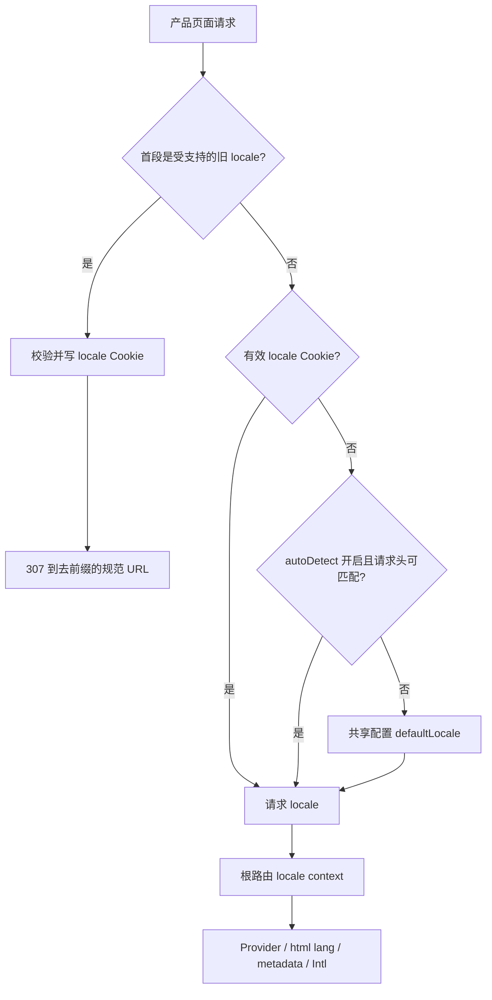

# 产品应用本地化与路由解耦迁移计划

> 生命周期：已归档
> 文档类型：迁移计划
> 状态：Complete
> 更新日期：2026-08-14
> 归档日期：2026-08-14
> 归档原因：产品应用无语言前缀迁移已实现并完成专项 Node/Cloudflare 验证；当前契约由稳定设计、Runbook 与包 README 继续维护
> 维护范围：`apps/web-app`、`libs/i18n`、`config.ts`、TanStack 路由与 E2E
> 稳定来源：[VibeChat MVP 版本产品与技术设计](../stable/designs/vibechat-mvp-product-and-technical-design.md)

## 1. 决策摘要

`apps/web-app` 改用**无语言前缀的规范 URL + 请求级语言偏好**：产品页面使用 `/`、`/signin`、`/messages`、`/rooms/:roomId`、`/me` 等业务路径，当前语言不再是 TanStack Router 的 path param。

本次迁移采用以下边界：

- `apps/web-app` 的语言由受校验的偏好 Cookie 解析，并通过根路由上下文提供给 React、`<html lang>`、SEO metadata 和格式化逻辑。
- 显式切换语言只改变语言偏好和页面内容，不改变当前 URL。
- `config.app.i18n` 是默认语言、支持语言和 Cookie 名称的唯一配置来源；当前默认语言继续使用 `zh-CN`，不借本次路由迁移改变产品默认策略。
- 保留 `libs/i18n` 现有 TypeScript 翻译对象和类型推断，第一阶段不引入 i18next、Paraglide 或新的消息格式。
- `apps/docs-app` 暂不迁移。文档站是可索引内容站，语言 URL、canonical 与 `hreflang` 有独立价值；不能把产品应用的 URL 策略机械套用到文档站。
- 旧的 `/en/**`、`/zh-CN/**` 产品链接在迁移期解析语言、写入 Cookie，再临时重定向到去掉语言段的规范 URL。

这与稳定产品设计给出的 `/messages`、`/rooms/:roomId`、`/contacts`、`/discover`、`/me` 路由一致。截至 2026-08-14，路由、请求 locale、旧链接兼容、E2E 场景和相关文档已经进入实现，尚需完成第 9 节的运行验证后才能标记 Complete。

## 2. 迁移基线与当前实现

### 2.1 迁移前耦合位置

| 层级 | 当前事实 | 迁移影响 |
| --- | --- | --- |
| 文件路由 | 所有产品页面位于 `apps/web-app/src/routes/$lang/**`，`$lang.tsx` 负责校验和 Provider | 页面文件、route ID 和生成路由树都要迁移 |
| 翻译 Hook | `useTranslation()` 从 `useParams()` 读取 `lang` | 改为读取根级 locale context |
| 导航 | `Link`、`navigate`、`window.location` 普遍拼接 `/$lang` 或 `/${locale}` | 全部改为业务路径，不再传 `lang` params |
| 页面守卫 | `requireAuth`、`requireAdmin`、`requireSubscription` 接受 `params.lang` 并生成带语言重定向 | 守卫只处理业务目的地与安全的 `returnTo` |
| SSR | `<html lang>` 从 URL 第一段推断 | 必须改为使用服务端已解析并序列化的 locale |
| SEO | `seoHead(lang, ...)` 依赖路由参数 | 改为从根级 locale 数据选择 metadata |
| 支付回跳 | 根级 `/payment-success`、`/payment-cancel` 只负责转发到 `/$lang/**` | 根级路径直接成为真实页面，不再二次跳转 |
| E2E | `BASE=/en`，语言测试以 URL 变化为主要断言 | 改为规范 URL、内容、Cookie、SSR 和旧链接兼容断言 |

2026-08-14 的静态盘点发现：

- `apps/web-app/src` 至少有 44 个源文件直接引用 `$lang`、`lang` 路由参数或相关 route ID。
- 至少有 37 个源文件构造带语言的内部导航。
- `tests/e2e` 中至少 10 个文件直接依赖 `/en`、`/zh-CN`、`LOCALE` 或 `BASE`。
- 至少 11 份非归档文档仍描述语言前缀路由。

上述数字用于界定迁移面，不作为完成证明；实施后应使用零残留规则重新扫描。

### 2.2 已修复的配置漂移

迁移前存在三个互相冲突的默认语言来源：

- `config.app.i18n.defaultLocale` 是 `zh-CN`。
- `libs/i18n/index.ts` 另行导出 `defaultLocale = 'en'`。
- E2E `tests/e2e/helpers/constants.ts` 假设默认语言是 `en`。

目前 `libs/i18n` 已从 `config.app.i18n` 重导出默认值与支持列表，E2E 使用无前缀规范路径并显式控制 Cookie，不再假设英文默认前缀。

### 2.3 与目标产品的关系

当前 `$lang` 路由来自旧 SaaS 脚手架。稳定产品设计中的产品 URL 均不含语言段，且“语言”被定义为“我的”中的用户偏好。路由解耦属于 A0 工程基线与路由差距盘点，不代表 Matrix、社交或氛围空间功能已经开始实现。

### 2.4 当前实现入口

| 能力 | 当前代码入口 |
| --- | --- |
| locale 配置、类型与规范化 | `config.ts`、`libs/i18n/index.ts` |
| 请求解析与偏好写入 | `apps/web-app/src/lib/locale.functions.ts` |
| SSR context、Provider 与 `html lang` | `apps/web-app/src/routes/__root.tsx` |
| 组件翻译与语言切换 | `apps/web-app/src/hooks/use-translation.ts` |
| 旧链接 307 兼容 | `apps/web-app/src/routes/$locale.tsx`、`$locale/$.tsx` |
| 规范产品路由 | `apps/web-app/src/routes/(root)`、`(auth)`、`admin` |
| 回归场景 | `tests/e2e/specs/i18n-switching.spec.ts` |

## 3. 目标与非目标

### 3.1 目标

1. 产品 URL 只表达资源和界面状态，不表达用户偏好。
2. SSR 首屏、客户端 hydration、`<html lang>`、翻译对象和日期/金额格式使用同一个 locale。
3. 语言切换保留当前 pathname、search 和 hash，不触发业务导航。
4. 旧的已分享链接在兼容期内可恢复原语言并落到规范 URL。
5. 鉴权、权限、支付、定价和 API 输入不再隐式依赖路由语言。
6. Node.js 与 Cloudflare Workers 构建使用同一套 locale 解析规则。
7. 迁移后新增产品页面不需要声明 `$lang`、传递 `lang` params 或手工拼接语言路径。

### 3.2 非目标

- 不在本次迁移中重写翻译文案、翻译 key 结构或翻译管理流程。
- 不在本次迁移中增加新的支持语言或启用 `autoDetect`。
- 不把 locale 当作认证、权限、计费、区域合规或价格可用性的可信依据。
- 不在本次迁移中实现跨设备语言偏好数据表；该能力随目标产品的用户资料/bootstrap 设计进入 A2。
- 不同时重构文档站路由。
- 不承诺旧脚手架博客的双语 SEO。若产品博客保留并需要不同语言分别索引，应迁入文档/内容站或建立独立内容路由设计，不能恢复全站强制语言前缀。

## 4. 目标架构

### 4.1 按产品表面选择 URL 策略

| 表面 | 目标策略 | 原因 |
| --- | --- | --- |
| 产品 Web/PWA `apps/web-app` | 无语言前缀；Cookie/用户偏好驱动 | URL 主要代表会话、联系人和房间资源，深链不应因语言产生多份身份 |
| 文档站 `apps/docs-app` | 维持可索引的语言内容 URL | 文档需要分享特定语言、搜索索引、canonical 与 `hreflang` |
| 氛围空间 iframe | 不管理宿主路由；从 `context.read` / `onLocaleChange` 接收 | 稳定设计已把语言定义为宿主上下文 capability |
| API、Webhook | URL 永不带语言前缀；需要本地化时传入已校验 locale | 传输和业务契约不应由页面路由隐式决定 |

### 4.2 请求级解析顺序

产品页面每次 SSR 使用以下顺序解析 locale：

1. 受支持且格式规范的 `VIBECHAT_LOCALE` Cookie。
2. 仅当 `config.app.i18n.autoDetect === true` 时，匹配 `Accept-Language` 中第一个受支持语言；`zh`、`zh-CN` 等映射规则集中定义，不在组件中重复实现。
3. `config.app.i18n.defaultLocale`。

认证用户的未来资料偏好不应让每次 SSR 增加数据库读取。A2 可采用以下同步规则：

- 用户主动切换时同时更新 Cookie 与资料偏好。
- 新设备登录且没有显式 Cookie 时，bootstrap 用资料偏好初始化 Cookie。
- 当前请求的渲染权威始终是已解析的请求 locale，避免服务端和客户端分别猜测。

### 4.3 责任分层

| 位置 | 目标职责 |
| --- | --- |
| `config.ts` | 唯一维护 `defaultLocale`、`locales`、`cookieKey`、`autoDetect` |
| `libs/i18n` | 翻译数据、`SupportedLocale`、`isValidLocale` 与 locale 规范化 |
| `apps/web-app/src/lib/locale.functions.ts` | server functions 读取请求、匹配 `Accept-Language`、解析/写入 Cookie |
| TanStack 根路由 context | 每个 SSR 导航解析 locale，并把序列化结果交给根文档与子路由 |
| 根路由 | 序列化 locale，建立 `I18nProvider`，设置 `<html lang>`，向 head/子路由提供同一上下文 |
| `useTranslation()` | 只消费 context 并提供 `t`、locale、切换动作；不读取路由参数 |
| 页面/API | 需要 locale 时显式从 context 或已校验输入取得，不自行解析 URL/Cookie/Header |

TanStack Start 锁文件当前解析到 `@tanstack/react-start@1.166.8`。本次通过根路由 `beforeLoad` 调用 server function 建立 request locale，没有新增 `src/start.ts`，因此没有覆盖框架默认 server function middleware。若未来改为自定义全局 request middleware，必须重新核验 CSRF middleware 和 Node/Cloudflare 类型链。

### 4.4 语言切换

语言切换使用一个受校验的 server function 或同源内部 endpoint：

1. 接收 `SupportedLocale`。
2. 服务端再次校验。
3. 写入 `Path=/`、`SameSite=Lax`、长有效期、生产环境 `Secure` 的偏好 Cookie。
4. 成功后使根级 locale 数据失效并重载当前文档；第一阶段优先使用保留 pathname/search/hash 的整页 reload，确保 SSR 与 hydration 一致。

不得继续在 Header、Hook 和各页面分别写 `document.cookie`。后续若要无 reload 热切换，必须同时更新 Provider、根路由数据、`<html lang>`、metadata、日期/金额格式和氛围空间 `onLocaleChange`，作为单独的优化验收。

### 4.5 URL 与旧链接兼容

规范 URL 示例：

| 当前 URL | 目标规范 URL |
| --- | --- |
| `/zh-CN` | `/` |
| `/en/signin` | `/signin` |
| `/zh-CN/dashboard?tab=account` | `/dashboard?tab=account` |
| `/en/admin/users/123` | `/admin/users/123` |
| `/payment-success?provider=stripe` | 保持不变，直接渲染真实成功页 |

兼容规则：

- 仅对 `GET`/`HEAD` 产品页面请求检查**精确支持的**首段 `en`、`zh-CN`。
- 命中时先写对应 Cookie，再用 `307 Temporary Redirect` 去掉首段并保留 query。
- `/fr/**`、`/english/**` 等未知首段按正常路由处理并返回 404，不能被误判成 locale。
- 排除 `/api/**`、静态资源、server function RPC 和内部构建路径。
- 至少保留一个稳定发布周期并记录命中量；确认无重要外链后，再决策改为 `308` 或删除兼容层。
- 兼容层不能接受外部 `returnTo` 或构造跨 origin Location，避免开放重定向。

### 4.6 缓存、SEO 与业务安全

- 由 Cookie 决定的 HTML 不得使用不区分 Cookie 的共享 CDN 缓存。若未来缓存 SSR HTML，至少设置正确的 private/no-store 策略或显式缓存键，不能把一个用户的语言页面复用给另一个用户。
- 产品页只有一个 canonical 业务 URL；可设置 `Content-Language` 和正确的 `<html lang>`，但不生成伪造的多语言 alternate URL。
- API 本地化内容（例如定价文案）继续接收显式、受校验的 `locale` 参数；locale 只选择展示文案，不决定计划是否允许购买。
- 邮件、通知和氛围空间上下文应由调用方显式传入已确定 locale，不在深层共享库里重新读取浏览器路由。
- 鉴权重定向使用 `/signin`、`/pricing` 等规范路径；`returnTo` 只能是同源内部路径并保留 search，不接受协议相对地址或完整外部 URL。

## 5. 代码与文档影响图

### 5.1 路由移动

| 当前 | 目标 |
| --- | --- |
| `routes/$lang.tsx` | 删除；Provider 并入根路由/根上下文 |
| `routes/index.tsx` 的默认语言重定向 | 删除重定向；`/` 直接渲染首页 |
| `routes/$lang/(root)/**` | `routes/(root)/**` |
| `routes/$lang/(auth)/**` | `routes/(auth)/**` |
| `routes/$lang/admin.tsx`、`admin/**` | `routes/admin.tsx`、`routes/admin/**` |
| 根级支付转发路由 + 带语言真实页面 | 合并为根级真实页面 |

所有移动在一个可构建变更集中完成，避免同时维护两套页面实现。`routeTree.gen.ts` 只由 TanStack Router 插件重新生成，不手工编辑。

### 5.2 调用方迁移

- `auth-guard.ts` 删除 `params.lang` 入参和带语言目的地。
- `seo.ts` 从根级 locale 数据选择翻译，不接受裸 `lang: string`。
- Header、Logo、认证表单、管理侧栏、AI 错误 CTA、支付页和所有 `<Link>` 删除 locale 拼接。
- `toLocaleString`、`toLocaleDateString` 和货币格式统一使用 locale context 提供的 BCP 47 locale。
- 定价 API 的 `?locale=` 保留，但通过共享 `isValidLocale` 校验并使用默认 fallback。
- OAuth、邮箱验证、重置密码、支付供应商 callback URL 全部审计 query 保留和同源跳转。

### 5.3 实施后需要同步的稳定文档

代码完成并验证后，至少更新：

- `apps/web-app/AGENTS.md`
- `libs/i18n/README.md` 与 `README_EN.md`
- `docs/stable/designs/auth-middleware.md`
- `docs/stable/runbooks/tanstack-start.md`
- `docs/stable/runbooks/basic-config.md`
- `docs/stable/runbooks/payment/dynamic-pricing.md`
- `docs/stable/runbooks/testing/manual-and-api-testing.md`
- 所有仍把 `/$lang/**` 描述为当前入口的非归档文档

稳定设计的产品目标路由已经无语言前缀，本次不需要改写其产品边界；只需在实现证据成立后更新 Active 跟踪状态。

## 6. 实施切片

### R0：契约与验收基线（已实施）

- 本计划进入评审。
- 在 `tests/e2e/TEST-CATALOG.md` 增加无语言前缀迁移 Backlog。
- 固化规范 URL、解析顺序、默认语言和旧链接兼容期。

退出条件：产品与工程确认“产品应用无前缀、文档站保留内容语言 URL”的边界。

### R1：共享 locale 核心与 SSR spike（已实施，待运行复核）

- 合并重复的 locales/defaultLocale 配置来源。
- 在 `libs/i18n` 增加 locale 规范化；在 server function 中集中匹配 `Accept-Language`。
- 建立 server function resolver、TanStack 根路由 context 和根 Provider。
- 验证 Node 与 Cloudflare 构建、首次 SSR 和 hydration。

退出条件：根级 locale 能稳定驱动 `html lang` 和翻译；当前未自定义 `src/start.ts`，不改变默认 CSRF 保护。

### R2：原子移动产品路由（已实施）

- 移除 `$lang` 路由层并移动 `(root)`、`(auth)`、`admin` 页面。
- 重新生成 route tree。
- 迁移所有类型安全 `Link`、`navigate`、硬跳转和守卫目的地。
- 将支付成功/取消根路由改为真实页面。

退出条件：应用可构建，规范页面均不需要 `lang` params，静态扫描无运行态 `$lang` 路由依赖。

### R3：兼容层与业务边界（已实施，待 E2E 复核）

- 实现受支持旧前缀的 Cookie + 307 兼容。
- 审计鉴权、OAuth/验证邮件、支付、返利、定价和 Admin 深链。
- 统一 SEO、`html lang`、日期/金额格式和 API locale 校验。
- 明确 SSR HTML 缓存策略。

退出条件：旧深链、无效 locale、query 保留和所有外部 callback 场景通过验收。

### R4：测试、运行走查与文档闭环（Active）

- 重写 `i18n-switching.spec.ts`，删除 E2E `LOCALE`/`BASE` 前缀假设。
- 运行相关鉴权、支付回跳、公共页面、Admin 和语言 E2E。
- 在 Node 开发服务器和 Cloudflare 预览走查核心流程。
- 更新稳定设计/Runbook/README 与 Active 实施证据。

退出条件见第 9 节；没有实际运行证据时不能标记 Complete。

## 7. 验收场景

| ID | 场景 | 预期 |
| --- | --- | --- |
| L1 | 无 Cookie 打开 `/` | URL 保持 `/`；使用配置默认 `zh-CN`；`html lang` 与正文一致 |
| L2 | 在 `/pricing?tab=credits#plans` 切换到 English | pathname、search、hash 不变；正文与 `html lang` 变为英文；Cookie 为 `en` |
| L3 | 刷新并导航到 `/signin` | 语言保持 English，URL 不出现 `/en` |
| L4 | 直接打开 `/zh-CN/pricing?tab=credits` | 写入 `zh-CN` Cookie，307 到 `/pricing?tab=credits` |
| L5 | 打开 `/fr/pricing` | 正常 404，不重定向到首页或默认语言 |
| L6 | 未登录打开 `/dashboard` | 跳转到规范 `/signin`，安全保留内部返回目标 |
| L7 | 已登录打开 `/signin` | 跳转到规范业务首页/目标页，不出现语言段 |
| L8 | 支付供应商返回 `/payment-success?provider=stripe&session_id=...` | 不发生语言转发；query 完整保留并直接验证支付 |
| L9 | SSR 首屏后 hydration | 无 locale 文案闪烁或 hydration mismatch |
| L10 | Node 与 Cloudflare 预览执行 L1-L9 | locale、Cookie、重定向和页面结果一致 |

`tests/e2e/TEST-CATALOG.md` 记录 plain-language 场景；实际 Playwright selector 必须在运行应用中检查真实 DOM 后再确定。

## 8. 风险与取舍

| 风险/取舍 | 处理 |
| --- | --- |
| 产品 URL 不再能分享“指定语言” | 语言是用户偏好；旧前缀在兼容期仍可用于一次性初始化偏好，文档站继续支持语言 URL |
| Cookie SSR 造成 CDN 串语言 | 禁止不区分 Cookie 的共享 HTML 缓存，交付时核验响应策略 |
| 大范围文件移动导致类型错误集中出现 | R1 先建立 locale context，R2 原子移动并依赖生成 route tree/类型检查发现遗漏 |
| 支付和认证外部回跳丢 query | 将 callback 场景列为 P0 验收，不使用字符串 replace 处理完整 URL |
| 自定义 Start middleware 覆盖默认安全项 | `src/start.ts` 显式注册 server function CSRF middleware，并加入评审清单 |
| 未来用户资料与本地 Cookie 冲突 | 当前请求以 Cookie 为渲染权威；资料仅在显式切换/无 Cookie bootstrap 时同步 |
| 旧博客需要多语言 SEO | 从全站路由迁移中拆出；若保留则进入内容站或独立内容国际化方案 |

## 9. 完成条件

- `apps/web-app/src/routes` 中不存在 `$lang` 产品路由层。
- 除明确的旧链接兼容代码/测试外，`apps/web-app/src` 不再构造 `/${locale}` 产品路径或传递 `lang` route params。
- locale 配置只有一个默认值来源，`libs/i18n` 与 E2E 不再硬编码冲突默认值。
- L1-L10 有自动化或明确的 Node/Cloudflare 运行证据。
- 语言切换、鉴权拒绝、权限拒绝、支付成功/取消、响应式页面和错误恢复完成走查。
- 实际运行并通过 `pnpm docs:check`、`pnpm build:docs`、`pnpm typecheck`、`pnpm build`、相关 TanStack E2E 和 Cloudflare 预览验证。
- 第 5.3 节列出的稳定文档与包 README 已按实际实现同步，不再把目标方案冒充为当前事实。
- Active 实施跟踪记录代码入口、测试命令和结果后，才能把本计划标记为完成或归档。

### 9.1 完成证据（2026-08-14）

- `apps/web-app/src/routes` 已移除 `$lang` 产品层，生成路由树只保留无前缀业务路由和 `$locale` 旧链接兼容边界。
- `pnpm typecheck` 通过；`pnpm build` 的 Cloudflare client/SSR bundle 通过。
- Node 开发服务器专项回归：本地化、旧深链、鉴权返回目标和支付回跳 8/8；公共页面与未登录守卫 9/9。
- Cloudflare workerd 专项回归：同一组本地化与规范路由场景 8/8。
- `pnpm docs:check` 与 `pnpm build:docs` 通过，文档站继续保留自身的内容语言 URL。
- 完整 `pnpm test:e2e` 已执行：27 通过、34 失败、7 跳过、93 未运行。本次新增的 8 项全部通过；主要阻塞是本地 PostgreSQL 缺少 `dodo_customer_id` 列，导致 Better Auth 注册/登录返回 500 并连锁中止需要账号的测试组。另有 2 个旧 Blog Header 用例与当前精简产品壳不一致。这些属于现有数据库/E2E 基线债务，不由本次路由迁移静默修复。

构建仍有既有的大 chunk 警告；文档构建仍提示 `baseline-browser-mapping` 数据过期。两者均未导致命令失败。

## 10. 参考资料

- [TanStack Router Internationalization (i18n)](https://tanstack.com/router/latest/docs/guide/internationalization-i18n)
- [TanStack Start Middleware](https://tanstack.com/start/latest/docs/framework/react/guide/middleware)
- [TanStack Start Server Functions](https://tanstack.com/start/latest/docs/framework/react/guide/server-functions)
- [TanStack Start Server Entry Point](https://tanstack.com/start/latest/docs/framework/react/guide/server-entry-point)
