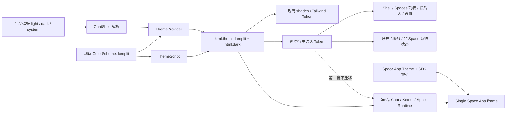

# VibeChat 宿主设计系统与主题工作流实施方案

> 生命周期：开发中
> 文档类型：计划
> 状态：实施中
> 更新日期：2026-08-28
> 维护范围：`packages/ui`、`packages/react-shared`、`apps/web-app` 宿主 Shell、Spaces 列表与发现、联系人、设置与账户、非 Space 系统界面、响应式与视觉验收
> 对应稳定设计：[VibeChat MVP 产品与技术设计](../../stable/designs/vibechat-mvp-product-and-technical-design.md)
> 相关实施记录：[Space App 设计演进与实施记录](./space-app-design-transition.md)

> 后续扩展：本计划完成后，用户于 2026-08-28 另行授权可信 Kernel 的视觉刷新；该独立范围见 [Space Kernel Lamplit 视觉刷新实施记录](./space-kernel-lamplit-visual-refresh.md)，不追溯改变本文首批冻结事实。

## 1. 目的与当前事实

本文把已经确认的“灯下房间”方向转化为可实施、可验证、可持续迭代的宿主设计系统方案。实施原则是 **reuse first**：复用并扩展已经工作的主题链路，在其上补齐语义 Token、设计语言与质量工作流，不建立平行主题系统。

当前代码已经具备以下基础：

- `packages/ui/src/themes.ts` 已定义 `Theme = light | dark`、`ColorScheme`、主题 class registry、存储读写和 `applyThemeToDocument`。
- `packages/ui/src/styles/themes/*.css` 已使用 `.theme-*` 与 `.theme-*.dark` 表达 ColorScheme 的 Light/Dark 变量。
- `packages/react-shared/src/components/theme-script.tsx` 已在 hydration 前应用主题，避免错误主题闪屏。
- `packages/react-shared/src/hooks/use-theme.tsx` 已提供 Provider、持久化和运行时切换。
- `apps/web-app/src/features/chat/chat-shell.tsx` 已把产品 `light`、`dark`、`system` 偏好解析为现有 `Theme`。
- `apps/web-app/src/styles.css` 已统一导入 `@vibechat/ui/styles/index.css`，不需要新增应用级主题入口。
- `apps/web-app/src/features/chat/chat.css` 已有 `.vc-app` / `.dark .vc-app` 产品变量，现有状态、路由、交互和响应式基础可以继续使用；旧页面结构仍带有营销 Hero、Dashboard 指标卡和 SaaS 卡片墙语义，不能只做变量换肤。
- 当前根路由直接跳转到 `/spaces`，因此 `/spaces` 列表页就是已登录产品的主界面；联系人、发现、设置和服务入口与它共享宿主导航及大量样式。
- `/spaces/:spaceId` 的 Kernel Bar、Space Runtime 和单一 Space App iframe 属于另一条高风险链路；本轮只建立不回归边界，不对其做视觉迁移。

因此本轮不是“重建主题系统”，而是完成三个缺口：

1. 把 `lamplit` 加入现有 `ColorScheme`，提供已经确认的 Light/Dark 视觉方向。
2. 在现有 CSS 变量体系上增加稳定的宿主语义 Token，并为 `chat.css` 建立渐进兼容映射。
3. 在保留真实数据、业务状态和路由行为的前提下，重组已登录、非 Space、非消息界面的信息层级，使页面真正成为“房间走廊”，而不是旧 Dashboard 的暖色版本。
4. 完成非 Space 宿主的视觉统一后，建立可重复的验收和主题更新流程。

本文描述目标与实施顺序，不代表这些能力已经完成。只有代码、测试、真实浏览器走查和文档闭环形成证据后，才能把对应阶段标记 Complete。

当前实施状态（2026-08-27）：

- [x] 确认 reuse-first 架构、非 Space 首批范围和冻结边界。
- [x] 在 `tests/e2e/TEST-CATALOG.md` 建立 #41 验收目录。
- [x] P1 Lamplit ColorScheme 与宿主语义 Token 已完成，并沿用现有主题入口与运行时。
- [x] P2–P4 非 Space 宿主页面首批迁移已完成；Chat、Kernel 与 Space Runtime 未进入改动范围。
- [x] P5 首轮响应式与视觉走查完成，覆盖四个基准视口、Light/Dark 和共用弹层。
- [x] P6 当前批次冻结回归完成：定向 E2E 已证明 Lamplit 不进入运行中的 Space。
- [x] 结构质量纠偏完成：`/spaces` 紧凑封面卡与 Finder 已替代旧 Hero、Dashboard 和大型房间布景，账户指标卡和服务卡片墙已移除。
- [x] 交付收口：全量 E2E 已执行并记录真实结果；61 项中 57 项通过、0 项失败、4 项按环境配置跳过，冻结的 Chat/Runtime 未出现本轮主题引入的回归。

## 2. 实施原则与非目标

### 2.1 实施原则

1. **一条运行时链路**：继续使用 `Theme`、`ColorScheme`、`.dark`、`ThemeScript`、`ThemeProvider` 和现有存储结构。
2. **主题只定义视觉值**：`lamplit.css` 负责 Token，不通过页面 selector 修补 Shell、Finder 或 Kernel。
3. **组件只理解语义**：宿主组件逐步消费画布、表面、文字、边界、强调、状态和阴影角色，不读取 `lamplit` 名称。
4. **渐进迁移**：先映射现有 `.vc-app` 变量，再按实际触及范围替换原始色值；结构调整只发生在已确认的非 Space 页面，不为了目录整齐大拆 `chat.css`。
5. **按页面职责划界**：即使非消息页面位于 `features/chat` 并共用 `chat.css`，也只修改本轮页面对应的 selector；不以目录名决定范围。
6. **只抽取稳定重复项**：只有已经跨三个以上位置表达同一意图的值才升级为公共 Token；一次性布局参数留在组件 recipe 中。

### 2.2 明确不做

- 不新增 `HostThemeId`，`lamplit` 就是现有 `ColorScheme` 的新成员。
- 不新增 `data-vc-theme`、`data-vc-mode` 或第二套根节点状态；继续使用 `.theme-lamplit` 与 `.dark`。
- 不新增主题存储 schema、版本字段或第二个 storage key；继续使用现有 `{ theme, colorScheme }`。
- 不重写 `applyThemeToDocument`、`ThemeScript` 或 `ThemeProvider`；仅在有明确兼容缺口和测试证据时做最小修改。
- 不删除或重命名 `default`、`claude`、`cosmic-night`、`modern-minimal`、`ocean-breeze`、`perplexity` 等历史 ColorScheme。
- 不一次性拆分 2200 多行的 `chat.css`；允许为已确认的非 Space 信息架构重组页面 DOM 与局部 selector，但不把主题换色本身当作重写业务组件的理由。
- 不让 VibeChat 宿主 Light/Dark 重绘用户 Space；Space App 主题与 Host 主题继续完全独立。
- 第一批不修改 `/spaces/:spaceId`、`/rooms/:roomId`、`/messages`、AI Chat、消息时间线、输入框、消息操作、Kernel、Space Runtime、App Bridge 或 iframe。
- 第一批不包含登录注册、Onboarding、Site、Admin 和 Docs；它们不属于已登录产品宿主纵向切片，后续按独立入口评审。

## 3. 已确认的宿主设计语言

### 3.1 使用模式

宿主界面是长期操作型界面。用户需要快速识别空间、进入活动房间并完成日常交流；设计表达必须服务于舒适、清晰和稳定使用，不能做成 SaaS Dashboard、工具面板、营销页或杂志版式。

### 3.2 视觉世界

- Light：明亮暖白的矿物表面，带极轻鼠尾草倾向；通过相邻表面的明度差、细边界、受控高光和柔和阴影保持质感，不能变成纯白扁平界面。
- Dark：炭灰吸音表面、低亮度层级与少量暖光；不是对 Light 做数值反转。
- 强调色：低频使用杏橙，只承担主行动、焦点、活跃状态和少量空间引导，不铺满容器。
- 宿主退后：导航、Finder、Kernel 和系统状态可识别但不抢 Space 的视觉主权。

### 3.3 结构与响应式

- 桌面一级导航位于左侧；搜索和账户位于底部，顶部只显示当前页面或 Space 上下文。
- `/spaces` 是“房间走廊”：首屏用真实 Space 数据呈现紧凑的封面卡；单个 Space 不横向撑满内容区，卡片只保留封面、名称、人数、更新时间和未读状态，不模拟灯具、家具、气泡或人物布景；不使用营销 Hero、统计 Dashboard 或管理型 SaaS 卡片网格。
- 完整空间列表、搜索、未读筛选和管理操作进入 Finder；桌面为侧边抽屉，移动端为 Bottom Sheet。
- `/spaces/:spaceId` 顶部只有可信 Kernel；iframe 直接占据其余视口。
- 移动端保留底部 Dock，并按内容重新编排，不是桌面缩小版。
- 设置与账户采用安静、清楚的分组和逐级展开，不做后台管理面板或指标 Dashboard。
- 服务与付费状态继续属于产品宿主，但视觉上使用相同表面、表单、状态与反馈语言，不另起一套 SaaS 风格。

## 4. 第一批页面边界

当前根路由直接跳转到 `/spaces`，所以本轮没有另造一个“首页”。第一批按以下路由和组件边界执行：

| 分组 | 页面与组件 | 本轮工作 |
| --- | --- | --- |
| 全局宿主 | `ChatShell`、`ProductShell`、桌面 Rail、移动 Dock、全局连接/空/错状态 | 统一导航、页面容器、响应式、焦点和主题表面 |
| 主界面与 Spaces 外层 | `/spaces`、`SpacesPage`、`SpaceRail`、`NewSpaceDialog` | 更新空间列表、筛选、未读、邀请、创建流程；链接行为不变 |
| 发现与模板 | `/discover`、`/discover/spaces/:spaceId` | 更新模板浏览、搜索、分类、详情和收藏；不进入运行中的 Space |
| 联系人 | `/contacts` | 更新联系人列表、搜索、好友请求、资料详情、备注和发起 Space 入口 |
| 设置与账户 | `/me`、`/account` | 更新个人资料、偏好、设备、隐私、安全、账务和数据状态 |
| 产品服务 | `/services`、`/premium-features`、支付结果页 | 统一宿主外观、表单、计划、上传入口和结果反馈；不改业务规则 |
| 共用反馈 | 上述页面使用的 dialog、menu、toast、tooltip、empty/loading/error | 统一语义和可访问状态 |

下列区域在第一批明确冻结：

| 冻结范围 | 对应实现 |
| --- | --- |
| 运行中的 Space | `/spaces/:spaceId`、`SpacePage` |
| Chat 与消息 | `/rooms/:roomId`、`/messages`、timeline、composer、消息操作 |
| Space 宿主运行时 | `SpaceKernelControls`、`SpaceRuntime`、`SpaceAppSurface`、App Bridge、iframe |
| 其他对话体验 | `/ai` 及 Default Chat App |
| 底层行为 | Matrix、Chat Core、Space SDK、Runtime、认证、计费与权限规则 |

`chat.css` 是历史聚合文件名，不是改动边界。允许修改其中属于上表第一批页面的规则，但必须通过 selector 清单和回归测试证明没有影响冻结区域。

## 5. 复用现有主题链路



保持以下不变量：

1. `Theme` 仍只表达解析后的 `light` 或 `dark`；产品的 `system` 偏好继续由现有产品层解析。
2. `ColorScheme` 仍表达配色与材质方案，`lamplit` 通过 `theme-lamplit` class 加入现有 registry。
3. Light 根状态为 `.theme-lamplit`，Dark 根状态为 `.theme-lamplit.dark`；不再创造另一套属性协议。
4. `applyThemeToDocument` 仍是 class 应用的唯一公共函数，ThemeScript 和 Provider 保持现有职责。
5. 第一批 Host Theme 只落到非 Space、非消息界面；Kernel 维持当前视觉，iframe 不接收 Host CSS 变量、滤镜、透明度、混合模式或颜色覆盖。
6. Space SDK 的 `ThemeTokens` 是独立版本化的 App 能力契约，不能复用 Host Token namespace。

## 6. Token 架构

### 6.1 分层模型

| 层级 | 现有或目标位置 | 组件是否直接消费 | 说明 |
| --- | --- | --- | --- |
| 现有通用 Token | `themes/*.css` 的 `--background`、`--card`、`--foreground`、`--border` 等 | 共享 UI 继续消费 | 保留 shadcn/Tailwind 基础，不改现有组件契约 |
| 宿主语义 Token | `semantic-tokens.css` 基线映射 + `themes/lamplit.css` 精确值 | 新迁移的 Host 组件消费 | 画布、表面、文字、边界、强调、状态和材质角色 |
| 旧宿主别名 | `chat.css` 的 `--vc-canvas`、`--vc-surface`、`--vc-ink` 等 | 迁移期旧规则继续消费 | 映射到新语义 Token，保证现有 selector 无需同时改写 |
| Component recipe | `chat.css` 或未来按证据拆出的组件 CSS | 仅组件内部 | Rail 宽度、列表宽度、设置行高度等结构参数，不属于主题 API |

`semantic-tokens.css` 只提供从现有通用 Token 到 Host 语义的安全基线，使历史 ColorScheme 不会出现未定义变量；`lamplit.css` 再为灯下房间提供精确 Light/Dark 值。它们都通过现有 `styles/index.css` 导入，不形成第二个 CSS 入口。

### 6.2 第一版宿主公共 Token

首版只建立已经在 Shell、Spaces 列表、发现、联系人、设置、账户和系统状态中反复出现的角色：

```text
--vc-color-canvas
--vc-color-surface
--vc-color-surface-raised
--vc-color-surface-sunken
--vc-color-overlay
--vc-color-text
--vc-color-text-muted
--vc-color-text-faint
--vc-color-border
--vc-color-border-strong
--vc-color-accent
--vc-color-on-accent
--vc-color-focus
--vc-color-success
--vc-color-warning
--vc-color-danger

--vc-shadow-low
--vc-shadow-medium
--vc-shadow-high
--vc-opacity-disabled
--vc-opacity-scrim
```

字体、间距、圆角、动效和 z-index 暂不预先铺满全套 Token。先复用现有 Tailwind、组件变量和 CSS 值；只有同一语义稳定重复三次以上，才提升为公共 foundation token。

### 6.3 兼容映射

Token 迁移的第一步不改页面规则，并复用现有 `data-mode` 与 `data-space-open` 划出采用范围。当前 `.vc-app` / `.dark .vc-app` 的值保留为冻结 Space/Chat 的兼容基线，只让非 Space 宿主映射到新语义 Token：

```css
.vc-app[data-mode="product"],
.vc-app[data-mode="matrix"]:not([data-space-open]) {
  --vc-canvas: var(--vc-color-canvas);
  --vc-surface: var(--vc-color-surface);
  --vc-surface-strong: var(--vc-color-surface-raised);
  --vc-ink: var(--vc-color-text);
  --vc-muted: var(--vc-color-text-muted);
  --vc-soft: var(--vc-color-text-faint);
  --vc-line: var(--vc-color-border);
  --vc-line-soft: color-mix(in oklab, var(--vc-color-border) 58%, transparent);
  --vc-accent: var(--vc-color-accent);
}
```

这样现有 `background: var(--vc-canvas)`、`color: var(--vc-ink)` 等规则继续工作，`data-space-open` 的运行 Space 仍使用当前兼容值。完成兼容映射后，再在实际修改的非 Space 组件中重组信息层级并直接消费公共语义 Token；冻结区域的 DOM、selector 和原始值本轮不清理。

### 6.4 Token 约束

- 主题文件只定义 Token，不包含 `.vc-primary-rail`、`.vc-space-card` 等组件 selector。
- 页面组件不得读取参考色阶或主题名；需要新角色时先判断现有语义是否足够。
- 颜色、阴影、透明度属于主题；断点、阅读顺序、触控尺寸和关键拓扑不随主题变化。
- 新增公共 Token 必须同时提供基线映射、Lamplit Light、Lamplit Dark、用途说明和自动化断言。
- 删除或改变公共 Token 语义属于契约变更；在所有消费方迁移前不得执行。

## 7. 文件级实施边界

目标是在现有目录内做最小增量：

```text
packages/ui/src/
├── themes.ts                              # 在现有 ColorScheme/registry 中增加 lamplit
└── styles/
    ├── index.css                          # 继续作为唯一公共入口
    ├── semantic-tokens.css                # 通用 Token → Host 语义安全映射
    └── themes/
        └── lamplit.css                    # shadcn Token + Host Token，Light/Dark 成对定义

apps/web-app/src/features/chat/
├── chat-shell.tsx                         # 全局 Rail / Dock / 非 Space 宿主状态
├── spaces-page.tsx                        # 已登录主界面
├── space-rail.tsx                         # Space 列表与 Finder 能力
├── discover-page.tsx
├── contacts-page.tsx
├── me-page.tsx
├── new-space-dialog.tsx
└── chat.css                               # 只改上述页面 selector，冻结 Chat / Kernel / Runtime

apps/web-app/src/features/
├── product/product-shell.tsx
├── account/*
├── services/*
└── payment/*

tests/e2e/specs/
└── host-lamplit-ui.spec.ts
```

明确不新增 `host-themes.ts`、`styles/host/` 平行主题目录，也不计划为了本轮工作重写 `use-theme.tsx` 或 `theme-script.tsx`。

| 位置 | 计划变更 | 保留内容 |
| --- | --- | --- |
| `packages/ui/src/themes.ts` | 增加 `lamplit` 到 `ColorScheme`、class registry、清理列表和展示配置 | 现有类型、函数签名、历史 scheme 和存储格式 |
| `packages/ui/src/styles` | 增加语义基线与 `lamplit.css`，更新现有入口 import | 现有主题文件和通用 CSS 入口 |
| `config/public.ts` | 本批不修改；Lamplit 由 Web 宿主 Shell 受控启用 | 共享默认值、Site/Admin 行为和环境变量边界 |
| `packages/react-shared` | 原则上不改；仅补充现有行为测试，必要时修正已证实的兼容缺口 | Provider、ThemeScript、storage key 和公开 API |
| `apps/web-app/src/features/chat` | 更新 Shell、Spaces 外层、发现、联系人、设置和创建弹层；在聚合 CSS 中按 selector 渐进迁移 | `SpacePage`、消息界面、Kernel、Runtime、App Bridge 和 iframe |
| `apps/web-app/src/features/product`、`account`、`services`、`payment` | 统一产品 Shell、设置延伸、服务与付费结果表面 | 认证、计费、上传、AI 和权限业务规则 |
| `packages/i18n` | 仅新增真实可见文案 | 英文先定义、中文同步 |
| `tests/e2e` | 保留宿主主题、响应式与 Space 隔离的两项聚合回归 | 其他产品功能继续由既有 specs 负责 |

## 8. 现有存储与发布兼容

现有主题存储 `{ theme, colorScheme }` 保持不变，不新增版本和迁移框架。

当前批次没有切换共享 `defaultColorScheme`，也没有迁移或覆盖任何已存储偏好。`ChatShell`、`ProductShell` 与 Portal 弹层在 Web 的非 Space 范围受控添加 `theme-lamplit`；Light/Dark 仍由既有产品偏好和 `.dark` 链路决定。这样 Site、Admin、ThemeScript、Provider、损坏值回退和未知 ColorScheme 的处理均保持原状。

将来若要把 Lamplit 提升为共享默认或开放 ColorScheme 选择，必须单独确认用户可见选择、首次加载、刷新、hydration、跨应用影响和旧隐式默认迁移；本轮证据不能被视为已经授权该迁移。

任何兼容修改都必须先对 `applyThemeToDocument`、`ThemeProvider` 和 `ThemeScript` 做 GitNexus upstream impact，并用首次加载、刷新和 hydration 测试证明必要性。没有兼容缺口时不修改这些符号。

## 9. 分阶段实施

### P0：锁定事实与验收目录

工作：

- 在 `tests/e2e/TEST-CATALOG.md` 先定义 Shell、`/spaces`、发现、联系人、设置、账户与服务的 Light/Dark、响应式和行为保持场景。
- 建立第一批 selector allowlist 与冻结 selector denylist；盘点 `chat.css` 中两者共享的变量和规则。
- 为 `/spaces/:spaceId`、Kernel 和 iframe 保存当前桌面/移动基线，作为“本轮未改”的回归证据。
- 对进入代码修改范围的符号执行 GitNexus impact；HIGH 或 CRITICAL 风险先报告。

退出标准：每个路由和 selector 都能归入“本轮更新”或“明确冻结”，不存在按文件整体改写的模糊范围。

### P1：扩展现有 `@vibechat/ui` 主题

工作：

- 将 `lamplit` 加入现有 `ColorScheme`、`COLOR_SCHEMES`、class 映射、清理列表和 `THEME_CONFIG`。
- 增加 `semantic-tokens.css`，以现有 shadcn/Tailwind Token 为历史 scheme 提供安全基线。
- 增加 `themes/lamplit.css`，同时提供完整 shadcn Token 与宿主语义 Token；Light 和 Dark 独立定义。
- 继续从 `styles/index.css` 导出，不改应用导入路径。

退出标准：仅通过现有 `applyThemeToDocument('light' | 'dark', 'lamplit')` 即可获得完整变量；历史 scheme 仍可正常应用。

### P2：全局 Shell 与主界面骨架

工作：

- 用现有 `data-mode` 与 `data-space-open` 只为非 Space 宿主启用语义 Token 映射，保留运行 Space 的当前兼容值。
- 对齐 `ChatShell` 与 `ProductShell` 的桌面 Rail、移动 Dock、品牌入口、账户入口、页面画布和全局服务状态。
- 保持已确认的信息结构：桌面主要操作不放在顶层，搜索和账户沉到底部；移动端使用 Bottom Dock。
- 在 Web 宿主 Shell 受控添加 `theme-lamplit`，不改共享默认 ColorScheme，不覆盖真实用户选择。

退出标准：所有第一批路由共享同一宿主骨架；进入 `/spaces/:spaceId` 后仍保持冻结基线。

### P3：Spaces 主界面与发现

工作：

- 更新 `/spaces`、`SpacesPage` 与 `SpaceRail`：用真实 Space 模板身份生成紧凑封面卡，单卡保持有界宽度并只显示直接相关的 Space 信息；完整列表、搜索、未读筛选和管理进入 Finder，桌面使用侧边抽屉、移动端使用 Bottom Sheet；创建与模板入口位于 Space 内容之后。
- 更新 `NewSpaceDialog` 的参与人、模板选择和确认步骤，但不改变创建 API、权限或数据结构。
- 更新 `/discover` 与模板详情：让浏览、收藏和使用模板属于同一设计语言，不把模板卡做成 SaaS 商品表。
- 保持进入 Space 的链接、mark-read、邀请处理、收藏和创建行为不变。

退出标准：`/spaces` 作为已登录主界面完成桌面与移动端视觉更新，但 `/spaces/:spaceId` 没有页面级视觉改动。

### P4：联系人、设置与产品服务

工作：

- 更新 `/contacts` 的好友请求、搜索、联系人列表、资料详情、备注、屏蔽和发起 Space 入口；桌面与移动端分别编排。
- 更新 `/me` 的个人资料、外观、语言、通知、设备会话、隐私、缓存和退出；保留所有真实状态、确认与错误处理。
- 更新 `/account`、`/services`、`/premium-features` 和支付结果页：账户采用安静的概要记录与最近账本，不保留指标卡 Dashboard；服务采用可扫读清单，不保留套餐卡片墙；计划、上传入口和反馈状态继续使用同一宿主语言。
- 统一上述页面重复使用的 heading、section、row、field、button、dialog 和 inline state；只有三个以上同意图用例才抽共享 recipe。
- 不进入 `/ai` 的对话页，也不借视觉更新修改认证、计费、上传、权限或产品 API。

退出标准：第一批所有非 Space 页面在 Light/Dark、成功/空/错/加载状态下达到同一质量水平，业务行为保持不变。

### P5：移动端与质量走查

工作：

- 在 1440×900、1024×768、390×844、360×800 四个基准视口成对检查 Light/Dark。
- 覆盖 Shell、Spaces 列表、发现、联系人、设置、账户、服务、共用弹层和系统反馈；Kernel 与 Chat 仍只做冻结回归。
- 验证触控目标、键盘顺序、焦点、长文本、中英文、0/1/典型/高数量、空/错/加载和 reduced motion。
- 专门检查 Light 的舒适度与材质：canvas、surface、raised、sunken、border、shadow 之间必须有层次，但避免整体压暗。

退出标准：移动端不是桌面缩小版；调整 Lamplit 不需要修改第一批页面组件；冻结路由截图和行为断言无变化。

### P6：冻结验收、治理与后续阶段

工作：

- 运行 `/spaces/:spaceId`、Kernel、iframe、消息命令和 Matrix 关键回归，只证明本轮没有破坏，不接受顺手视觉调整。
- 把经过核验的非 Space 宿主设计语言提升到稳定设计，把主题新增/修改/回滚流程提升为 Runbook。
- Chat、Kernel 和 Space Runtime 的视觉更新另立计划，重新做 impact、交互目标和验收基线，不自动继承本批范围。
- 根据实际复用证据决定是否将部分 Token 推广到 Auth、Onboarding、Site、Admin 或 Docs，不预先统一所有应用。
- 历史 ColorScheme 本轮全部保留；只有确认没有运行时、存储、文档和用户依赖后，另开清理任务。

退出标准：非 Space 宿主完成闭环，冻结区域零意外视觉或行为变化，后续 Chat/Space 工作有独立边界。

## 10. 主题更新工作流

以后新增或修改主题统一遵循：

1. 在现有 `themes.ts` 注册或确认 `ColorScheme`，不创建新的主题类型。
2. 在一个主题 CSS 文件内成对完成 Light/Dark 的通用 Token 与 Host 语义 Token。
3. 在真实 Web 路由中检查代表性非 Space 页面与四个基准视口，Light/Dark 成对评审。
4. 运行 `host-lamplit-ui.spec.ts`，确认宿主 Token、响应式和运行 Space 隔离。
5. 在整批宿主样式交付前运行仓库现有全量 E2E；功能行为继续由其所属既有 spec 负责，不在主题测试中重复建设。
6. 记录变更摘要、影响范围和回滚方式；只有真实发布后才写发布说明。

调整视觉值不应修改 ThemeProvider、页面 DOM 或产品状态。若一次主题更新需要改运行时或组件结构，应先判断它是否其实是契约或交互变更，而不是普通换肤。

### 10.1 当前批次实现证据

- `@vibechat/ui` 已增加 `lamplit` 注册、Light/Dark 主题值和宿主语义 Token 基线；ThemeProvider、ThemeScript、storage schema 与共享默认 ColorScheme 未修改。
- Lamplit 只挂载到 Web 的 `ChatShell`、`ProductShell` 和 Portal 创建弹层；Token 映射仅作用于 `.vc-app[data-mode="product"]` 与未打开 Space 的 Matrix 宿主。
- 首轮 Token 换肤完成后又进行结构质量纠偏：`/spaces` 首屏现在由真实 Space 数据驱动紧凑封面卡，单个 Space 不再占满首屏，完整列表、搜索与未读筛选进入桌面 Finder 抽屉或移动 Bottom Sheet；不再是营销 Hero、Dashboard 或大型房间布景。
- `/account` 已删除顶端 Tab 骨架与四块指标卡，改为侧边记录索引、账户概要与连续账本；`/services` 已从重复价格行/购买 CTA 改为可滚动方案架与单一购买门槛；`/contacts` 的零状态不再保留后台分屏，而是把搜索、灯光门廊和第一位联系人邀请组成同一空间。发现、设置、premium 和支付反馈沿用同一宿主语言。
- Finder 已补齐焦点进入、Tab 圈定、Escape 关闭、背景 `inert` 和触发点恢复；Lamplit 大标题已移除块状 OFL 展示字体，统一使用宿主无衬线字体栈的 Regular 字重和更舒展的字距，小尺寸正文和辅助信息保持长期可读尺度。
- 根级 [DESIGN.md](../../../DESIGN.md) 与 `.impeccable/design.json` 已从实际 Token、组件和成片固化“灯下房间”设计语言；后续主题迭代以语义 Token 和受控组件 recipe 为入口，不再通过页面级纠偏层换肤。
- 重建后的有效截图矩阵覆盖 `/spaces`、`/contacts`、`/account`、`/services` 的 1440×900 与 390×844 Light/Dark；此前 1024×768、360×800、发现、设置和创建弹层走查仍保留。重建后 `host-lamplit-ui.spec.ts` 再次 2/2 通过。
- 真实浏览器已检查 1440×900、1024×768、390×844、360×800，覆盖 Light/Dark、桌面 Rail、移动 Dock、创建弹层和主要非 Space 路由。
- `host-lamplit-ui.spec.ts` 定向 Chromium E2E 2/2 通过，覆盖 Token、Shell、响应式、`/spaces` 去 Dashboard 以及 `/spaces/:spaceId` 继续使用冻结兼容变量。
- 当前收口再次通过应用边界检查（344 个活动源码文件）、文档链接检查、19/19 workspace typecheck、14/14 package build、Backend/Web/Site/Admin/Space Runtime 5/5 production build、Docs production build 和 `git diff --check`。根 `pnpm` / Turbo 包装层受到本机 Corepack keychain/TLS `fetch failed` 影响，检查按相同脚本内容使用仓库锁定的 Node 24 和本地二进制直接执行；Backend 构建过程中 Wrangler 日志目录出现非阻断 EPERM，构建本身成功。
- 完整本地服务栈上的 61 项全量 Chromium E2E 最终为 57 通过、0 失败、4 按配置跳过，耗时 4.2 分钟；联盟推荐因 `AFFILIATE_ENABLED=false` 跳过 1 项，两个真实 Agent provider 场景和一个 Fake Agent 场景因对应 provider-ready 环境未启用跳过 3 项。
- Finder 信息架构落地后，既有持久化状态、社交邀请和完整 Matrix 操作用例已改为先从桌面 Rail 或移动端走廊入口打开 Finder，再检查完整 Space 列表；Matrix 长轮询 Context 使用有界清理，未删除或放宽任何业务断言。账户五项索引、Home/End 键盘选择、tabpanel 同步、390px 无横向溢出已补入 Lamplit 聚合回归。
- Space 封面卡精简后，桌面单卡实测为 320×278px、封面比例 16:10；吊灯、地面、人物与消息气泡均不再进入 DOM。更新后的宿主聚合 E2E 在桌面与 390px 移动视口再次 2/2 通过。
- 本批不再扩展主题专用测试场景；全量执行已覆盖账户/服务、认证、真实 Matrix 消息与邀请、会话撤销、Site/Admin/i18n、Space Runtime membership 和 Lamplit 2/2 聚合回归。

## 11. 验收矩阵

### 11.1 架构验收

- `lamplit` 是现有 `ColorScheme` 成员，通过现有 class registry 与 `applyThemeToDocument` 工作。
- ThemeScript、ThemeProvider、storage key、`ThemeState` 和 `.dark` 继续兼容。
- 新迁移的非 Space Host 组件只消费公共语义 Token，不读取主题名。
- 历史 ColorScheme 仍可应用，未定义宿主 Token 有基于现有通用 Token 的安全映射。
- 主题 CSS 不包含组件 selector；已迁移组件 CSS 不包含未允许的原始颜色。
- `data-mode` 与现有 `data-space-open` 只用于限定采用范围，不引入第二套主题状态。

### 11.2 视觉与交互验收

- Light 长期使用明亮、舒适，并通过表面层次、细边界和柔和阴影保留质感。
- Dark 与 Light 具有相同信息层级，但使用独立材质与对比关系。
- 桌面主要操作不堆在最顶层；左侧 Rail、底部搜索/账户符合已确认结构。
- 移动端使用底部 Dock，Finder 和内容按移动场景重新编排。
- 360px 至桌面宽度无水平溢出；触控目标至少 44px；键盘顺序与视觉顺序一致。
- 主行动、焦点、成功、警告和错误不只依赖颜色表达。
- `/spaces`、发现、联系人、设置、账户和服务呈现同一设计语言，但不会被做成同构卡片矩阵。

### 11.3 冻结区域验收

- `/spaces/:spaceId` Host DOM 仍只有 Kernel + 单一 iframe。
- `SpacePage`、Kernel、Runtime、消息时间线和输入交互的基线截图无非预期变化。
- Host Light/Dark 或 ColorScheme 切换不改变 iframe URL、ready Revision、App DOM 或 App 内 computed style。
- Runtime 失败不伪造默认 Chat 或用户 Space 内容。

### 11.4 验证命令

仅本计划文档变更执行：

```bash
pnpm docs:check
pnpm build:docs
```

进入代码阶段后按实际影响至少执行：

```bash
pnpm --filter @vibechat/ui typecheck
pnpm --filter @vibechat/ui build
pnpm boundaries:check
pnpm docs:check
pnpm typecheck
pnpm build
```

同时运行 `host-lamplit-ui.spec.ts` 的两项聚合回归，并在整批宿主 CSS 迁移后运行完整 `pnpm test:e2e`。联系人、创建、收藏、账户、服务和 Matrix 行为继续由仓库已有功能 specs 覆盖。

## 12. 风险与控制

| 风险 | 控制 |
| --- | --- |
| 为了未来扩展建立第二套系统 | 强制复用 `Theme`、`ColorScheme`、class、Provider、Script 和 storage；代码评审拒绝平行状态 |
| 破坏已经工作的界面基础 | 先 Token 映射，后按区域细化；保留真实数据、状态、路由、业务交互和冻结区域 DOM，只重组已确认的非 Space 信息架构并逐页视觉对照 |
| 现有用户被旧隐式默认卡住 | 只识别旧默认值并在现有对象格式内处理；发现真实用户选择时停止自动覆盖 |
| Token 数量膨胀 | 只有三个以上同意图用例才抽公共 Token；一次性值留在组件 recipe |
| 历史 ColorScheme 出现未定义变量 | `semantic-tokens.css` 以现有通用 Token 提供安全基线，所有历史 scheme 保留 |
| Light 提亮后变得廉价或扁平 | 成组评审 canvas、surface、raised、sunken、border、shadow，不只调整背景色 |
| Dark 只是机械反色 | `lamplit.css` 中 Light/Dark 各自完整定义并分别验收 |
| Host Theme 渗入 Space | namespace 分离、iframe 边界断言和切换前后 App 不变的 E2E |
| 大拆 CSS 引入无关回归 | 本轮不以拆文件为目标，只迁移触及区域；拆分必须另有复用或维护证据 |
| `chat.css` 共用规则误伤冻结区域 | 用现有 `data-mode` / `data-space-open` 限定语义映射，建立 selector allowlist/denylist 与冻结截图 |
| 一次覆盖太多页面导致质量摊薄 | 按 Shell → Spaces/发现 → 联系人/设置/账户/服务交付，每阶段独立浏览器验收后再进入下一阶段 |

## 13. 对上一版方案的修正

| 上一版设想 | 本版决定 |
| --- | --- |
| 新建 `HostThemeId` | 删除；扩展现有 `ColorScheme` |
| 新增 `data-vc-theme` / `data-vc-mode` | 删除；继续 `.theme-lamplit` / `.dark` |
| 新建主题存储 schema | 删除；继续 `{ theme, colorScheme }` |
| 重写 ThemeScript / ThemeProvider | 删除；保留现有运行时，只补有证据的兼容测试或最小修正 |
| 新建 `host-themes.ts` 与平行目录 | 删除；使用 `themes.ts`、`styles/themes/` 和现有入口 |
| 大规模拆分 `chat.css` | 删除；先做旧 Token 映射和按区域渐进迁移 |
| 清理历史主题 | 移出本轮；全部保留，未来单独评估 |
| 首批迁移 Kernel 与 Space Runtime | 移出本轮；先完成非 Space 宿主，Kernel/Chat/Runtime 保持基线 |

## 14. 完成条件

本文只有满足以下条件后才能由 Active 草案提升或拆分为稳定设计与 Runbook：

1. `lamplit` 已作为现有 `ColorScheme` 通过原有主题链路工作，Light/Dark Token 完整。
2. 非 Space 的 `ChatShell`、`ProductShell`、`/spaces`、发现、联系人、设置、账户、服务与共用反馈已按语义 Token 完成渐进迁移。
3. `/spaces/:spaceId`、Chat、Kernel、Runtime、iframe、ThemeProvider、ThemeScript、storage、历史 ColorScheme 和业务行为没有回归。
4. 真实浏览器走查覆盖本批页面的中英文、关键状态、四个基准视口和 reduced motion。
5. `host-lamplit-ui.spec.ts` 证明 Host Theme 不改变运行中的 Space，并且仓库全量 E2E 已执行并记录实际结果。
6. 文档检查、typecheck/build 和真实浏览器走查均通过并记录实际结果。
7. `packages/ui` README、TEST-CATALOG、当前开发重点和相关用户文档已经同步。
