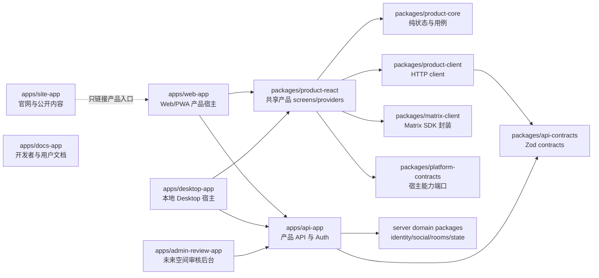

# Apps 边界与 Desktop 架构 RFC

> 生命周期：开发中
> 文档类型：RFC
> 状态：评审中
> 更新日期：2026-08-12
> 维护范围：`apps/*`、共享前端 packages、产品 API、Web/PWA 与未来 Desktop 宿主
> 稳定来源：[VibeChat MVP 版本产品与技术设计](../stable/designs/vibechat-mvp-product-and-technical-design.md)

## 1. 提案摘要

当前 `apps/web-app` 同时承担主站、认证、聊天产品、旧 SaaS 页面、后台和全部 HTTP API，已经形成部署、依赖和产品边界耦合。未来 Desktop 如果直接复用这个 app，只能选择加载远程站点或复制整套 TanStack Start 应用；两种做法都会把 SSR、Cookie、路由、旧业务和 Cloudflare 运行时一起带入桌面端。

本 RFC 建议：

1. 保留 `apps/web-app` 名称，将它逐步收敛为唯一的 Web/PWA 产品宿主。
2. 新建独立 `apps/site-app` 承载官网与公开内容；主站不导入产品服务端代码。
3. 将产品 HTTP 边界抽到 `apps/api-app`，Web 可通过同源网关访问，Desktop 通过显式 API origin 访问。
4. Web 与 Desktop 共同组合 `packages/product-*`、`packages/matrix-client` 和平台能力接口；任何 app 不得导入另一个 app。
5. `apps/desktop-app` 打包本地产品前端资源，不把线上 `web-app` 当远程 WebView 页面。
6. 旧 AI、计费、推广和通用后台能力先隔离，不默认迁入新的产品 app 或产品 API。
7. 采用渐进迁移，不进行目录整体复制或一次性重写。

Desktop 不属于当前 Web/PWA MVP 的既定发布范围。本 RFC 只确保当前拆分不会封死 Desktop；是否进入正式产品路线，需要在完成 Desktop 技术 spike 后更新稳定设计和产品路线图。

## 2. 当前实现事实

### 2.1 Apps 与构建边界

仓库当前只有两个 app：

| App | 当前职责 | 问题 |
| --- | --- | --- |
| `apps/web-app` | 官网、认证、聊天、旧 SaaS、后台、产品 API、支付/AI API | 所有页面和运行时共享一次构建、部署和依赖图 |
| `apps/docs-app` | Fumadocs 文档站 | 已独立，但名称与稳定设计中的 `docs-site` 不一致 |

`libs/*` 不属于 pnpm workspace package，没有独立 `package.json`、exports、依赖声明或构建门槛。`apps/web-app/tsconfig.json` 直接把全部 `libs/**/*.ts(x)` 和全局配置纳入同一编译单元，因此“共享”目前是源码别名，不是受约束的包边界。

### 2.2 Web 路由混合

截至本 RFC 盘点：

| 路由族 | 文件数 | 内容 |
| --- | ---: | --- |
| 聊天产品页面 | 8 | messages、rooms、contacts、discover、me |
| 认证页面 | 7 | signin、signup、OTP、phone、reset 等 |
| 主站与旧 SaaS 页面 | 13 | 首页、blog、pricing、dashboard、AI、生成、upload 等 |
| 后台页面 | 32 | users、orders、credits、pricing、blog、affiliate 等 |
| 旧 `/api/*` 服务端路由 | 51 | auth、AI、支付、affiliate、admin、upload 等 |
| 产品 `/v1/*` 路由 | 16 | bootstrap、profile、social、rooms、spaces、preferences |

`apps/web-app/src` 约 25,398 行，聊天 feature 约 5,361 行，HTTP route 约 4,343 行。任何聊天发布都会重新验证和部署旧支付、AI、博客和后台依赖；任何主站改动也会触发 Matrix 与产品 API 构建。

### 2.3 Desktop 复用阻碍

聊天 UI 已是 React，但还不是可由多个宿主组合的产品前端：

- `apps/web-app/src/features/chat` 直接导入 TanStack Router 的 `Link`、`useNavigate` 和 `useRouterState`。
- 页面和 store 直接使用 `fetch('/v1/...')`、`fetch('/api/auth/...')`，默认 API 与页面同源。
- 登录、onboarding、退出和错误恢复直接调用 `window.location.*`。
- Matrix runtime 直接选择浏览器 IndexedDB；文件、通知、深链、更新和安全存储没有平台接口。
- `libs/auth` 同时暴露 Better Auth 服务端实例和 React client，客户端/服务端边界依赖调用者自觉。
- `config.ts` 同时承载公开配置与服务端 provider 配置。
- 产品 API 只能以 TanStack route 形式存在，Desktop 没有稳定、可版本化的独立 API origin 和认证方式。

## 3. 设计目标与非目标

### 3.1 目标

- 官网、Web 产品、产品 API、Desktop 和文档可独立构建、部署、回滚和扩容。
- Web 与 Desktop 复用同一套产品 screens、状态模型、API client 和 Matrix client，不复制 feature 代码。
- 产品 UI 不知道 TanStack、Tauri、Cookie、绝对域名或文件系统细节。
- 服务端领域逻辑不依赖 TanStack route；route 只做运行时适配。
- API contract、错误码和序列化形状由一个 workspace package 管理。
- 当前 Web 用户 URL 和 Cookie 会话在迁移期间保持兼容。
- 新 app 只有在有真实职责、构建和验收时才创建，避免生成新的空架子。

### 3.2 非目标

- 本 RFC 不立即实现 Desktop。
- 不在本轮确定 Desktop 正式发布日期或支持的操作系统矩阵。
- 不把全部 `libs/*` 一次性重命名或迁入 `packages/*`。
- 不借拆分把旧 AI、支付、推广、博客和通用后台自动认定为 VibeChat 产品范围。
- 不在主站复制一套登录态和聊天业务逻辑。
- 不通过 iframe 或远程 WebView 把线上 Web 产品直接包装为 Desktop。
- 不在 app 拆分中改变 Matrix、产品数据库和 Better Auth 的数据权威。

## 4. 目标应用拓扑



### 4.1 App 职责

| App | 责任 | 明确禁止 |
| --- | --- | --- |
| `site-app` | 首页、功能说明、公开 blog、下载入口、法律页面、SEO | 数据库、Matrix SDK、聊天 store、管理后台、产品 Cookie 逻辑 |
| `web-app` | 认证 UI、onboarding、messages、contacts、discover、me、rooms、PWA 能力 | 官网内容管理、旧 SaaS 页面、领域数据库写入、另一个 app 的源码 |
| `desktop-app` | Desktop 启动、窗口、深链、系统通知、文件选择、安全存储、更新、平台适配 | 加载线上产品 URL、直接访问数据库、复制 Web feature |
| `api-app` | Better Auth HTTP 挂载、产品 `/v1`、上传授权、Matrix identity/room bridge、请求级 DB/日志 | React 页面、Matrix 浏览器 sync、官网内容 |
| `docs-app` | 用户、SDK、CLI 和部署文档 | 产品运行时依赖 |
| `admin-review-app` | A4 空间审核、撤销和治理 | 继承旧 SaaS 通用 admin；在 A4 前创建空 app |

### 4.2 本地端口建议

| 服务 | 端口 |
| --- | ---: |
| Web 产品 | `8001` |
| 产品 API | `8002` |
| 官网 | `8003` |
| 文档 | `8004` |
| 审核后台 | `8005` |
| Desktop Vite dev server | `8006` |
| 预留 | `8007` |
| Synapse | `8008` |

端口只是本地约定，不进入 API contract。生产建议使用 `www`、`app`、`api`、`docs` 和受限的内部 review 域名。

## 5. 目标 Package 边界

第一轮只建立 Desktop 与 app 拆分真正需要的 packages：

| Package | 内容 | 允许依赖 |
| --- | --- | --- |
| `@vibechat/api-contracts` | Zod schema、DTO、错误码、contract version | Zod 与纯 TS |
| `@vibechat/product-client` | profile/social/rooms/spaces/session API client；可注入 base URL 与 auth transport | api-contracts |
| `@vibechat/product-core` | 与 React、路由、运行时无关的产品状态、用例和 selector | api-contracts、product-client 接口 |
| `@vibechat/matrix-client` | `matrix-js-sdk` 生命周期、timeline、媒体与 storage port | matrix-js-sdk、纯契约 |
| `@vibechat/platform-contracts` | navigation、storage、file、notification、deep-link、update、external-link 能力接口 | 纯 TS |
| `@vibechat/product-react` | ChatProvider、宿主 shell、screens、hooks | 上述 packages、design system、i18n |

后续再按证据迁移 `design-system`、`auth-client` 和 server domain packages。现有 `libs/identity`、`libs/social`、`libs/rooms`、`libs/product-state` 已有较清晰领域边界，可以先由 `api-app` 继续源码引用，再逐个升级为 workspace package；不需要为目录整齐一次性搬迁全部通用 SaaS 库。

### 5.1 强制依赖规则

```text
apps/* -> packages/* -> 第三方依赖
apps/api-app -> server domain packages -> database/providers

禁止：packages/* -> apps/*
禁止：一个 app -> 另一个 app
禁止：product-react -> TanStack Router / Tauri API / server domain
禁止：client package -> database / Better Auth server / Cloudflare binding
```

通过 package `exports`、独立 tsconfig 和边界检查脚本执行规则，不能只写在文档里。

## 6. Web 与 Desktop 的共享方式

### 6.1 共享 screens，不共享 app

`product-react` 输出路由无关的 screen 和 provider，例如：

```ts
interface ProductNavigation {
  openMessages(): void
  openContacts(): void
  openRoom(roomId: string): void
  openSignIn(options?: { returnTo?: string }): void
  replaceOnboarding(): void
}

interface ProductEnvironment {
  navigation: ProductNavigation
  api: ProductApiClient
  auth: ProductAuthClient
  files: FileCapability
  notifications: NotificationCapability
  externalLinks: ExternalLinkCapability
  storage: ClientStorageCapability
}
```

Web route 文件负责把 TanStack navigation、浏览器文件选择和 Web Notification 适配进去；Desktop 入口负责把本地 router、Tauri command、OS 通知、深链和安全存储适配进去。共享 screen 不直接调用 `window.location`、相对 `fetch` 或 Tauri `invoke`。

### 6.2 Matrix runtime

Web 与 Desktop 都可以使用 `matrix-js-sdk`，但初始化必须接收 storage、网络状态和日志接口。Web 默认使用 IndexedDB；Desktop spike 必须验证系统 WebView 的持久化、升级和崩溃恢复。如果 IndexedDB 在目标平台不满足要求，再实现 Desktop storage adapter，不能提前 fork Matrix 逻辑。

Matrix access token 只进入 runtime 内存和受控 SDK storage，不写入普通 localStorage。Desktop 原生层不得提供一个可被任意前端代码读取的通用 secret API。

### 6.3 Desktop 壳候选

默认技术候选为 Tauri 2，原因是本项目需要本地打包的 Web UI、细粒度系统 capability、深链、通知、文件和更新，而不需要内置完整 Chromium。该选择必须通过 spike 才能成为稳定决策，至少验证：

- macOS 与 Windows 的 WebView/IndexedDB 持久化。
- 系统浏览器认证回跳与单实例深链。
- Matrix 长连接在前台、休眠和网络切换后的恢复。
- 自动更新签名与降级策略。
- 最小 capability allowlist；产品 UI 不能获得任意 shell/文件系统权限。
- 产物体积、冷启动、崩溃日志和 CI 签名流程。

若 spike 无法满足这些条件，再比较 Electron；不能仅以安装包大小决定。

## 7. API 与认证边界

### 7.1 API 抽取方式

现有领域 service/repository 可以复用，但 TanStack route 不能成为领域 API：

1. `api-contracts` 保存请求、响应和错误 schema。
2. app 无关的 handler/use case 接收标准 `RequestContext`，不导入 TanStack。
3. 当前 TanStack `/v1` route 先变成薄适配器。
4. `api-app` 挂载同一 handler；契约测试同时打两个入口。
5. Web 通过网关继续使用同源 `/v1` 和 `/api/auth`，避免拆分当天改变 Cookie/CSRF 行为。
6. 完成流量和回滚验证后，删除 Web 中对应 server route。

### 7.2 Web 认证

Web 继续使用 Better Auth Cookie session。生产网关应让浏览器看到稳定的 `app` origin；物理 API 独立部署不等于必须让浏览器跨域。这样可以先保持现有 Cookie、Origin、CSRF 和 OAuth callback 契约。

### 7.3 Desktop 认证决策门

Desktop 不应把长期 session token 放进 WebView localStorage，也不能假设系统浏览器与应用 WebView共享 Cookie。正式实现前必须完成认证 spike，在以下目标下选择协议：

- 系统浏览器完成登录或授权。
- 通过一次性、短时效、绑定设备与 state/PKCE 的 code 回到自定义深链。
- 原生安全存储只保存可撤销凭据；React 层获得受限 session 能力。
- API 同一授权层同时支持 Web Cookie principal 和 Desktop principal。
- 登出、撤销其他 session、设备命名、过期和重放防护有端到端测试。

是否使用 Better Auth 的 bearer 能力、额外插件或自定义 device authorization flow，必须以当前版本官方能力和 spike 结果决定。本 RFC 不把候选方案写成既定事实。

## 8. 当前路由去向

| 当前范围 | 目标去向 | 处理原则 |
| --- | --- | --- |
| `/$lang/` | `site-app` | 官网首页；CTA 指向 Web 产品 origin |
| `/$lang/blog/*` | `site-app` 或 docs 内容 | 先评审是否仍属产品内容，再迁移 |
| auth + onboarding | `web-app`，UI 可进入 `product-react`/`auth-client` | Web 路由保留，Desktop 使用独立认证入口 |
| messages/contacts/discover/me/rooms | `web-app` + `product-react` | 路由薄适配，共享 screen |
| `/v1/*` | `api-app` | 先共享 handler，再切网关 |
| `/api/auth/*` | `api-app` | 保持公开路径和 Web 同源代理 |
| `/api/upload` | `api-app` 的产品媒体接口 | 拆分头像/产品媒体与旧通用上传 |
| pricing/payment/dashboard/affiliate | 待产品决策 | 不自动迁移；在旧 app 中隔离或退场 |
| AI/image/video/premium/upload demo | 旧脚手架隔离/退场 | 不进入 VibeChat 产品 Web/Desktop |
| 现有通用 admin | 旧脚手架隔离/退场 | 不等同于未来 `admin-review-app` |

主站拆出后，当前 `web-app` 中未决旧路由可以短期保留在兼容部署，但必须有 feature flag、owner 和删除条件；不能成为 `site-app` 或新产品 package 的依赖。

## 9. 分阶段迁移计划

### Phase 0：决策与边界门禁

交付：

- 评审本 RFC，确认 app 命名、路由去向和旧 SaaS 处理原则。
- 为 `apps/* -> packages/*` 建立可执行 import-boundary 检查。
- 给 `web-app` 的主站、产品、legacy、admin、server route 建立清单和 owner。
- 记录当前 Web URL、Cookie、API 和 E2E 基线。

退出标准：没有未分类的当前路由；CI 能阻止 app-to-app 和 client-to-server 违规导入。

### Phase 1：在现有 Web 内建立可抽取 seam

交付：

- 创建 `api-contracts`、`product-client`、`platform-contracts`、`matrix-client`。
- 用 `ProductApiClient` 替换聊天 feature 中全部相对 `fetch`。
- 用 navigation/platform ports 替换共享 feature 中的 TanStack 与 `window.location`。
- 将 Matrix runtime 从 React store 和 Web storage 选择中分离。
- 拆分 `libs/auth` 的 client/server 入口，拆分公开/服务端配置入口。

退出标准：聊天 feature 的核心可在不导入 TanStack route 和服务端源码的独立测试中启动；Web 行为和 19 项聊天 E2E 不变。

### Phase 2：抽取产品 API

交付：

- 创建 `apps/api-app`，本地端口 `8002`。
- 将 `/v1`、Better Auth 和产品上传迁为 app 无关 handler + API runtime adapter。
- Web 开发代理和生产网关保持浏览器同源公开路径。
- 增加 API contract tests、CORS/CSRF、request ID 和兼容版本测试。

退出标准：Web server route 不包含产品领域逻辑；`api-app` 可独立构建/部署/回滚；Web 用户无需重新登录完成切换。

### Phase 3：拆分官网

交付：

- 创建 `apps/site-app`，本地端口 `8003`。
- 迁移首页和经产品确认的公开内容。
- 主站通过配置的 Web origin 打开产品，不依赖产品内部 route tree。
- 对 legacy 页面逐项退场或隔离，避免搬入官网。

退出标准：主站和 Web 产品可单独发布；官网构建不包含 Matrix、Better Auth server、数据库、支付或 AI provider 代码；`web-app` 根路由明确重定向产品入口或由域名直接承载产品。

### Phase 4：形成共享产品宿主

交付：

- 创建 `product-core` 与 `product-react`，逐页迁移 onboarding/messages/contacts/discover/me/room。
- Web route 只提供参数、loader/guard 和 navigation adapter。
- browser platform adapter 覆盖文件、通知、存储、外链和 reload。
- 每个共享 screen 建立宿主无关 component/integration tests。

退出标准：`product-react` 不导入 `@tanstack/*`、`cloudflare:*` 或 `apps/*`；Web 仍通过完整真实链路。

### Phase 5：Desktop spike 与最小闭环

交付：

- 只有此时创建 `apps/desktop-app`，本地 dev 端口 `8006`。
- 打包本地 `product-react`，实现最小 Desktop platform adapter。
- 完成系统浏览器认证回跳、Matrix bootstrap、双用户消息、重启恢复、深链和更新签名 spike。
- 建立 Web/Desktop API 兼容版本握手和最低支持版本策略。

退出标准：Desktop 能在不加载线上 Web URL、不复制产品 screen、不暴露长期 token 的前提下完成登录、接受邀请、收发消息和重启恢复；之后再决定正式路线与 Tauri/Electron。

### Phase 6：清理与独立发布

交付：

- 删除 Web 中已经切走的 route/handler 和兼容代理。
- 清理未采用的 legacy SaaS 库、配置、环境变量和测试。
- 每个 app 有独立 CI、artifact、部署 Runbook、回滚和 owner。
- A4 开始时再创建真正的 `admin-review-app`。

## 10. 验证矩阵

| 边界 | 必须验证 |
| --- | --- |
| packages | 独立 typecheck、exports、无 app import、无隐式全局 env |
| site-app | SEO/静态页面、CTA、无产品 server 依赖、独立构建 |
| web-app | auth/onboarding/chat E2E、PWA、Cookie/CSRF、真实 Matrix |
| api-app | contract tests、资源归属、两种 principal、幂等、错误码、独立部署 |
| desktop-app | 深链、系统认证、secure storage、Matrix sync、休眠/断网/重启、更新签名 |
| 跨客户端 | Web 与 Desktop 同房间双向消息、邀请、编辑/删除/回应、版本兼容 |

所有迁移阶段都必须保持一个可回滚的公开入口，不能同时切路由、Cookie domain、API host 和数据 schema。

## 11. 风险与缓解

| 风险 | 缓解 |
| --- | --- |
| 过早拆成大量空 app | 只有进入对应 Phase 且有构建/验收时创建 app |
| Web 与 Desktop UI 分叉 | 共享 `product-react`；app 只提供 adapter 和 route composition |
| API 拆分导致 Cookie/CSRF 回归 | Web 先走同源网关；物理部署与公开 origin 分开演进 |
| Desktop auth 方案不安全 | 系统浏览器 + 一次性 code spike；禁止 localStorage 长期 token |
| Tauri WebView 的 IndexedDB/长连接差异 | 在正式选型前做真实双平台休眠、升级、断网测试 |
| server/client 包互相污染 | package exports 和边界检查；不依赖路径别名自觉 |
| 旧 SaaS 范围借迁移回流 | 路由处置表与 owner；未评审能力保持隔离/退场 |
| 多 app 版本不兼容 | API contract version、客户端最低版本、渐进发布与兼容窗口 |

## 12. 待评审决策

| 决策 | 建议 | 最晚时间 |
| --- | --- | --- |
| 现有 `web-app` 是否保留名称 | 保留并收敛为产品 Web/PWA，减少无价值重命名 | Phase 0 |
| 官网技术栈 | 优先轻量 SSR/静态 React；以 SEO、内容和独立部署为标准，不要求与产品同框架 | Phase 3 前 |
| API runtime | 先抽标准 handler，再比较 Cloudflare Workers 与 Node 部署；不把 TanStack route 当长期 API 框架 | Phase 2 前 |
| Desktop 壳 | Tauri 2 为默认 spike 候选，真实验证后决策 | Phase 5 前 |
| Desktop 认证 | 系统浏览器 + 一次性 code 为目标模型，具体 Better Auth 集成待 spike | Phase 5 前 |
| pricing/payment/affiliate/AI | 默认不迁移；逐项产品评审 | Phase 3 前 |
| `docs-app` 是否重命名 | 暂不重命名；等 apps 拆分稳定后统一命名 | Phase 6 |

## 13. RFC 完成条件

- [ ] App 目标边界、路由处置和 package 依赖方向完成评审。
- [ ] Desktop 是否进入产品路线获得明确决策；若进入，更新稳定设计的首发/后续平台边界。
- [ ] Phase 0 的 import-boundary、路由 inventory 和 owner 已实现。
- [ ] Phase 1 建立首批 workspace packages，并以现有聊天 E2E 证明行为不变。
- [ ] 实施伴随记录接替本 RFC；RFC 评审结论同步到稳定设计或归档。

在这些条件满足前，本 RFC 只表达建议架构，不代表 Desktop 已承诺发布，也不代表目标目录已经实现。
