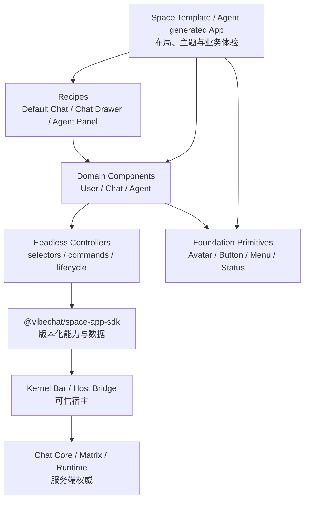

# Space App 基础组件库设计

> 生命周期：开发中
> 文档类型：设计
> 状态：评审中
> 更新日期：2026-08-27
> 维护范围：Space App 组件模型、User/Chat/Agent 领域组件、组件分发、Template 组合、版本治理与验证
> 稳定约束：[VibeChat MVP 产品与技术设计](../stable/designs/vibechat-mvp-product-and-technical-design.md)
> 当前实现：[Space App 设计演进与实施记录](./active/space-app-design-transition.md)
> Active 实施：[Space App 基础组件库实施跟踪](./active/space-app-component-library-implementation.md)

## 1. 背景与问题

Space 的稳定边界已经确定：Kernel Bar 是唯一固定宿主界面，Chat Core 是不可修改的平台能力，Kernel Bar 以下的完整界面属于可定制的 Space App。Default Chat App 和其他 Space Template 都应通过同一 Space App SDK 调用成员、消息、Mention、Agent、共享状态和实时事件。

当前实现已经验证了这条链路，但 Template UI 复用仍停留在复制源码阶段：

| 当前事实 | 影响 |
| --- | --- |
| 五个官方 Template 都包含 `src/browser/`、`src/chat/`、`src/app/` 等完整项目模块 | Project 是可独立构建的，但公共能力以源码副本存在 |
| 五份 `src/browser/` 当前相同；五份 `src/chat/` 除 Default Chat 使用 `full`、其余 Template 使用 `dock` 外基本相同 | Chat 修复、可访问性和新能力需要同步修改五份实现 |
| `@vibechat/space-app-sdk` 已提供 members、messages、Mention、typing、read、附件、关系操作、Agent 状态和 App State | 已具备在 SDK 之上建立稳定 UI 层的能力 |
| 当前 Template 通过服务端 TypeScript 返回 HTML，并将浏览器逻辑装配为内联 ES module | 组件方案必须兼容现有 `agentos-app-v1` Project 和隔离构建，不应先假设 React/Vite 应用 |
| `@vibechat/react-shared` 服务于 Site/Web/Admin React 宿主，`@vibechat/ui` 服务于宿主主题与通用资产 | 它们不是 iframe Space App 领域组件库，不能直接承担 Chat/Agent 组件契约 |
| 当前 Agent 生成约束只认可 `/v1/space-app-sdk` 这一条宿主绝对 URL | 组件实现不能依赖浮动 CDN 或新增未版本化宿主脚本 |

如果继续让每个 Template 维护独立 Chat、User 和 Agent UI，公共能力会在 Template 数量增长后形成多套行为语义、错误处理和可访问性基线。反过来，如果把全部 UI 固定进 Host，又会破坏“Chat UI 属于 Space App、可被模板和 Agent 重组”的产品边界。

因此需要在 Space App SDK 与 Space Template 之间增加一层可版本化、可组合、可替换的基础组件库。组件库提供可靠默认实现，但不成为新的可信边界，也不强制所有 Space 使用同一种视觉布局。

## 2. 目标

1. 为 Space App 提供统一的 User、Chat、Agent 和协作基础组件，使 Template 与 Agent 可以通过稳定 API 组合界面。
2. 将 Chat Core 的复杂交互语义集中在可测试的无头控制器和领域组件中，避免每个 Space 重写消息、Mention、typing、附件、回复、编辑、删除、Reaction 和错误恢复。
3. 保持 Space App 的布局和视觉自由：Template 可以组合、替换、包装或完全不使用组件库，但不能绕过 Space App SDK。
4. 让组件版本、SDK 版本、Template Version、Project Revision 和 Release 各自独立演进，并保证既有不可变 artifact 不受浮动依赖影响。
5. 建立清晰的扩展、弃用、测试、文档和性能门槛，使组件库可以持续增加能力而不退化成无法维护的“大组件”。
6. 为 Agent 生成代码提供有限、清楚、可发现的公共表面，优先组合已有组件，再通过 slot、part、variant 和本地 wrapper 扩展。

## 3. 非目标

- 不把组件库变成第四个产品边界；产品仍只有 Kernel Bar、Chat Core 和 Space App 三个逻辑边界。
- 不把 Chat UI 收回 `apps/web-app`，也不让 Host 在 iframe 外重新渲染 timeline 或 composer。
- 不在组件中实现第二套身份、成员、消息 timeline、Agent 调度、积分、权限或发布状态。
- 不要求所有 Template 呈现相同的 Chat 布局；全屏、抽屉、浮层、分栏或场景内嵌 Chat 都应由相同底层组件支持。
- 第一阶段不建立 React 专用组件体系。React adapter 可以后续建立，但不能成为核心组件和 Template 的前置条件。
- 不把发布、恢复、成员治理、Agent 管理或账务确认按钮放入 App 组件库；这些可信操作仍归 Kernel Bar。
- 不要求一次性迁移全部现有 Template 或修改 SDK/API；实施按 Default Chat、抽屉式 Template、其余场景逐步验证，每个 Template 都必须独立签发新版本。

## 4. 设计原则与不变量

### 4.1 核心原则

1. **能力来自 SDK，组件只负责交互和呈现。** 组件不能直接连接 Matrix、Backend privileged API、Agent provider 或 Runtime control API。
2. **状态逻辑与视觉分离。** 消息归一化、选择器、命令状态和订阅生命周期进入无头控制器；DOM、样式和布局进入组件与 recipe。
3. **基础组件小而稳定，组合 recipe 可替换。** `UserAvatar`、`ChatBubble` 等基础组件不拥有页面状态；`DefaultChat` 等 recipe 只是参考组合。
4. **artifact 自包含。** 组件实现以固定版本和内容 hash 进入 Candidate/Revision/Release artifact，不能通过浮动宿主 URL 或 CDN 改变已存在 Space 的 UI 行为。
5. **升级必须显式。** 组件库升级会形成新的 Project source/artifact；不得静默改写既有 ready Revision、Published Release 或已有定制 Project。
6. **框架中立优先。** 核心使用 TypeScript 无头控制器和 Web Components/DOM adapter，允许未来由 React、Vue 或其他 renderer 包装。
7. **可访问性、i18n、安全和错误恢复是组件契约的一部分。** 不能把它们留给每个 Template 重复补齐。

### 4.2 不变量

- 组件只能消费显式注入的 `SpaceAppClient`，不能初始化第二份 SDK 或缓存 Matrix token。
- Chat 消息以 `space.chat.messages` 投影的 Matrix timeline 为权威；Agent 构建进度属于独立 Agent 状态，不能伪装成 Chat 消息。
- Agent 调度只能使用 SDK 提供的结构化 Mention target ID；组件不能依靠文本正则自行决定是否调用 Agent。
- 组件不能访问 Cookie、localStorage 中的权威业务数据、宿主 DOM、Kernel 命令、源码、凭据或任意外部网络。
- 组件卸载时必须释放 SDK 订阅、timer、observer、object URL 和未完成异步任务。
- Template 可以覆盖视觉 token 和组合方式，但不能改变 SDK 命令结果、ACL、计费、成员权威或消息语义。

## 5. 分层架构



各层职责如下：

| 层 | 职责 | 是否允许依赖 SDK | 是否允许拥有业务权威 |
| --- | --- | --- | --- |
| Foundation | token、图标、焦点、Avatar、Button、Popover、Spinner 等基础交互 | 否 | 否 |
| Headless | SDK snapshot 归一化、selector、订阅、命令状态、dispose | 是，通过注入 | 否 |
| Domain | User、Chat、Agent 领域呈现和交互 | 通过 Headless | 否 |
| Recipe | 可直接使用的完整组合，如全屏 Chat、Chat Drawer | 通过 Domain/Headless | 否 |
| Template | Space 独有布局、主题、状态和业务体验 | 是 | 只拥有 App State，不拥有平台事实 |

组件库是可选的 App 构建依赖，不是新的 Runtime 服务。直接使用 SDK 自行实现界面的 Template 仍然合法，但必须通过同一 Chat Core contract suite。

## 6. Package 与公开出口

第一阶段新增一个真实 workspace package：`@vibechat/space-app-components`。先使用子路径出口保持领域边界，只有在出现独立运行时、发布节奏或依赖门槛后才拆成多个 package。

```text
@vibechat/space-app-components
├── /core           # context、selector、controller、dispose、错误模型
├── /foundation     # token、图标和无领域基础组件
├── /user           # User/Member 组件
├── /chat           # Chat 组件与 controller
├── /agent          # Agent 组件与 controller
├── /recipes        # Default Chat、Chat Drawer 等组合
├── /styles         # 默认 token、主题与可选 reset
├── /manifest       # 组件 bundle manifest 与兼容信息
└── /testing        # Fake SDK、harness、contract assertions
```

Package 规则：

- 拥有独立 `package.json`、显式 `exports`、TypeScript 配置、build/typecheck/test 和 README。
- 只能依赖浏览器安全的 workspace package；不能导入 `apps/*`、`libs/*`、TanStack route、数据库、provider 或 Runtime server。
- 通过类型依赖使用 `@vibechat/space-app-sdk` 的 `SpaceAppClient`，运行时必须由 App 注入现有 `space` 实例，避免 SDK 双实例和事件重复订阅。
- 不依赖 `@vibechat/react-shared`。后续 React adapter 应作为独立出口或独立 package，只包装同一 core/controller。
- 不直接暴露 `@vibechat/ui` 的 Host class name。Space App 使用独立的 `--vc-space-*` token 契约；可在构建期复用同源色彩/间距数据，但 App-facing token 必须独立版本化。
- 每个领域出口必须可独立 tree-shake；导入 `user` 不能隐式打入完整 Chat 和 Agent recipe。

## 7. Renderer 与组合模型

### 7.1 第一阶段选择

核心 renderer 采用 **无头 TypeScript controller + 标准 Web Components/DOM adapter**：

- 当前官方 Template 已经是 TypeScript + DOM + HTML document，而不是 React 应用；该方案可以增量接入。
- Space App 运行在隔离 iframe 内，Custom Element 名称和样式作用域容易稳定控制。
- Template 或 Agent 可以直接在 HTML 中组合组件，也可以由未来 React/Vue adapter 包装。
- 领域行为可以留在 controller 中测试，避免 Custom Element 本身变成不可扩展的状态机。

组件名统一使用 `vc-space-*` 前缀。叶子组件使用 open Shadow DOM、CSS custom properties 和有限的 `::part`；需要 Template 重排布局的复合组件使用 slot 和 light-DOM recipe，不封死 timeline、composer 或 Agent panel 的空间结构。

React 不是禁止项。后续只有在 Space App Project 已稳定支持 JSX、browser bundling 和可重复依赖解析后，才增加 `@vibechat/space-app-components/react`；它必须复用同一 controller、错误模型、i18n 和 contract tests。

### 7.2 推荐调用形态

```ts
import { space } from "/v1/space-app-sdk"
import {
  createSpaceComponentContext,
  defineSpaceElements,
  mountChatRecipe,
} from "@vibechat/space-app-components"

await space.ready
defineSpaceElements()

const context = createSpaceComponentContext({ sdk: space })
const dispose = mountChatRecipe(document.querySelector("#chat"), {
  context,
  mode: "dock",
  variant: "campfire",
})

window.addEventListener("pagehide", dispose, { once: true })
```

单个组件也可以独立组合：

```html
<vc-space-user-avatar size="md"></vc-space-user-avatar>
<vc-space-chat-timeline density="comfortable"></vc-space-chat-timeline>
<vc-space-chat-composer mention-mode="members-and-agents"></vc-space-chat-composer>
<vc-space-agent-status variant="compact"></vc-space-agent-status>
```

对象数据通过 property/context 注入，不把完整 JSON 放进 HTML attribute。所有 mount API 返回幂等 `dispose()`。

## 8. 组件范围

### 8.1 Foundation

| P0 组件/能力 | 职责 |
| --- | --- |
| `SpaceIcon` | 使用受控图标集合，避免每个 Template 复制 SVG |
| `SpaceButton` / `SpaceIconButton` | 统一 focus、disabled、loading、touch target 和键盘行为 |
| `SpacePopover` / `SpaceMenu` | Mention、消息操作和选择器的基础浮层 |
| `SpaceAvatarBase` | 图片、fallback initials、颜色、加载失败和尺寸契约 |
| `SpaceStatusDot` / `SpaceBadge` | presence、Agent、delivery 和 build 状态的基础呈现 |
| token 与 motion utilities | light/dark/high-contrast/reduced-motion 的稳定默认值 |

Foundation 不知道 User、Chat 或 Agent 对象，不读取 SDK。

### 8.2 User 与 Member

| P0 组件 | 主要输入与行为 |
| --- | --- |
| `UserAvatar` | member、size、presence、fallback；正确处理缺失/失败 avatar |
| `UserName` | display name、handle、截断与可访问标签 |
| `UserPresence` | online/away/offline，不能自行推断服务端状态 |
| `UserInfoCard` | Avatar、名称、handle、presence、可选 slot；不内置越权管理操作 |
| `MemberListItem` / `MemberList` | 成员列表、选择态、键盘导航和空状态 |
| `MentionTargetItem` | 统一成员/Agent target 视觉，但保留明确类型标记 |

后续可增加 member picker、presence stack、role badge 和 profile preview；成员治理操作仍由 Kernel 权限面提供。

### 8.3 Chat

| P0 组件/控制器 | 主要职责 |
| --- | --- |
| `ChatController` | snapshot selector、message map、reply/edit context、typing timer、command pending/error 和 dispose |
| `ChatTimeline` | 有序消息、空状态、增量更新、滚动锚点、加载状态，以及可选的公开 Actions/Reaction 组合 |
| `ChatMessage` / `ChatBubble` | 自己/他人/Agent、删除、编辑、delivery 和语义化正文 |
| `ChatMessageMeta` | User/Agent identity、时间和状态，不混入平台私有标识 |
| `ReplyPreview` | 被回复消息、作者和缺失消息 fallback |
| `ChatAttachment` | 图片/文件预览、名称、类型和安全下载入口 |
| `ReactionBar` | Reaction 计数、当前用户状态和 toggle 命令 |
| `MessageActions` | 消费 message view 中 Host 授权的 reply/edit/delete/retry availability，并提供错误反馈 |
| `TypingIndicator` | 使用 SDK typing member IDs 与 User 组件 |
| `ChatComposer` | 自动扩展输入、发送、附件、reply/edit context、pending 与错误恢复 |
| `MentionMenu` | SDK target search、键盘导航、结构化 member/Agent ID |
| `ChatErrorState` | 可恢复命令错误；不伪造 Runtime/Kernel 诊断 |

P0 不在浏览器维护第二条消息数据库。分页、虚拟列表、富文本、语音、线程和媒体画廊在 SDK 合约成熟后单独增加。

Host 必须在 SDK snapshot 中显式提供 Chat permissions；空 snapshot 和缺失字段一律 fail closed。message view 只允许把全局 permission 与消息 ownership/status 组合成每条消息的 action availability，Template 和 presentational component 都不能通过 `isOwn`、`isAgent` 或 DOM 状态自行猜测 ACL。交互 Timeline 通过公开 property、typed event、稳定 test id 与 `::part` 组合 Actions/Reaction；只读 Timeline 保持默认呈现，消费方不得进入 Shadow DOM 添加控件或注入样式。

交互 Timeline 的默认信息密度也属于公共行为契约：已有 Reaction 只保留一套可交互呈现，不与 Message 内只读 Reaction 重复；未使用的候选 Reaction、reply/edit/delete/retry 通过 compact MessageActions 渐进披露，Delete 必须使用危险语义和显式二次确认。compact 模式要同时覆盖桌面浮层、窄屏 action sheet、焦点进入/循环/恢复、Escape、外部点击、forced colors 与 reduced motion。支持 Popover API 时，浮层必须进入浏览器 top layer，并由 native light-dismiss 与 `::backdrop` 负责关闭和遮罩；只有不支持 Popover 时才使用 viewport fixed 菜单、显式 backdrop 和 document pointer fallback。Template 的 `transform`、`filter`、`backdrop-filter` 与 `overflow` 不得成为组件正确性的前置条件，指针关闭后必须在点击默认动作完成后恢复 trigger 焦点。独立 MessageActions 默认仍为 inline，以保持已有消费方兼容。相邻同作者且时间间隔不超过五分钟的消息可以组合为 `single/first/middle/last`，隐藏重复作者和时间，并只在组尾/单条保留非本人头像；分组只改变呈现，不改变 message key、timeline 顺序或 Chat Core 语义。

### 8.4 Agent

| P0 组件/控制器 | 主要职责 |
| --- | --- |
| `AgentAvatar` / `AgentBadge` | 明确区分 Agent 与成员，不使用 provider 专属视觉契约 |
| `AgentCard` | 名称、可用性、能力摘要和可选 slot |
| `AgentStatus` | idle/queued/working/unavailable/failed 的标准呈现 |
| `AgentActivity` | 当前 build stage、有限 tool activity 和可访问 live region |
| `AgentQueueStatus` | active/pending 数量；不允许 App 篡改队列 |
| `AgentMentionItem` | 从 SDK mention targets 选择 Agent，交给 Composer 发送结构化 mention |
| `AgentMessageMeta` | 展示 Matrix Agent event 的 identity、turn/source 关系摘要 |

组件库不提供绕过 Chat 发送的 `agent.invoke()`。MVP 的 Agent 请求仍由包含结构化 Agent Mention 的 Chat event 触发。Provider、模型、积分预留、取消和管理策略不进入普通 App 组件公共 API。

### 8.5 Recipe

首批 recipe 只提供经过验证的组合，不增加新能力：

- `DefaultChatRecipe`：全尺寸默认 Chat。
- `ChatDrawerRecipe`：供 Campfire/Arcade/Focus/Postcard 等差异化 App 使用的抽屉 Chat。
- `AgentActivityPanelRecipe`：可嵌入 Space 场景的只读 Agent 状态面板。

Recipe 通过 slot、variant、token 和局部 wrapper 扩展。Template 的场景内容、游戏、仪式、工具面板和品牌视觉继续保留在自身 Project 中。

## 9. 数据、状态与命令模型

### 9.1 Context

`createSpaceComponentContext()` 接收：

- `sdk: SpaceAppClient`：唯一能力实例；
- `locale` 与 `translate(key, params)`：默认来自 SDK locale 和组件 catalog；
- `theme`：App token 覆盖；
- `logger`：只记录非敏感诊断；
- 可选 `clock`、`idFactory`：用于确定性测试。

Context 不保存长期业务事实。当前 snapshot、订阅和命令结果仍以 SDK 为准。

### 9.2 Controller

Controller 统一提供：

```ts
interface SpaceComponentController<State, Command> {
  getSnapshot(): State
  subscribe(listener: () => void): () => void
  command: Command
  dispose(): void
}
```

- `UserDirectoryController` 归一化 self、members、mentions 和 presence。
- `ChatController` 维护消息 selector、Composer 临时状态和 Chat commands。
- `AgentController` 读取 available agents、build、queue 和 Matrix Agent metadata。

Controller 对组件输出稳定 view model，不把 SDK 内部 record 或 provider 原始事件直接暴露给 DOM。命令状态至少包含 `idle/pending/succeeded/failed`、可恢复错误和原始 SDK command correlation；重复点击、超时和卸载后的结果必须安全处理。

### 9.3 Presentational component

叶子组件只接受 typed property 和 callback，不自行查找全局 `space`：

```ts
avatar.member = memberView
message.message = messageView
message.onReply = () => chat.command.beginReply(message.id)
```

这样可以在 component catalog、unit test 和未来 renderer 中脱离真实 Matrix/Runtime 使用同一组件。

## 10. 样式、主题、i18n 与可访问性

### 10.1 样式与主题

- token 使用 `--vc-space-*` 前缀，覆盖颜色、字体、间距、圆角、阴影、层级、motion 和 Chat 密度。
- 提供 light、dark、high-contrast 默认主题，Template 可以只覆盖 token，不复制整份组件 CSS。
- `variant` 表达有限结构差异，token 表达视觉差异，slot 表达内容差异；不通过无限 boolean props 拼出页面。
- 组件不注入全局 CSS reset，不修改 `html/body`，不使用固定页面级 z-index。
- 叶子组件和组合 Timeline 公开有限 `::part`；未声明的内部 DOM、Shadow Root selector 与私有 data attribute 不是公共 API。

### 10.2 i18n

- 组件内所有用户可见文本使用 `space.components.*` i18n key；先定义 English，再同步 `zh-CN`。
- 默认 catalog 随组件 bundle 固化，不能依赖 Host 在运行时返回一份可漂移文案。
- Template 可以通过 `translate` 或 slot 覆盖文案，但不能用覆盖改变权限、账务或 Agent 调度语义。
- 时间、数字、复数和成员列表使用 `Intl`，不在组件中手写语言分支。

### 10.3 可访问性

- 组件以 WCAG 2.2 AA 为最低目标，支持键盘、触摸、屏幕阅读器、200% 字体、reduced motion 和高对比。
- Popover/Menu 使用正确焦点循环、Escape 关闭和焦点归还；Composer 支持 IME，不在 composition 中误发送。
- Timeline 新消息与 Agent activity 使用克制的 live region，不能造成重复朗读。
- Avatar 图片失败必须有文本 fallback；颜色不能成为 presence、delivery 或 Agent 状态的唯一信号。
- 默认 touch target 不小于 44×44 CSS px；Template 缩小视觉时仍保留可点击面积。

## 11. 安全边界

- 所有用户文本、display name、文件名、消息正文和 Template slot 默认按文本处理；允许富文本前必须有独立 schema、sanitizer 和安全评审。
- 组件不能渲染未经校验的 `innerHTML`、`javascript:` URL、任意 iframe 或外部脚本。
- 附件只使用 SDK 返回的受控 URL/metadata；下载、预览、大小与类型限制继续由 Chat Core/Storage 校验。
- 组件错误不得包含 token、Cookie、Matrix ID 映射、provider payload、源码或账务详情。
- App State key、event name、property path 和 DOM data attribute 都要防止 `__proto__` 等原型污染键。
- Permission denied、balance insufficient、membership revoked 和 Runtime unavailable 必须保持服务端错误语义，组件只提供可恢复展示。
- Kernel 发布、恢复、ACL、Agent 管理和账务操作不进入组件库，避免不可信 App 伪造可信控制面。

## 12. 组件 artifact、依赖与版本

### 12.1 分发方式

组件源代码在 workspace package 中维护，构建后产生内容寻址的 `SpaceComponentBundle`：

```ts
interface SpaceComponentBundleManifest {
  schemaVersion: "vibechat.space-component-bundle/v1"
  packageVersion: string
  sdkRange: string
  projectFormats: string[]
  exports: string[]
  sourceHash: string
  artifactHash: string
  cssTokenVersion: string
}
```

Space 源码必须使用普通 package import 和精确 SemVer，并用独立 lock 固定受管 artifact：

```json
// package.json
{
  "dependencies": {
    "@vibechat/space-app-components": "0.7.4"
  }
}
```

```json
// space-app-dependencies.json
{
  "schemaVersion": "vibechat.space-app-dependencies/v1",
  "packages": {
    "@vibechat/space-app-components": {
      "version": "0.7.4",
      "integrity": "sha256:4a7d7296653b0164005283b5d836788300504e1d7590f803bbd2ba52fd15e201"
    }
  }
}
```

Candidate 构建从平台管理的 Registry/Object Store 解析 name、精确 version、Project format 和 integrity，并生成独立 prepared artifact。只有 prepared `package.json` 被改写为 revision-local `file:` 依赖；stored source、Template source 和 Agent workspace 保持普通 package specifier。prepared artifact、解析清单和 import map 都进入 artifact hash，并通过 Project pointer 的 `artifactObjectKey/artifactHash` 与源码对象分开持久化。

公共 import 使用与存储方式无关的语义化 subpath：`/foundation`、`/user`、`/agent`、`/chat` 均保留 ESM module boundary 供消费方 tree-shake，仅 `/register` 与 `/register/*` 声明自动注册 side effect。当前返回自包含 HTML 的 `agentos-app-v1` 使用 `/chat/inline` delivery adapter；普通浏览器构建使用 `/chat`。`/artifacts/*`、Registry object key 和版本目录不是公共 import 契约。

Git 只保存源码、构建配置和当前 `managed-release.json` 发布锁；`dist/`、tarball 和 `releases/<version>/package` 类逐版本编译目录都是 gitignored 发布产物。每个供 Space 使用的版本必须先将 tarball 上传到 managed Registry/Object Store，并登记不可变的 `name + version + integrity + objectKey`。公共 npm 或 npm-compatible Registry 可以镜像同一 package，但不是线上 Space Runtime 构建或浏览器加载的前置依赖。

已有 ready Revision、Published Release 和已缓存的 prepared artifact 不依赖 Registry 在线可用。Registry 只参与新 Candidate；缺包、版本不一致、hash 漂移或生成路径冲突会令 Candidate fail closed，不切换 ready/Release 指针。生产浏览器不从 npm、CDN 或未版本化 Host URL 下载组件实现。

阶段 2 的构建同时产生兼容聚合入口 `browser.js` 和 `foundation.js`、`user.js`、`agent.js`、`chat.js` 领域入口；manifest 的 `exports` 与 artifact hash 覆盖全部入口。Template 可以固定聚合入口，也可以只固化所需领域入口，但不能把不同版本的领域文件拼接为一个未被 manifest 覆盖的运行时组合。

`/v1/space-app-sdk` 仍是可信能力桥的特殊入口；组件 bundle 不增加第二条 Host capability。组件 bundle 可以在当前单文档 App 中以内联 ESM/CSS 形式存在，也可以在 Runtime 支持 revision-local 静态资产后使用同 artifact 的 hashed asset URL，两者都必须由 artifact hash 覆盖。

Template 和 Agent-generated Space 不得提交 `vendor/vibechat-packages/`、`vibechat.resolved-dependencies.json` 或组件源码副本；这些路径只属于 Runtime 生成的 prepared artifact。仓库内相对路径 import 不是 Space 的分发契约，不能作为线上或既有 Space 后加依赖的方式。

### 12.2 版本关系

| 版本 | 描述 | 升级影响 |
| --- | --- | --- |
| Component package SemVer | 组件 API、DOM part、token 与行为 | App 显式升级依赖并生成新 Revision |
| Space App SDK/Bridge version | 数据和命令能力 | Component manifest 声明兼容 range |
| Template Version | 一次不可变 Template 载荷 | 组件依赖或 bundle 变化会改变 source/artifact，必须签发新版本 |
| Project Revision | 某个 Space 的已验证源码快照 | 只在 Candidate ready 后切换 |
| Release | 固定 Revision 的不可变发布 | 组件内容已经包含在 artifact hash 中 |

- Component patch：不改变公开 API、token、part 和用户语义的兼容修复。
- Component minor：向后兼容的新组件、variant、token 或 optional property。
- Component major：移除/重命名 public export、property、event、part、token，或改变默认交互语义。
- Template 不允许写 `latest`、范围版本或浮动 URL；必须固定 Component version 和 content hash。
- 废弃 API 至少保留两个 minor 版本，并在 component catalog、类型和迁移文档中同时标注。
- 已有 Space 不自动升级。官方 Template、Default Chat 恢复和已有定制 Project 的迁移继续遵守 Template/Revision/Release 规则。

## 13. 扩展治理

新增组件前满足至少一项：

1. 已有两个以上 Template/recipe 出现相同领域交互；
2. 属于 Chat Core 正确性、可访问性、安全或错误恢复的统一实现；
3. 需要稳定公共 API 供 Agent 生成代码调用。

只属于单个 Template 的场景视觉、游戏机制或业务状态保留在 Template 内。出现第二个真实消费者后，再提炼为 variant、slot、controller extension 或新组件。

每个公开组件必须同时提交：

- API/type、状态图和事件说明；
- 默认/空/加载/错误/disabled/权限拒绝状态；
- light/dark/high-contrast、mobile/desktop 和长文案示例；
- unit、a11y、interaction 和 visual baseline；
- bundle size 影响、SDK compatibility 和迁移说明；
- Agent 可使用的简短示例及禁止事项。

不允许通过复制组件内部源码形成“定制版”。优先使用 property、slot、part、token 或本地 wrapper；确有不兼容需求时建立新的明确 variant 或保持 Template-local。

## 14. 性能与容量目标

下列是实现阶段需要实测的初始预算，不是当前已通过证据：

- Foundation + core 首次 gzip 预算不超过 20 KB；每个领域出口独立加载。
- 单个 Chat recipe 增量 gzip 预算不超过 35 KB，不因引入 Chat 自动打入全部 Agent/未来媒体能力。
- typing、presence 或 Agent queue 更新不能重建完整 timeline。
- Timeline 使用稳定 message key 和增量 patch；达到长历史门槛后接入 SDK 分页/窗口化，不在浏览器保留无界副本。
- 组件 mount 到首个可交互状态、snapshot 更新和滚动性能在中低端移动设备上建立基准。
- Component package 的 bundle report 进入 CI；超过预算必须说明原因并经过评审。

## 15. 实施阶段

### 阶段 0：契约与构建 Spike

任务：

- 建立 `@vibechat/space-app-components` package 骨架与 bundle manifest。
- 验证组件 bundle 能从受管依赖解析进入 AgentOS Dev/Release artifact，且离线运行不请求 npm/CDN。
- 固定 SDK 注入、component hash、Template source/artifact hash 和 Release 恢复链路。
- 建立最小 component catalog/harness，并验证 Custom Element、controller、SSR document 和 dispose。

完成标准：同一固定 Revision 在 Dev、Release、冷启动恢复中加载完全相同的组件 hash；组件 Registry 不可用时 Candidate fail closed，最后 ready Revision 不受影响。

### 阶段 1：Foundation + User + Agent Identity

任务：

- 实现 token、IconButton、AvatarBase、StatusDot、UserAvatar、UserName、UserInfoCard、AgentAvatar、AgentBadge 和 AgentStatus。
- 建立 i18n、a11y、visual 和 size budget 基线。
- 用 Default Chat 与一个差异化 Template 的静态区域证明主题可覆盖、身份语义一致。

完成标准：两种完全不同主题不复制 Avatar/identity 逻辑，且 keyboard、screen reader、200% 字体和图片失败状态通过。

### 阶段 2：Chat Headless 与叶子组件

任务：

- 实现 `ChatController`、message view model、Reply/Attachment/Reaction/Delivery/Typing/Mention 和 Composer。
- 先迁移 Default Chat App，保持完整 Chat Core 行为不变。
- 在 `tests/e2e/TEST-CATALOG.md` #40 增加组件库验收场景后，再编写真实 DOM E2E。

完成标准：Default Chat 不再维护 Template-local Chat 状态机，SDK contract、Matrix 消息操作、Mention、typing、read、附件和错误恢复回归通过。

### 阶段 3：Recipe 与第二布局验证

任务：

- 建立 `DefaultChatRecipe` 与 `ChatDrawerRecipe`。
- 迁移 Campfire 或另一差异最大的 Template，验证同一 controller/组件可支持全屏与抽屉布局。
- 验证 Agent activity、member/Agent Mention 和 responsive layout。

完成标准：两个 Template 共享同一 Chat/User/Agent 组件实现，只保留各自布局、主题和场景代码；双 Chromium 使用同一 Matrix timeline。

### 阶段 4：官方 Template 收敛

任务：

- 迁移其余官方 Template 和 Runtime Default Chat seed。
- 删除五份重复 `src/chat/`、`src/browser/` 实现，但保留必要的 Template wrapper 和 recipe 配置。
- 按 [Space Template 版本规则](../stable/references/space-template-versioning.md)为实际载荷变化签发相邻版本，不能覆盖历史 release lock。
- 更新 Agent generator 指令，使生成代码优先查询组件 catalog 和 examples。

完成标准：五个官方 Template 的共享组件修复只修改一个 package；每个 Template 的 source/artifact hash、版本、lineage 和现有定制 Project 迁移行为均可审计。

### 阶段 5：持续扩展与对外开发体验

任务：

- 补充公开 component catalog、交互 playground、API 参考和迁移工具。
- 根据真实 Template 消费提炼更多 User/Chat/Agent 组件。
- 在 Project build 稳定支持 JSX 后评估 React adapter，但不复制 controller 和 contract tests。

完成标准：新 Space Template 能只依赖 SDK、组件库和自身业务代码实现完整体验；新增组件遵守发布、文档、a11y、性能和兼容门禁。

## 16. 验证策略

| 层级 | 必须验证 |
| --- | --- |
| Package | exports、边界、typecheck、build、tree-shaking、bundle manifest/hash |
| Core/Controller | selector、订阅、并发命令、失败、重试、dispose、假时钟和 Fake SDK contract |
| Component | DOM、键盘、IME、a11y、主题、长文案、空/错/disabled 状态和 visual baseline |
| Template | Default Chat + 至少一个抽屉 Template 使用同一组件，Template-local 代码只负责组合 |
| Runtime | Candidate 构建、artifact 固化、Dev/Release/恢复、组件依赖缺失时 fail closed |
| Chat Core | 真实 Matrix 文字/附件/回复/编辑/删除/Reaction/typing/read/Mention 与刷新恢复 |
| Agent | 结构化 Agent Mention、单一 Matrix Agent event、queue/build 状态和 provider-neutral UI |
| 安全 | iframe、XSS、URL、原型污染、权限拒绝、member revoke、凭据和 Host 控制面隔离 |

实现阶段除仓库通用门禁外，至少运行：

```bash
pnpm boundaries:check
pnpm --filter @vibechat/space-app-components typecheck
pnpm --filter @vibechat/space-app-components build
pnpm docs:check
pnpm build:docs
```

迁移用户可见 Template 后，还要运行相关 unit/contract、五个官方 Project 严格 TypeScript、catalog/hash check 和 `tests/e2e/TEST-CATALOG.md` #40 的真实 TanStack + Synapse + Space Runtime 场景。未执行的真实 provider、双浏览器、D1/R2 或 AgentOS 验证必须明确记录，不能写成通过。

## 17. 风险与控制

| 风险 | 控制 |
| --- | --- |
| 组件库变成另一套 Chat Core | 只接收 SDK view model/commands；服务端仍是唯一权威 |
| 一个完整 Chat 大组件阻碍 Template 定制 | controller、叶子组件、recipe 分层；layout 由 slot/light DOM 组合 |
| 组件升级改变已有 Release | exact version + content hash + artifact 内置 + 显式 Revision 升级 |
| Web Components 样式难以定制 | token、variant、slot、公开 part；不承诺内部 DOM |
| 为兼容当前内联脚本固化临时序列化方案 | package 负责预编译 bundle；Template 不再手工 `function.toString()` 拼装共享逻辑 |
| Agent 为了定制而复制/修改组件内部源码 | 提供 catalog、wrapper 示例、slot/part/token 和受控升级工具 |
| i18n/a11y 在不同 Template 漂移 | 进入组件 contract/CI，Template 只覆盖文案或布局 |
| 依赖解析引入外部网络或供应链漂移 | 受管 Registry/Object Store、allowlist、精确 hash、离线 artifact build |
| 组件数量持续膨胀 | 真实双消费者门槛、领域出口、bundle budget、弃用流程和 owner review |

## 18. 已决策与待决策项

阶段 0 已确定：component release job 生成不可变 managed package；Runtime Registry 解析并 materialize 到 prepared artifact；Default Chat 继续把已验证的 `chat.js` source 内联进自身文档，不增加浏览器网络入口。公共 npm 发布不是 Space Runtime 的依赖条件。

以下细节仍可后续决策，不影响本文确定的边界：

1. Component catalog 使用独立开发应用还是复用 Space Runtime 的专用只读 Preview route。
2. 何时为大型媒体/recipe artifact 增加 revision-local hashed asset handler；它不能替代当前 package/integrity 契约。
3. React adapter 的触发门槛、package 名称和是否随 `1.0.0` 后提供长期兼容承诺。

无论选择哪种实现，都必须满足：不新增浮动运行时 URL、artifact 可离线重建、版本可审计、既有 Space 不静默变化、组件不拥有平台业务权威。

## 19. 文档完成条件

本文从草案进入可实施状态前必须完成：

- 由 Space SDK、Template、Runtime 和前端维护者共同确认 package、renderer、artifact 和版本边界。
- 阶段 0 Spike 给出真实 AgentOS Dev/Release/冷启动证据，并回填待决策项。
- 在 `tests/e2e/TEST-CATALOG.md` #40 写入首批组件库验收场景和完成证据要求。
- 组件公共 API、token、part、event、i18n 和 a11y 基线通过评审。
- 实施工作进入 Active 后建立伴随实施记录；稳定且经过完整验证后，再决定是否把本文提升为 `docs/stable/designs/`，未验证内容继续留在开发中。
