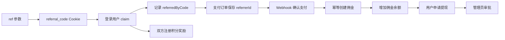

# 返利系统设计

> 生命周期：长期稳定
> 文档类型：设计
> 状态：生效
> 更新日期：2026-08-11
> 维护范围：`config/affiliate.ts`、`libs/affiliate`、返利 API 和管理页面

## 目标与边界

返利系统负责推荐归因、注册积分奖励、支付佣金和提现。共享业务逻辑位于 `libs/affiliate`，TanStack API 路由只负责会话解析、输入输出和数据库运行时接入。

系统默认关闭，通过 `AFFILIATE_ENABLED=true` 启用。佣金余额只支持 `AFFILIATE_CURRENCY` 指定的一种币种，参与返利的订单必须使用相同币种。

## 领域流程

## 核心模块

| 模块 | 当前入口 | 责任 |
| --- | --- | --- |
| 配置 | `config/affiliate.ts` | 开关、佣金率、币种、Cookie、奖励和最低提现额 |
| 推荐 | `libs/affiliate/referral.ts` | 推荐码生成、归因校验和注册奖励 |
| 佣金 | `libs/affiliate/commission.ts` | 支付后幂等计算、佣金落库和余额更新 |
| 提现 | `libs/affiliate/withdrawal.ts` | 申请、状态和余额处理 |
| 用户 API | `apps/web-app/src/routes/api/affiliate/*`、`api/withdrawal/*` | 当前用户的统计、记录、claim 和提现 |
| 管理 API | `apps/web-app/src/routes/api/admin/commissions.ts`、`api/admin/withdrawals/*` | 管理查看与审批 |
| 页面 | `apps/web-app/src/routes/$lang/admin/commissions`、`admin/withdrawals` | 管理界面 |

## 不变量

- 用户不能推荐自己，也不能覆盖已经建立的推荐关系。
- 一个订单最多生成一条佣金记录，`orderId` 是幂等边界。
- 订单币种不匹配时不产生佣金。
- PG/SQLite 通过事务更新佣金和余额；D1 使用原子 batch，避免不支持的 SAVEPOINT。
- Webhook 验证成功后才处理佣金；前端回跳不能创建佣金。
- 提现和管理 API 必须在服务端校验用户与管理员权限。

## 配置契约

| 环境变量 | 含义 | 默认值 |
| --- | --- | --- |
| `AFFILIATE_ENABLED` | 总开关 | `false` |
| `AFFILIATE_COMMISSION_RATE` | 百分比佣金，小数表示 | `0.20` |
| `AFFILIATE_FIXED_COMMISSION_AMOUNT` | 固定佣金，正数时覆盖比例 | `0` |
| `AFFILIATE_CURRENCY` | 唯一佣金币种 | `USD` |
| `AFFILIATE_COOKIE_EXPIRY_DAYS` | 推荐 Cookie 天数 | `30` |
| `AFFILIATE_MIN_WITHDRAWAL` | 最低提现额 | `100` |
| `AFFILIATE_REFERRER_SIGNUP_BONUS` | 推荐人注册积分奖励 | `10` |
| `AFFILIATE_REFEREE_SIGNUP_BONUS` | 被推荐人注册积分奖励 | `10` |

操作步骤见[返利系统 Runbook](../runbooks/affiliate.md)。
