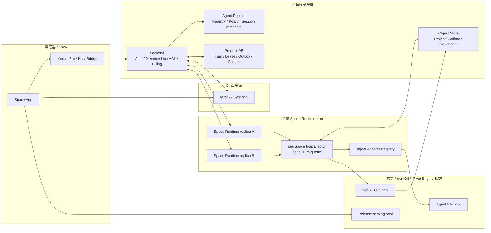

# Agent 架构与 AgentOS 部署设计

> 生命周期：长期稳定
> 文档类型：设计
> 状态：生效
> 更新日期：2026-08-26
> 维护范围：Space Agent、Agent Registry/Adapter、Space Runtime、AgentOS/Rivet Engine、Agent 会话、App Dev/Release、权限、计费与运行治理
> 父级设计：[VibeChat MVP 产品与技术设计](./vibechat-mvp-product-and-technical-design.md)
> Active 实施：[VibeChat MVP 产品与技术设计 Active 实施跟踪](../../development/active/product-and-technical-implementation.md)
> 实施结构：[Agent 架构实施结构计划](../../development/active/agent-architecture-implementation-plan.md)
> 事实边界：本文定义 Agent 与 AgentOS 的目标架构、部署单位和长期不变量；当前实现、迁移差距和运行证据以上述 Active 文档及代码、测试为准。

## 1. 背景与决策摘要

VibeChat 的 Agent 同时参与两类工作：在 Chat Core 中回答成员请求，以及在受控 Project 上生成、修改和修复 Space App。Agent 不是 Chat、权限、计费、Project 或发布的权威；这些契约属于 VibeChat 平台。Pi 只是首个 Adapter 实现，AgentOS/Rivet Engine 只是隔离执行与 App Dev/Release 的基础设施，不进入用户可见产品语义。

本设计确定以下部署与隔离原则：

1. **AgentOS 不按 Space 独立部署。** 默认按环境和区域部署共享的 AgentOS/Rivet Engine 集群。
2. **Space 是核心逻辑隔离和调度单位。** 每个 Space 拥有一个可重建的逻辑 `SpaceInstanceServer`、一个 App Project 和一条严格串行的写队列。
3. **Agent 会话按 `Space × Agent` 隔离。** 不同 Space 或不同 Agent 不共享隐藏 session；跨 Agent 上下文只能经过平台持有的可审计摘要、授权消息窗口和 Project snapshot。
4. **AgentOS App identity 按 Space 隔离。** 每个 Space 拥有独立 App namespace；Dev/Candidate 再按 Revision 隔离，不可变 Release 拥有自己的 serving replica。
5. **`apps/space-runtime` 是独立部署单元。** 它可以水平扩容并通过 Product DB lease/fencing 竞争 Space 写所有权；Cloudflare Backend 不启动 Agent 子进程、VM 或 build worker。
6. **Agent 执行和 App 执行是两个接口层。** 二者可以复用同一 AgentOS 集群，但生产环境应使用不同 worker pool、配额、凭据和网络策略。
7. **不部署全球唯一的单体 AgentOS。** 生产环境按区域、数据驻留和故障域拆分；专属租户集群是受治理的例外能力，不是默认模型。

因此，部署单位与业务单位不能混用：

| 问题 | 确定答案 |
| --- | --- |
| 一套 AgentOS 服务多少 Space | 同一环境/区域内服务多个 Space |
| 一个 Space 是否有独立 AgentOS 安装 | 否 |
| 一个 Space 是否有独立 AgentOS App identity | 是 |
| 一个 Space 是否有独立逻辑状态机和写队列 | 是 |
| Agent session 的隔离键 | `spaceInstanceId + agentId + sessionGeneration` |
| Dev/Candidate 的隔离键 | `spaceInstanceId + revisionId` |
| Release 的隔离键 | 不可变 `releaseId`，并关联固定 Revision |

## 2. 目标

- 让 Agent provider、模型、工具和运行供应商可替换，而不迁移 Chat、Project、权限、计费或发布公共契约。
- 保证同一 Space 的 App 修改严格串行、不同 Space 在多级配额内并行。
- 保证普通人类 Chat 不自动进入付费 Agent provider；只有经过平台核验的显式 Agent 请求才执行。
- 使 Conversation、Revision、自动修复、取消、超时、恢复、usage 和审计使用同一 Adapter 合约。
- 使 Space Runtime、AgentOS Engine 和 App Release 可以独立扩缩容、升级和故障恢复。
- 保证 Agent、App build 或 Runtime 故障不破坏 Matrix Chat Core，也不替换最后一个 ready Revision 或 Published Release。
- 为多 Agent、领域 Agent、第二 provider、区域化部署和企业专属池保留可演进边界。

## 3. 非目标

- 本设计不定义多 Agent 自动协作、Agent 市场、BYOK、E2EE 下的 Agent 访问或跨 Space 自主工作；这些能力必须独立评审。
- 本设计不把 AgentOS 定义为身份、成员、聊天、账本、市场或 Project 元数据的权威。
- 本设计不允许 Generated App 直接连接 Agent provider、读取 Agent session、控制 build/publish 或获得任意网络与 shell。
- 本设计不要求每个 Space 保持常驻 VM、常驻 build worker 或常驻 Release replica。
- 本设计不把开发时随进程启动的 managed Engine 视为生产多副本部署方案。

## 4. 术语与单位

| 单位 | 定义 | 生命周期与扩缩容 |
| --- | --- | --- |
| Agent Definition | 平台 Registry 中的逻辑 Agent，包含能力、Adapter、费用与治理状态 | 平台级版本化配置 |
| Agent Adapter | 将平台统一 Turn 协议适配到 Pi 或其他 provider 的 Runtime 实现 | 随 Runtime 发布，不对浏览器暴露 provider SDK |
| Agent Session | 某个 `Space × Agent` 的隔离会话引用、摘要和恢复信息 | 可跨 Turn 恢复，可轮换 generation |
| Agent Turn | 一条或一批显式请求的可审计处理单元 | 持久化、幂等、可取消、可恢复 |
| SpaceInstanceServer | 每个 Space 一个的逻辑 actor/state machine | 按需加载，可由任意 Runtime replica 重建 |
| AgentOS Cluster | Agent VM、App build/dev 和 Release serving 的区域级运行基础设施 | 环境/区域级部署和扩容 |
| Agent VM Actor | 执行某个 Space/Agent 会话的隔离 VM actor | 按需启动，受会话和资源策略约束 |
| AgentOS App | 某个 Space 独有的 App namespace | Space 级 identity，不代表独立 AgentOS 安装 |
| Dev/Candidate VM | 构建并验证固定 Project 内容的隔离实例 | 按 `Space × Revision` 创建，失败可回收 |
| Release Replica | 服务固定不可变 Release 的运行副本 | `minReplicas=0` 起步，按并发扩缩容 |

## 5. 总体架构



### 5.1 请求链路

1. 成员通过 Space App/SDK 先把人类消息写入 Matrix。
2. 只有消息携带平台定义的结构化 Agent Mention 时，Backend 才按精确 Matrix `eventId` 复核 sender、membership、Agent target 和幂等键。
3. Backend 校验 `agent.invoke`、Space Agent allowlist、预算与余额，创建 reservation，并持久化 Turn 与顺序后确认入队。
4. 任意 Space Runtime replica 可以发现可执行 Turn，但同一 `spaceInstanceId` 只有有效 lease owner 可以 claim 和写入。
5. Runtime 根据 Agent Definition 选择 Adapter，并以受限上下文、Project snapshot、工具、预算和取消信号运行 Turn。
6. Conversation 结果通过幂等 Outbox 写回 Matrix Agent virtual user；Runtime SSE 只承载队列、进度和状态，不建立第二条 Chat timeline。
7. Revision 结果先形成 Candidate，在隔离 Dev/Build VM 中校验；只有 ready Candidate 才保存不可变 Revision 并移动当前 ready 指针。
8. 显式 Publish 是队列屏障，固定请求时的 ready Revision，生成不可变 Release；后续 Agent 修改不能自动覆盖该 Release。
9. usage、退款/结算、Matrix 回复和 v2 state 通过稳定 effect key 重放，不因重试产生重复副作用。

## 6. 责任边界

| 边界 | 负责 | 明确不负责 |
| --- | --- | --- |
| `apps/web-app` / Space SDK | 结构化 Mention、Kernel 状态、受控 capability bridge | Agent provider SDK、token、计费权威、发布实现 |
| Matrix/Synapse | 成员、邀请、Chat timeline、Agent virtual-user 消息 | Agent queue、Project、credits、隐藏 session |
| `apps/backend` | 身份、实时 membership 复核、ACL、Agent policy、credits、幂等入队、Outbox | 长期 VM、Agent 子进程、App build/serve |
| `libs/space-agents` | 目标 Agent Registry、Space binding、session metadata、费用与审计领域规则 | provider SDK、VM client、Hono 路由 |
| `libs/ai` | 通用 AI provider 计费与退款原语 | Space queue、Space Agent Registry、AgentOS VM |
| `apps/space-runtime` | Instance Server、Turn scheduler/processor、Adapter、Project 工具、Dev/Release 编排 | Better Auth Cookie、Matrix membership 权威、直接修改产品账本 |
| Agent Adapter | provider session、事件映射、usage、取消、恢复 | ACL、最终 Project 指针、发布权限、账本 |
| AgentOS/Rivet Engine | 隔离 VM、Actor、Dev/Build 和 Release serving | 产品身份、成员、账本、市场、长期业务指针 |
| Product DB/Object Store | Registry、Turn、lease、session ref、Project/Revision/Release 指针与内容 | 活动 VM 进程和瞬时 progress |

## 7. Agent Registry 与 Space 绑定

### 7.1 Agent Definition

Agent Registry 是平台事实，不以 Runtime 进程内 Map 作为长期权威。每个 Agent Definition 至少包含：

- `agentId`：长期稳定、provider-neutral 的逻辑 ID。
- `adapterKey`：Runtime 选择的 Adapter 类型，不直接作为用户文案。
- `provider`、`model`、`capabilities`、`toolPolicyId`。
- `pricingPolicyId`、`usageSchemaVersion`、预算上限和并发策略。
- `version`、`status`、`availability`、`dataRegionPolicy`。
- `displayName`、公开说明与治理信息；不得包含 provider credential。

### 7.2 Space Agent Binding

每个 Space 保存默认 Agent、允许 Agent 列表和调用策略。`defaultAgentId` 只是便捷指针，不能替代 allowlist 和版本化 policy。调用时必须同时满足：

- Agent Definition 可用且未冻结；
- Agent 已绑定到当前 Space；
- 成员拥有 `agent.invoke`，管理/切换需 `agent.manage`；
- Agent、用户、Space、租户、provider 和区域配额均允许；
- 数据区域、消息窗口和工具策略与当前请求兼容。

### 7.3 目标数据模型

| 记录 | 关键字段 |
| --- | --- |
| `space_agents` | `agent_id`、Adapter/provider/model、能力、费用策略、版本、状态、区域策略 |
| `space_agent_bindings` | `space_instance_id`、`agent_id`、是否默认、权限/预算/工具 policy、状态 |
| `space_agent_sessions` | `space_instance_id`、`agent_id`、generation、provider session ref、摘要、恢复状态 |
| `space_agent_requests` / `batches` | event/request ID、顺序、Agent、状态、attempt、lease、reservation、结果 |
| `space_agent_audit_events` | policy 决策、上下文裁剪、工具活动摘要、usage、取消/恢复和治理动作 |

Provider credential 只存在于受管 secret system 和相应 worker pool，不写入上述记录。

## 8. Agent Adapter 合约

每个 Adapter 至少实现：

```ts
interface SpaceAgentAdapter {
  beginSession(input: BeginSessionInput): Promise<AgentSessionRef>
  runTurn(
    input: AgentTurnInput,
    signal: AbortSignal,
  ): AsyncIterable<AgentEvent>
  summarize(input: AgentSummaryInput): Promise<AgentSummary>
  cancel(input: CancelAgentTurnInput): Promise<void>
  restore(input: RestoreAgentSessionInput): Promise<AgentSessionRef>
}
```

平台事件只允许版本化的通用类型：

- `status`
- `text_delta`
- `tool_activity`
- `project_patch`
- `usage`
- `completed`
- `failed`

Provider 原始事件、session token 和内部诊断不得直接进入浏览器、Matrix 或公共 API。Adapter 必须把错误标准化为平台错误码，并明确错误是否可重试、是否需要重建 session、是否已经产生 billable usage。

Pi Adapter、fake Adapter 和后续真实第二 Adapter 必须通过同一套合约测试。Fake Adapter 只用于确定性测试，不能成为已认证产品路由的成功 fallback。

## 9. Session、上下文与工具

### 9.1 Session 隔离

Session 的稳定隔离键为：

```text
spaceInstanceId + agentId + sessionGeneration
```

- 同一个 Agent 在不同 Space 的 session 不共享。
- 同一个 Space 中不同 Agent 的隐藏 session 不共享。
- provider session ref、平台摘要和恢复状态持久化；VM 进程本身可以销毁并重建。
- provider session 无法恢复时，可以从平台摘要、授权消息窗口和固定 Project snapshot 重建新 generation，并记录 provenance 与上下文截断。
- Agent 切换不能复制另一 Agent 的隐藏 chain-of-thought、credential 或 provider 原始事件。

### 9.2 上下文策略

Agent 只接收完成当前任务所需的：

- Space/成员的最小展示信息；
- 显式授权的有限 Matrix 消息窗口；
- 当前固定 Project snapshot 和模板 lineage；
- Agent/Space policy、预算、剩余修复次数和可用工具；
- 必要的前序平台摘要。

邮箱、Cookie、Matrix access token、账单详情、完整账号资料、未授权私聊历史和其他 Space 数据不得进入 prompt 或工具环境。

### 9.3 工具边界

- 项目文件必须通过路径、文件数量、单文件/总大小和类型 allowlist 校验。
- App SDK、依赖和网络能力使用平台 allowlist，Agent 不能通过生成代码自行扩大。
- 任意 shell、宿主文件、credential、发布、账本和 ACL 工具默认不可用。
- Candidate build 与 Agent VM 使用不同 filesystem、credential 和网络策略。
- 所有修改都必须形成可比较的 Project snapshot/patch，由平台验证后再保存。

## 10. 队列、并发与恢复

- 队列分区键为 `spaceInstanceId`；同一 Space 同时最多一个 active write batch。
- 不同 Space 在全局、区域、租户、用户、Agent、provider 和 Runtime provider 配额内并行。
- 相邻 Revision 请求可以在短窗口内合并；Conversation、Publish、Restore 与治理动作遵循各自屏障规则。
- Publish 固定 `expectedReadyRevisionId`；Restore 同样使用 expected revision 防止覆盖新修改。
- Turn、reservation、顺序和幂等键先持久化再确认；active attempt 使用短 lease、heartbeat 和单调 fencing token。
- 旧 Runtime owner 失去 lease 后不得保存 Project、完成 Turn 或产生 Outbox effect。
- Runtime 重启后，过期 active Turn 回到队首或进入人工恢复；不得重复扣费、Matrix 回复、Revision 或 Release。

调度配置使用平台通用名称，例如 `SPACE_AGENT_MAX_CONCURRENCY` 和 `SPACE_TURN_BATCH_WINDOW_MS`；`PI_*` 只允许描述 Pi Adapter 自身的 provider/model/CLI 行为。

## 11. AgentOS 部署设计

### 11.1 默认物理拓扑

每个环境/区域部署一套共享运行平面：

```text
environment / region
├── Backend + Product DB + Object Store + Outbox
├── Space Runtime replicas
└── AgentOS / Rivet Engine cluster
    ├── Agent execution worker pool
    ├── App dev/build worker pool
    └── immutable release serving pool
```

开发环境允许 `apps/space-runtime` 以 managed mode 启动本地 Rivet Engine；生产多副本必须连接受管、持久化、可观测的外部 Engine endpoint。多个 Runtime replica 不能各自启动互不相通的本地 Engine 并同时声称服务同一生产区域。

### 11.2 逻辑资源映射

| 资源 | 逻辑键 | 默认常驻 | 扩缩容与恢复 |
| --- | --- | --- | --- |
| Space Instance actor | `spaceInstanceId` | 否 | Runtime replica 按需加载，DB lease 选主 |
| Agent VM/session actor | `spaceInstanceId + agentId + generation` | 否 | 按需启动；session ref/摘要在 Product DB |
| AgentOS App identity | `spaceInstanceId` | 元数据常驻 | Project/Release 指针持久化 |
| Dev/Candidate VM | `spaceInstanceId + revisionId` | 否 | 构建时启动，ready/failed 后按策略回收 |
| Release replica | `releaseId` | 默认 `minReplicas=0` | 按并发启动，固定 artifact 恢复 |

### 11.3 为什么不按 Space 部署 AgentOS

- AgentOS 控制平面、升级、补丁、健康检查和可观测性会随 Space 数量线性膨胀。
- 大量 Space 大部分时间没有 Agent 或 build 负载，独立常驻基础设施会造成显著资源浪费。
- Space 所需隔离可以通过 actor key、VM sandbox、Project namespace、session key、lease、quota 和 credential policy 提供，不需要复制整个集群。
- 共享 worker pool 才能实施区域级容量控制、冷启动优化、版本兼容治理和故障转移。

### 11.4 为什么不使用全球唯一 AgentOS

- 全球单一故障域会扩大 Agent、build 和 Release serving 的爆炸半径。
- 跨区域访问增加延迟，并可能违反数据驻留和 provider 区域约束。
- Runtime、Object Store、DB 与 Engine 的恢复边界难以保持一致。

因此生产默认按区域部署；企业专属集群或专属 worker pool只有在隔离、合规、容量或商业策略明确时启用，并继续使用相同平台契约。

### 11.5 Worker pool 分离

Agent execution、App build/dev 和 Release serving 虽可共享 Engine 控制面，但必须支持以下独立治理：

- 不同容器/VM 镜像与依赖；
- 不同 CPU、内存、磁盘、超时、并发和冷启动策略；
- 不同 egress allowlist 和 DNS；
- 不同 provider credential、artifact credential 和 serving identity；
- 独立指标、告警、暂停、扩容和升级窗口。

Agent provider credential 不得进入 App build 或 Release serving；App artifact/object-store credential 不得默认进入 Agent VM。

## 12. 数据权威与持久化

| 数据 | 权威来源 |
| --- | --- |
| 用户与登录 session | Better Auth |
| Space membership 与 Chat timeline | Matrix/Synapse |
| Agent Definition、binding、policy、session metadata | Product DB |
| Turn、lease、attempt、reservation、Outbox、审计 | Product DB/Durable Queue |
| Project、Revision、Release 指针 | Product DB |
| Project source、artifact、SBOM、provenance | Object Store/Registry |
| 活动 VM、瞬时 progress、serving replica | AgentOS/Runtime，可从持久数据重建 |

AgentOS 内的 Actor 或 Release 状态不能成为唯一业务事实。VM 进程不可恢复时，平台必须能够从固定 Project/Revision、session ref/摘要、Turn attempt 和 Release artifact 重建。

## 13. 安全与信任边界

- Browser 只持有成员作用域的短期 Runtime session；Backend→Runtime、Runtime→Backend callback、Agent provider 和 Object Store 使用不同 audience/key。
- Backend 每次 Runtime Gateway 请求实时复核 Matrix membership，不信任陈旧 participant projection。
- Runtime 不接受浏览器 Cookie，不直接改 Product credits、membership、市场或 ACL。
- AgentOS VM、Dev/Build VM 和 Release serving 使用不同 sandbox 与网络策略。
- Agent、App 和 Template 都不能伪造 Kernel、系统/Agent 身份、发布确认或账务结果。
- Project source、artifact、Template Version 和 Release 与内容 hash、SBOM、provenance、签名和撤销状态绑定。
- 日志不得记录完整 prompt、消息正文、源码全文、App State 私有值、credential、Cookie 或 token。
- Admin 可以冻结 Agent、撤销 Release、调整 policy 和查看审计，但不能绕过 lineage 直接改写不可变源码。

## 14. 故障处理

| 故障 | 必须保持的行为 |
| --- | --- |
| Agent provider 不可用 | 已确认的人类消息保留；Turn 失败并幂等退款；Chat Core 可用 |
| Agent VM 中断 | lease/attempt 超时后恢复或重建 session；不重复副作用 |
| Candidate build 失败 | 保留最后 ready Revision；仅发布稳定诊断 |
| Release build/serve 失败 | 不移动 Published Release 指针；可从固定 artifact 重建 replica |
| Space Runtime replica 退出 | 新 replica 接管过期 lease；Matrix Chat 不依赖该 lease |
| AgentOS Engine 不健康 | Runtime health 非 2xx；停止 claim 新 Turn；已有 Chat 不受影响 |
| Object Store/DB 暂时不可用 | 不从本地文件 fallback 创建第二权威；任务保留可恢复状态 |
| Outbox 下游失败 | 使用稳定 effect key 重试 Matrix、credits 和 state 投影 |

## 15. 可观测性与容量

至少记录并按区域、Space、Agent、Adapter、provider 和 release version 聚合：

- Agent queue depth、wait、batch、claim、lease、fencing、turn duration 和结果码；
- Adapter/provider 可用率、session cold start、restore/rebuild、取消与超时；
- Conversation/Revision 分类、project patch 大小、自动修复次数和 Candidate 结果；
- input/output/total tokens、reservation、settlement、refund 与账务差异；
- Agent VM、build VM、Release replica 的启动、CPU、内存、磁盘、网络与驱逐；
- Engine、Runtime replica、DB、Object Store、Matrix callback 和 Outbox 健康；
- 每个 Release 的冷启动、并发、错误率和撤销状态。

日志和 trace 使用 `spaceInstanceId`、`turnId`、`attemptId`、`agentId`、`adapterVersion`、`revisionId`、`releaseId` 和不含正文的 request/effect ID 关联。

## 16. 维护边界与目标代码结构

### 16.1 领域与基础设施分离

目标结构：

```text
libs/space-agents/
├── registry
├── bindings-and-policy
├── sessions
├── requests-and-audit
└── billing-outbox-rules

apps/space-runtime/src/
├── composition/
├── space-instance/
├── scheduler/
├── turn-processor/
├── release-manager/
├── agent-runtime/
├── app-runtime/
└── adapters/
    ├── pi/
    └── fake/
```

- `libs/space-agents` 不依赖 AgentOS、Pi 或其他 provider SDK。
- `adapters/*` 不读取 Product DB schema，不直接操作 credits、Matrix 或 Release 指针。
- `agent-runtime` 和 `app-runtime` 封装 AgentOS client；业务流程不在多个路由和 helper 中散落 `vm.getOrCreate()`、`deployApp()`。
- Runtime 内部统一使用 `spaceInstanceId`；`appId` 只保留在 AgentOS Apps 兼容 transport 边界。
- 公共 schema、错误码和 event version 放入 workspace contracts，不从 Runtime 内部类型反向生成。

### 16.2 版本与升级策略

- AgentOS、AgentOS Apps、Pi 和隔离 VM 依赖由 lockfile 固定；补丁必须有原因、范围和移除条件。
- AgentOS 升级先通过 Adapter/App Runtime contract tests、Dev/Release 恢复测试和双进程故障演练，再进入生产区域。
- Agent Definition 保存 Adapter/model/tool policy 版本；进行中 Turn 不因配置热更新静默换 provider。
- 公共 AgentEvent、usage、session metadata 和 error schema 采用显式版本与兼容迁移。
- provider-specific 环境变量只由对应 Adapter 读取；平台调度变量使用 `SPACE_AGENT_*` / `SPACE_TURN_*` 命名。

## 17. 兼容与迁移

### 阶段 0：文档与部署边界

- 本文成为 Agent/AgentOS 的聚焦设计事实源；MVP 设计只保留摘要和链接。
- 在 Active 文档记录当前 Registry、Adapter、session、部署和验证差距。
- 为 `space-runtime`、外部 AgentOS endpoint、迁移和回滚补齐生产 Runbook，不把本地 managed Engine 步骤写成生产事实。

### 阶段 1：基础设施封装与通用命名

- 抽取 Agent execution runtime 与 App execution runtime，集中封装 AgentOS API。
- 将平台调度配置迁移到 `SPACE_AGENT_*` / `SPACE_TURN_*`；旧 `PI_*` 在一个兼容周期内只作为显式 fallback 并记录弃用。
- 将 Runtime 内部业务参数从 `appId` 收敛为 `spaceInstanceId`，只在 AgentOS Apps adapter 转换。

### 阶段 2：Registry、Binding 与完整 Adapter 合约

- 建立 `libs/space-agents` 与目标数据模型；历史 `room_index.default_agent_id` 继续作为兼容指针。
- 补齐 begin/stream/summarize/cancel/restore、标准事件、session persistence 和审计。
- Pi 与 fake/真实第二 Adapter 通过同一合约测试，证明公共协议不绑定 Pi。

### 阶段 3：生产共享 AgentOS

- 部署区域级外部 AgentOS/Rivet Engine，并让至少两个 Space Runtime replica 连接同一受管 Engine。
- 完成 D1/R2/Registry migration、真实 Synapse/AgentOS/R2 接管、旧 owner fencing、artifact/Release 跨宿主恢复和 Outbox 重放。
- 建立独立 Agent、build/dev 和 serving pool，以及区域级容量、告警、备份与回滚。

### 阶段 4：扩展与治理

- 接入第二真实 Agent/provider、Agent 切换、冻结、版本治理和 Admin 审计。
- 根据负载与合规需求增加区域或专属租户 pool；保持公共契约与数据权威不变。
- 多 Agent 协作、Agent 市场和 BYOK 进入独立设计，不在本迁移中隐式实现。

## 18. 验证与完成条件

只有以下证据齐全，Agent/AgentOS 生产架构才可在 Active 文档中标记 Complete：

1. Pi 与至少一个 fake/第二 Adapter 通过统一 session、stream、usage、cancel、restore 和错误合约测试。
2. 两个 Runtime replica 竞争同一 Space 时，只有 lease owner 写入；接管后 queue、Project、Revision、Release、Matrix reply 和 credits 都无重复。
3. 两个不同 Space 可以在全局配额内并行，同一 Space 始终严格串行。
4. Agent、build、Release 和 Engine 故障均保留 Matrix Chat 与最后 ready Revision。
5. Agent session 在同 Space/Agent 中可恢复，跨 Space/Agent 无隐藏上下文泄漏。
6. 真实区域部署使用外部持久 AgentOS/Rivet Engine，不依赖单 Runtime Pod 的本地 Engine 数据目录。
7. Agent VM、build/dev 和 release serving 的 credential、network、quota 和指标可以独立治理。
8. D1/R2 migration、跨宿主 artifact/Release 恢复、Outbox/credits reconciliation 和回滚 Runbook 通过演练。
9. 结构化 `@agent`、Matrix virtual-user 回复、刷新恢复、Candidate 失败保护、Publish 屏障和成员撤权 E2E 全绿。
10. 稳定设计、Active 实施、部署 Runbook、公开用户文档和 TEST-CATALOG 已同步。

## 19. 不变量与变更要求

以下变化必须先更新本文并完成架构评审：

- 将 AgentOS 改为每 Space 独立部署或全球唯一部署；
- 允许不同 Space/Agent 共享隐藏 session；
- 让 AgentOS、Runtime 或 Agent Adapter成为 Chat、membership、credits 或 Project 业务权威；
- 允许 Generated App 直接连接 Agent provider、获取 credential 或控制 build/publish；
- 取消同 Space 单写、lease/fencing、幂等 reservation/Outbox 或 ready Revision 失败保护；
- 将 Agent provider 专属字段写入公共 API、数据库核心 identity 或 SDK；
- 让生产 Runtime replica 各自启动互不相通的本地 Engine；
- 合并 Agent VM、App build 与 Release serving 的 credential 或网络信任边界。
