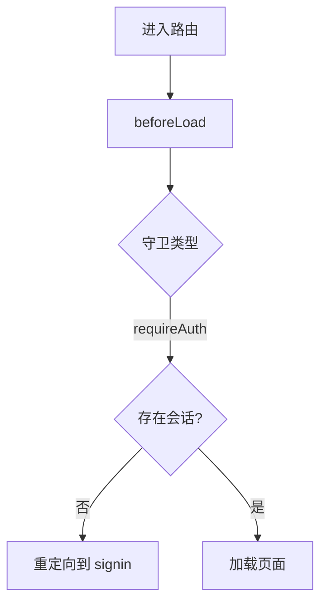

# 认证与路由保护设计

> 生命周期：长期稳定
> 文档类型：设计
> 状态：生效
> 更新日期：2026-08-12
> 维护范围：`apps/web-app`、`apps/backend`、`libs/auth`、`libs/permissions`

## 目标

Vibe Chat 的产品 Web 位于 `apps/web-app`，共享 backend 位于 `apps/backend`。页面访问控制由 Web 的 TanStack Router `beforeLoad` 完成，身份解析通过同源 backend 网关调用 Better Auth；backend API 必须独立完成会话和资源权限检查，不能依赖页面守卫。

## 组成

| 层级 | 当前入口 | 职责 |
| --- | --- | --- |
| 会话解析 | `libs/auth` + `apps/backend/src/routes/api/auth/$.ts` | Better Auth 配置、会话与认证 handler |
| 页面守卫 | `apps/web-app/src/lib/auth-guard.ts` | 通过 backend session 接口完成登录检查与重定向 |
| 路由接入 | `apps/web-app/src/routes/$lang/**` | 在 `beforeLoad` 调用对应守卫 |
| 权限模型 | `libs/permissions` | `Action`、`Subject`、角色与 `can()` 判断 |
| API 保护 | `apps/backend/src/routes/**` | 从请求 headers 解析会话并执行资源级权限检查 |

## 页面访问流程



现有守卫：

- `redirectIfAuthenticated`：已登录用户离开登录、注册等认证页面。
- `requireAuth`：没有会话时跳转到 `/$lang/signin`。

## API 安全边界

- 每个用户可访问 API 都必须从当前 `Request` 的 headers 解析会话。
- API 必须独立执行资源归属和权限检查，页面路由的 `beforeLoad` 不能替代 API 授权。
- Cloudflare 模式下，backend handler 通过 `withCfDb` 注入请求级数据库上下文。
- 认证失败返回 `401`，权限不足返回 `403`；只有页面导航使用重定向。
- 日志可以记录路由、用户 ID 和请求 ID，不得记录 cookie、token 或认证密钥。

## 接入规则

新建受保护页面时，在路由定义中直接调用守卫：

```ts
export const Route = createFileRoute('/$lang/(chat)/example')({
  beforeLoad: requireAuth,
  component: ExamplePage,
})
```

需要新的资源权限时，先扩展 `libs/permissions` 的共享模型，再让页面和 API 使用同一组 action/subject。不要在组件中仅靠隐藏按钮实现授权。

## 验证

- 未登录访问受保护页面会跳转到对应语言的登录页。
- 用户不能通过直接调用 backend API 绕过资源归属和权限检查。
- SSR 首次请求和客户端导航执行相同守卫逻辑。
- `pnpm typecheck`、`pnpm build` 和相关 TanStack E2E 用例通过。
