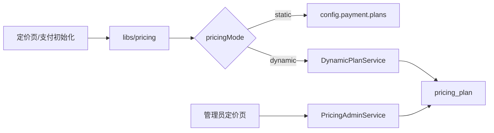

# 动态定价设计

> 生命周期：长期稳定
> 文档类型：设计
> 状态：生效
> 更新日期：2026-08-11
> 维护范围：`config/payment.ts`、`libs/pricing`、定价 API 与管理页面

## 目标

定价系统对页面和支付流程提供统一的 `Plan` 契约，同时支持两种来源：

- `static`：从 `config/payment.ts` 读取随代码发布的计划。
- `dynamic`：从数据库 `pricing_plan` 表读取由管理员维护的计划。

运行模式由 `PRICING_MODE=static|dynamic` 决定，默认是 `static`。

## 架构

| 层级 | 当前入口 |
| --- | --- |
| 统一读取 | `libs/pricing/index.ts` |
| 动态查询 | `libs/pricing/service.ts` |
| 管理操作 | `libs/pricing/admin.ts` |
| 数据类型转换 | `libs/pricing/types.ts` |
| 数据模型 | `libs/database/schema/*/pricing-plan.ts` |
| 公开 API | 当前未启用；恢复结账前必须由 Backend 提供 |
| 管理 API | `apps/backend/src/routes/api/admin/pricing-plans/*` |
| 管理页面 | `apps/admin-app/src/routes/$lang/admin/pricing/*` |

## 安全与一致性

- 当前只启用 Admin 方案维护；恢复购买时只能接受当前来源中存在且可购买的计划，动态模式下停用计划不能结账。
- 管理 API 必须要求管理员权限，不能只依赖管理页面守卫。
- 软删除通过 `isActive` 隐藏计划；硬删除只用于明确的管理操作。
- 排序以 `sortOrder` 为主，创建时间为稳定的次级顺序。
- 页面展示、支付订单和 Webhook 对账必须使用相同 plan ID、金额、币种与支付类型。

## 变更要求

新增字段时同步更新 PG、SQLite/D1 schema、转换类型、管理 API、页面和 i18n。配置步骤见[动态定价 Runbook](../runbooks/payment/dynamic-pricing.md)。
