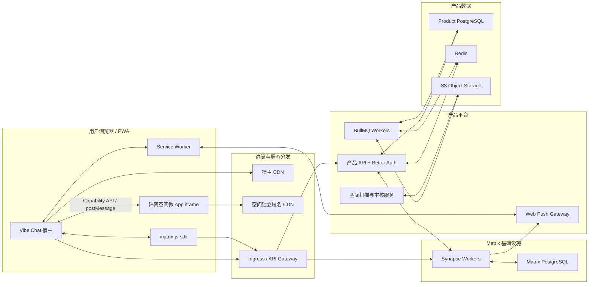
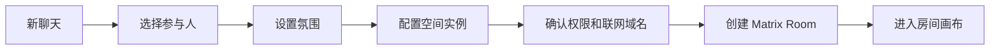
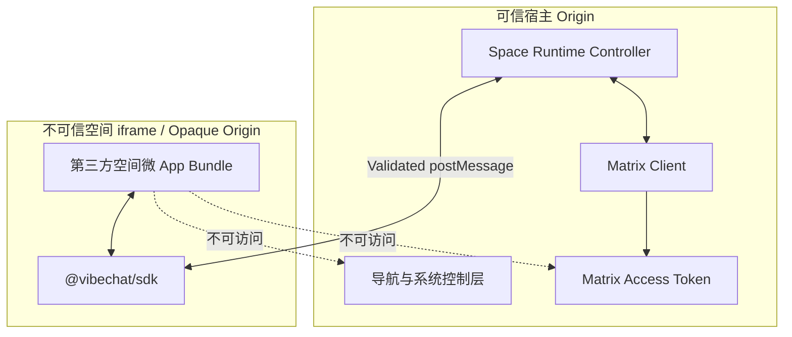
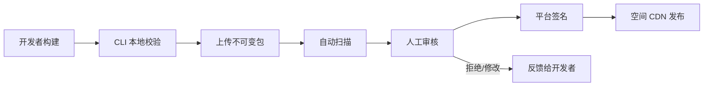
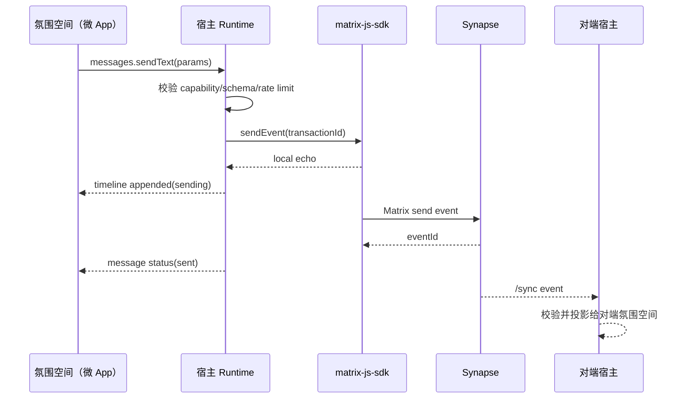

# VibeChat MVP 版本产品与技术设计

> 生命周期：长期稳定
> 文档类型：设计
> 状态：MVP 基线设计
> 日期：2026-08-12
> 首发平台：Web / PWA
> 目标规模：10,000 DAU 以内，约 1,000 峰值并发连接
> Active 实施：[VibeChat MVP 产品与技术设计实施跟踪](../../development/active/product-and-technical-implementation.md)

## 目录

1. [执行摘要](#1-执行摘要)
2. [产品定义与核心概念](#2-产品定义与核心概念)
3. [范围与成功标准](#3-范围与成功标准)
4. [技术选型与系统架构](#4-技术选型与系统架构)
5. [用户端产品与前端设计](#5-用户端产品与前端设计)
6. [氛围空间运行时](#6-氛围空间运行时)
7. [氛围空间开发与发布](#7-氛围空间开发与发布)
8. [后端服务设计](#8-后端服务设计)
9. [数据模型与 Matrix 映射](#9-数据模型与-matrix-映射)
10. [消息、媒体、搜索与推送](#10-消息媒体搜索与推送)
11. [安全、隐私与合规](#11-安全隐私与合规)
12. [部署、扩展与可观测性](#12-部署扩展与可观测性)
13. [测试与验收](#13-测试与验收)
14. [实施阶段](#14-实施阶段)
15. [风险与缓解措施](#15-风险与缓解措施)
16. [已确定决策与后续范围](#16-已确定决策与后续范围)

---

## 1. 执行摘要

Vibe Chat 是一个以“氛围”为核心的消费级即时聊天平台。传统聊天产品把消息列表和输入框视为固定界面；Vibe Chat 则把每个聊天房间定义成一个独立的**氛围空间实例**。氛围空间在技术上是一个微 App，可以从完全空白的画布开始，通过平台 SDK 获取参与人、消息、媒体、房间共享状态和自定义互动能力，自行决定聊天如何呈现、如何输入以及如何互动。

产品采用以下基础架构：

- 使用 **Matrix 协议、`matrix-js-sdk` 和独立部署的 Synapse** 复用成熟的即时通信能力，包括同步、本地回显、发送队列、失败重试、消息关系、已读、正在输入、媒体和房间成员关系。
- 使用自研闭源 React 宿主客户端，不 fork AGPL/商业双许可的 Element Web。
- 使用 **Better Auth + Email OTP plugin** 负责邮箱验证码注册登录、用户身份、Cookie 会话和会话管理，不自研认证系统。
- 产品业务后端选型暂缓；API schema 统一使用 **Zod 4**，不作为后端框架选型约束。
- 氛围空间的微 App 代码在隔离 iframe 中运行，永远不能直接取得 Matrix access token、宿主 DOM、Cookie 或宿主存储。
- 每个房间只有一个氛围空间，不能叠加其他空间。更换氛围通过“克隆迁移”创建新房间，旧房间与历史保持不变。
- MVP 面向熟人私聊和小群，首发 Web/PWA，不包含 E2EE、音视频、公共聊天室、原生移动端和无代码编辑器。

### 1.1 核心设计原则

1. **房间即氛围空间，而不是房间加插件。**
2. **氛围空间拥有完整会话画布，宿主拥有账号、安全和退出能力。**
3. **可靠消息属于平台，表现形式属于氛围空间。**
4. **危险操作必须由 iframe 外的系统界面确认。**
5. **所有空间版本不可变、可审计、可撤销、可恢复。**
6. **即使氛围空间崩溃或下架，用户仍能读取基础消息并迁移房间。**
7. **创建聊天仍遵循熟悉路径：先选人，再设置氛围。**

---

## 2. 产品定义与核心概念

### 2.1 核心实体

| 实体                       | 定义                                                              |
| -------------------------- | ----------------------------------------------------------------- |
| 用户 User                  | 由 Better Auth 管理的产品账号，同时映射到一个本地 Matrix 用户     |
| 联系人 Contact             | 产品层的双向好友关系；Matrix 不作为好友关系的权威来源             |
| 氛围空间 Atmosphere Space  | 一个可创建聊天房间的空间类型，在技术上由微 App 实现               |
| 空间版本 Space Version     | 氛围空间的不可变、已签名发布版本                                  |
| 房间 Room / Space Instance | 某一空间版本与参与人、实例配置共同创建的聊天实例                  |
| 宿主 Host                  | 用户端 PWA，负责账号、导航、Matrix 连接、安全控制和 iframe 运行时 |
| 互动事件 Interaction       | 氛围空间自定义的可持久化房间事件，必须带宿主可读降级文本          |
| 恢复视图 Recovery View     | 氛围空间失效时由宿主提供的只读基础消息界面                        |

术语规范：

- 产品界面、产品文档、开放 API 和开发者文档统一使用“氛围空间”；上下文明确时可简称“空间”。
- “微 App”只用于说明氛围空间的技术实现形态，不作为用户可见的产品实体名称。
- 对外契约统一使用 `spaceId`、`spaceVersionId`、`/spaces` 和 `io.vibechat.space.*`。
- 不保留此前基于 App 的产品实体称谓。

### 2.2 不变量

- 一个产品房间对应一个 Matrix room。
- 一个房间在任意时刻只对应一个 `spaceId`。
- 房间不能叠加第二个氛围空间。
- 空间身份不能在原房间中替换。
- 空间版本可以升级，但发布物本身不可变。
- 权限或联网域名增加时，成员必须重新确认。
- 克隆迁移会创建新房间，不修改源房间。
- Matrix 保存消息与成员关系的权威事实；产品数据库保存好友、市场、审核和业务索引。
- 氛围空间的微 App 不直接连接 Matrix，只能通过宿主 capability API 操作。

### 2.3 宿主入口与房间边界

宿主在房间之外提供类似传统即时聊天产品的入口：会话列表、联系人、选人发起聊天、未读数、通知和全局搜索。这里的“传统”只描述用户如何找到人并进入会话，不代表平台提供传统聊天房间或固定消息界面。

- 用户选择参与人后必须继续选择并配置一个氛围空间，才能创建房间。
- 系统不存在默认传统聊天空间，也不存在脱离氛围空间运行的普通产品房间。
- 一旦进入房间，整个会话区域都由该房间的氛围空间渲染。
- 宿主只在 iframe 外保留返回、安全确认、成员权限、故障恢复等系统控制。
- 平台提供 headless 消息、媒体、成员、状态和互动 API，但不规定消息气泡、输入框或会话布局。
- 平台可以发布官方氛围空间，第三方也可以发布氛围空间；二者使用完全相同的公开 SDK 和审核规则。

---

## 3. 范围与成功标准

### 3.1 MVP 目标

- 用户可以通过 Better Auth 的邮箱验证码流程自动注册或登录。
- 用户可以搜索、添加、接受、拒绝和屏蔽联系人。
- 用户可以先选择参与人，再选择氛围并创建私聊或小群。
- 用户可以在氛围空间市场中浏览、搜索、预览和收藏空间。
- 第三方开发者可以从空白画布创建氛围空间，通过 CLI 上传审核并发布。
- 氛围空间可以完全控制会话画布，并使用平台 API 操作消息、成员、媒体、状态和互动。
- 氛围空间崩溃、撤销、断网或版本不兼容时，房间仍可恢复和迁移。
- 系统能够在 1,000 峰值并发连接下保持可靠消息传递。

### 3.2 MVP 非目标

- 端到端加密。
- 语音和视频通话。
- Matrix 联邦。
- 公共聊天室和陌生人社区。
- 用户评分与评论。
- 图形化开发者 Studio。
- 普通用户无代码搭建。
- 房间叠加多个氛围空间。
- 任意 HTTPS 地址直接加载为氛围空间。
- 原生 iOS 和 Android 客户端。

### 3.3 核心成功指标

- 消息发送到同区域对端渲染 p95 小于 500ms。
- 已缓存氛围空间的画布 ready 时间小于 2 秒。
- 会话列表首次可交互时间小于 2.5 秒。
- 核心消息服务月度可用性目标为 99.9%。
- 已确认发送成功的消息在滚动重启中不丢失。
- 宿主导航、系统控制层和恢复视图达到 WCAG 2.2 AA；第三方氛围空间在发布审核中接受基础无障碍检查。
- 空间越权请求、未声明联网和 iframe 逃逸均被阻止。

---

## 4. 技术选型与系统架构

### 4.1 开源基础选择

#### Matrix

使用 Matrix 作为通信协议和房间状态模型。`matrix-js-sdk` 采用 Apache-2.0，并处理同步、房间状态、成员、消息关系、本地回显、队列、重试和分页：

- <https://github.com/matrix-org/matrix-js-sdk>

#### Synapse

生产环境运行未修改的 Synapse，作为独立 Matrix 服务。Synapse 当前采用 AGPL/商业双许可：

- <https://github.com/element-hq/synapse>

闭源宿主和产品 API 仅通过标准 HTTP/Admin API 与 Synapse 通信，不修改或链接 Synapse 源码。商业发布前必须由法律顾问复核 AGPL 边界、源码提供方式和许可证声明。

#### Better Auth

使用 Better Auth 作为唯一的产品认证实现，并启用 Email OTP plugin：

- Better Auth 负责用户、验证码、自动注册、会话 Cookie、会话查询/撤销和认证端点限流。
- React 宿主只通过 `better-auth/client` 和 `emailOTPClient()` 发起认证，不自行调用认证数据表。
- 产品 API 仅挂载 Better Auth handler，并在业务 route 中通过 `auth.api.getSession()` 验证身份。
- Product PostgreSQL 使用 Better Auth 官方 schema 与 CLI migration；产品代码不得自行写入其核心认证表。
- MVP 将 Better Auth `user`、`session`、`account` 持久化在 PostgreSQL，并显式启用 `session.storeSessionInDatabase: true`；Redis secondary storage 只承载短期 verification 和认证限流数据。
- 邮件服务只实现 `sendVerificationOTP()` 投递适配器，不参与 OTP 生成、保存、过期或校验。
- 登录成功后的 Matrix 用户与设备创建属于产品集成，由独立 bootstrap 流程完成，不放入 Better Auth 的认证判定逻辑。

官方文档：

- <https://better-auth.com/docs/plugins/email-otp>
- <https://better-auth.com/docs/concepts/session-management>
- <https://better-auth.com/docs/concepts/database>

#### 不直接 fork Element Web

Element Web 功能成熟，但当前采用 AGPL/GPL/商业多重许可，不符合“不购买商业许可且宿主闭源”的选择：

- <https://github.com/element-hq/element-web>

因此本项目复用 Matrix 通信引擎，而不复用 Element UI 源码。

### 4.2 技术栈

| 层             | 技术                                    | 责任                                                            |
| -------------- | --------------------------------------- | --------------------------------------------------------------- |
| 用户宿主       | React、TypeScript、Vite、PWA            | 导航、联系人、市场、Matrix 连接、空间微 App 容器                |
| 前端服务端状态 | TanStack Query                          | 产品 REST 数据缓存和失效                                        |
| 前端本地状态   | Zustand                                 | 导航、控制岛、权限面板、临时 UI 状态                            |
| 路由           | TanStack Router                         | 桌面与移动响应式路由                                            |
| 宿主组件       | Radix Primitives + 自研样式             | 可访问的弹层、菜单、对话框和表单                                |
| 用户认证       | Better Auth + Email OTP plugin          | 邮箱验证码注册登录、用户、Cookie session 和会话撤销             |
| 认证客户端     | `better-auth/client` + `emailOTPClient` | 登录状态、OTP、退出和设备会话管理                               |
| Matrix 客户端  | `matrix-js-sdk`                         | Matrix 同步、消息、媒体和成员关系                               |
| 产品 API       | 待定（TypeScript 为候选）               | Better Auth 挂载、Matrix 身份桥接、社交、房间、市场、审核、推送 |
| API schema     | Zod 4                                   | 类型、校验、序列化、OpenAPI                                     |
| 主数据库       | PostgreSQL                              | 产品业务数据                                                    |
| 缓存与队列     | Redis、BullMQ                           | Better Auth 短期 verification/限流、扫描、邮件、推送、发布任务  |
| 消息服务       | Synapse                                 | Matrix room、事件、同步、媒体元数据                             |
| 对象存储       | S3 兼容存储                             | 空间包、海报、扫描产物、媒体归档                                |
| 静态分发       | CDN                                     | 宿主静态资源和已签名空间版本                                    |
| 可观测性       | Pino、OpenTelemetry、Prometheus         | 日志、追踪、指标和告警                                          |

候选方案应提供 schema 验证、模块封装、TypeScript 类型集成和明确的 LTS 策略；最终后端选型将在前端骨架建立后重新评审。

### 4.3 系统结构



### 4.4 Monorepo 结构

```text
apps/
  site-app/              官网与公开内容
  web-app/               用户端宿主 PWA
  backend/               共享后端、产品 API 与 Better Auth
  docs-app/              SDK、用户与部署文档
  desktop-app/           后续 Desktop spike 通过后创建
  admin-app/             独立运营后台；A4 在此加入空间审核模块
packages/
  auth/                  Better Auth 服务端配置、客户端和邮件适配器
  sdk/                   @vibechat/sdk
  protocol/              postMessage 与 Matrix 事件契约
  api-contracts/         Zod schema 与生成客户端
  design-system/         宿主设计系统
  cli/                   create/dev/validate/publish CLI
  test-harness/          空间微 App 模拟宿主与测试工具
infra/
  compose/               本地完整环境
  kubernetes/            生产工作负载
  observability/         指标、日志与告警
```

---

## 5. 用户端产品与前端设计

### 5.1 信息架构

一级导航固定为：

1. 消息
2. 联系人
3. 发现
4. 我的

| 路由                        | 页面                         |
| --------------------------- | ---------------------------- |
| `/auth`                     | 邮箱验证码登录               |
| `/onboarding`               | 昵称、用户名和头像设置       |
| `/messages`                 | 会话列表                     |
| `/rooms/:roomId`            | 房间氛围空间画布             |
| `/contacts`                 | 联系人、好友请求和用户搜索   |
| `/discover`                 | 氛围空间市场                 |
| `/discover/spaces/:spaceId` | 空间详情与预览               |
| `/me`                       | 账号、隐私、通知和开发者入口 |

### 5.2 响应式框架

#### 桌面：宽度 ≥ 1100px

- 72px 一级导航栏。
- 340px 会话/联系人/市场列表栏。
- 剩余区域为详情或房间画布。
- 房间画布打开时不会卸载会话列表，以保持快速切换。

#### 平板：720–1099px

- 64px 一级导航栏。
- 列表与详情双栏切换。
- 房间打开后隐藏列表，通过返回按钮恢复。

#### 移动：宽度 < 720px

- 底部四项导航栏。
- 每个页面独占视口。
- 进入房间后隐藏底部导航，房间控制岛负责退出。
- 使用安全区 inset，避免遮挡 iOS 浏览器和 PWA 系统区域。

### 5.3 视觉方向

宿主采用“中性数字画廊”风格，让氛围空间成为视觉主体：

- 暖灰白背景、近黑正文、灰褐次级文字。
- 朱红作为系统强调色，仅用于创建、确认、警告和未读。
- 不使用常见紫色渐变或模板化玻璃拟态。
- 中文正文使用自托管思源黑体，编辑型标题使用思源宋体；拉丁字符使用 IBM Plex Sans。
- 统一 4/8px 间距网格。
- 宿主使用中等圆角；空间画布不继承宿主圆角或颜色。
- 常规反馈 160ms，页面进入 240ms。
- `prefers-reduced-motion` 下取消位移和缩放，只保留透明度变化。

#### 核心颜色 token

```css
:root {
  --host-canvas: #f3f0e9;
  --host-surface: #fbfaf6;
  --host-ink: #1c1b19;
  --host-muted: #777169;
  --host-line: #d9d4ca;
  --host-accent: #e4472f;
  --host-danger: #bc2c2c;
  --host-system-overlay: rgba(17, 17, 16, 0.9);
}
```

### 5.4 登录 `/auth`

页面包含：

- 品牌说明和一个只使用虚拟数据的氛围画布预览。
- 邮箱输入。
- 六位验证码输入。
- 发送倒计时和重新发送。
- 服务条款和隐私政策入口。

状态：

- 邮箱格式错误。
- 验证码错误或过期。
- 发送频率超限。
- 邮件发送延迟。
- 服务不可用。
- 登录成功后恢复之前访问的房间路径。

实现约束：

- 发送验证码调用 `authClient.emailOtp.sendVerificationOtp({ type: "sign-in" })`。
- 验证码登录调用 `authClient.signIn.emailOtp()`；未注册邮箱由 Better Auth 自动创建用户。
- 页面不直接请求自定义登录接口，也不自行保存、比对或刷新验证码。
- 成功建立 Better Auth session 后，再调用产品 Matrix bootstrap API。

### 5.5 首次设置 `/onboarding`

- 设置昵称。
- 设置唯一用户名。
- 上传、裁剪或跳过头像。
- 用一屏说明“先选人，再为聊天设置氛围”。
- 不在首次页面立即弹系统推送权限；用户完成第一次聊天后再用上下文提示申请。

### 5.6 消息页 `/messages`

#### 会话列表

会话卡保持完全统一，不允许氛围空间自定义布局或颜色。

每行展示：

- 单聊头像或群头像。
- 房间名称。
- 最后一条宿主可读摘要。
- 时间。
- 未读数。
- 静音、置顶、失败或离线标志。
- 小型空间图标仅用于辅助识别，不改变卡片视觉结构。

排序：

1. 置顶会话。
2. 未读会话。
3. 最后活动时间倒序。

交互：

- 搜索会话、联系人和历史消息。
- 未读筛选。
- 置顶、静音、标记已读。
- 进入房间。
- 更换氛围，实际进入克隆迁移。
- 离开房间。
- 氛围空间失效时显示恢复标志。

空间自定义事件必须包含 `fallbackText`，宿主用它生成会话摘要、通知和恢复视图。如果事件不合法或缺少降级文本，宿主可以持久化原始事件，但不展示为可读摘要。

#### 空状态

- 无会话时显示“开始第一次聊天”。
- 有联系人时展示最近联系人快捷入口。
- 无联系人时先引导添加联系人。

### 5.7 新建聊天流程

入口采用传统即时聊天产品熟悉的选人方式：点击消息页右上角“新聊天”，先选择人，再设置氛围。



#### 第一步：选择参与人

- 最近联系人。
- 全部联系人。
- 搜索用户名或邮箱。
- 支持单选和多选，MVP 小群最多 50 人。
- 被屏蔽用户不可选择。
- 如果已有与同一用户的会话，展示“打开已有会话”与“创建新的氛围会话”。

#### 第二步：设置氛围

- 不提供默认空间；用户必须明确选择一个可用的氛围空间。
- 最近使用。
- 官方精选。
- 已收藏。
- 全部氛围。
- 搜索和分类筛选。

空间卡片展示海报、名称、开发者、短简介、敏感权限数量和是否连接外部服务。

#### 第三步：配置氛围空间

- 没有配置项时直接跳过。
- 提供 `configSchema` 时，宿主渲染统一的 schema 表单。
- 提供 `setupEntry` 时，在隔离 iframe 中运行空间自定义设置画布。
- `setupEntry` 只能输出符合 manifest schema 的 `instanceConfig`。
- 设置阶段没有 Matrix room，也不能读取真实参与人的历史信息；只会得到所选成员的最小展示资料。

#### 第四步：权限确认

展示：

- 空间开发者和当前版本。
- 会读取的消息、成员、媒体或状态范围。
- 可执行的成员和消息操作。
- 外部联网域名。
- 隐私说明。

用户确认后才发送房间创建请求。

#### 第五步：创建与邀请

- 产品 API 创建 Matrix room。
- 写入空间 instance 状态。
- 邀请其他成员。
- 创建人立即进入房间。
- 受邀成员收到带完整空间权限信息的邀请卡。

### 5.8 联系人 `/contacts`

分区：

- 好友请求。
- 最近联系人。
- 全部联系人。
- 添加联系人。

功能：

- 按用户名或完整邮箱搜索。
- 默认不提供公开全量用户目录。
- 接受、拒绝或屏蔽好友请求。
- 修改备注名。
- 查看共同房间。
- 发起聊天并进入“设置氛围”。
- 查看与该联系人已有的多个氛围会话。
- 屏蔽后停止新邀请和好友请求，但保留用户已有消息数据。

### 5.9 发现 `/discover`

MVP 的发现页是氛围空间市场，不包含公开聊天室。

首页包含：

- 编辑精选主展示位。
- 最近上新。
- 热门氛围。
- 官方氛围空间。
- 日常、陪伴、游戏、学习、仪式、角色扮演、实验等分类。
- 搜索、权限和是否外部联网的筛选。

MVP 不开放用户评分和评论。排序由人工精选、使用量、崩溃率、加载性能和举报情况决定。

#### 空间详情 `/discover/spaces/:spaceId`

- 海报和开发者身份。
- 功能说明与适用场景。
- 使用虚拟成员和虚拟消息的沙箱预览。
- 权限、联网域名和隐私说明。
- 版本记录。
- 收藏和举报。
- “使用这个氛围聊天”：预选当前空间，再进入选择参与人流程。

### 5.10 我的 `/me`

- 昵称、用户名和头像。
- 邮箱和账号安全。
- 通知偏好。
- 外观、语言和减少动态效果。
- 好友申请范围。
- 黑名单。
- 登录设备和会话。
- PWA 安装状态。
- 缓存与离线数据管理。
- 开发者令牌和 CLI 文档入口。
- 开源许可证与 Synapse 源码入口。
- 退出登录和注销账号。

其中登录设备与会话列表直接使用 Better Auth 的 `listSessions`、`revokeSession`、`revokeOtherSessions` 和 `signOut`；产品层只补充显示对应 Matrix device 的同步状态。

### 5.11 邀请体验

邀请卡展示：

- 邀请人和其他参与人。
- 房间使用的氛围空间、版本和开发者。
- 空间海报。
- 所需权限。
- 外部联网域名。
- 接受、拒绝和屏蔽邀请人。

接受邀请即表示接受当前空间版本的权限。空间权限扩大或新增联网域名时，现有成员必须重新确认后才能加载新版本。

### 5.12 房间全画布 `/rooms/:roomId`

- iframe 覆盖完整会话区域。
- 氛围空间自行渲染消息、输入、成员、动画和互动。
- 宿主不提供固定消息框或输入栏。
- iframe 外始终保留不可伪造的系统控制层。

#### 自动收起控制岛

控制岛包含：

- 返回消息列表。
- 房间名称和空间图标。
- 网络/同步状态。
- 成员入口。
- 系统菜单。

行为：

- 进入房间后显示 3 秒，然后自动收起。
- 鼠标进入顶部、触摸顶部边缘、按 `Esc` 或键盘聚焦时重新出现。
- 断线、危险操作、崩溃或权限请求时强制显示。
- 采用固定的黑色高对比半透明胶囊，不允许空间修改样式。
- 减少动态效果模式下只淡入淡出。

#### 系统菜单

- 房间与氛围空间信息。
- 成员列表。
- 权限和联网域名。
- 通知设置。
- 基础消息恢复视图。
- 举报房间或氛围空间。
- 更换氛围。
- 离开房间。

### 5.13 加载、离线和错误状态

加载顺序：

1. 展示宿主房间骨架。
2. 获取空间 bootstrap 信息。
3. 验证版本状态、签名和哈希。
4. 加载 iframe。
5. 完成 SDK 握手。
6. 授予 capability。
7. 空间发出 `ready` 后切换画布。

错误处理：

- 5 秒未 ready：显示“仍在加载”、重试和恢复视图入口。
- manifest 或哈希错误：禁止执行空间代码。
- iframe 崩溃：保留 Matrix 连接，允许重载。
- 离线且空间已缓存：加载空间和缓存消息，发送操作进入队列。
- 离线且空间未缓存：进入只读恢复视图。
- 空间版本被撤销：停止执行并进入恢复视图。

### 5.14 更换氛围与克隆迁移

流程：

1. 从系统菜单选择“更换氛围”。
2. 选择目标氛围空间。
3. 展示可迁移和不可迁移内容。
4. 配置目标空间。
5. 用户确认。
6. 创建新房间并邀请原成员。
7. 新旧房间互相保留来源/去向链接。

自动迁移：

- 房间名称和群头像。
- 原成员邀请列表。
- 宿主中立配置。
- 双方 migration schema 兼容且用户确认的结构化空间状态。

不迁移：

- 聊天历史。
- 旧空间私有数据。
- 未经用户确认的外部服务数据。
- 原成员的自动加入状态。

---

## 6. 氛围空间运行时

### 6.1 安全边界



iframe 默认配置：

```html
<iframe
  sandbox="allow-scripts allow-forms allow-pointer-lock allow-downloads"
  referrerpolicy="no-referrer"
  allow="clipboard-write"
/>
```

默认不允许：

- `allow-same-origin`
- 顶层导航。
- 任意弹窗。
- 摄像头和麦克风。
- 未声明网络域名。
- 宿主存储和 Cookie。

### 6.2 空间 manifest

```json
{
  "schemaVersion": 1,
  "spaceId": "com.example.campfire",
  "version": "1.2.0",
  "name": "Campfire",
  "entry": "index.html",
  "setupEntry": "setup.html",
  "integrity": "sha256-...",
  "minHostVersion": "1.0.0",
  "permissions": [
    "context.read",
    "members.read",
    "messages.read",
    "messages.send",
    "interactions.send",
    "state.shared.read",
    "state.shared.write"
  ],
  "networkDomains": ["api.example.com"],
  "configSchema": {},
  "migrationSchema": {}
}
```

规则：

- `spaceId + version` 唯一。
- 发布后的 manifest、HTML、JS、CSS 和资源不可修改。
- 完整包使用内容哈希和平台签名。
- 新版本必须重新扫描和审核。
- 外部域名必须精确声明，不接受任意通配符。

### 6.3 生命周期

```text
unloaded
  -> validating
  -> loading
  -> handshaking
  -> ready
  -> suspended | error | revoked
```

- `validating`：检查房间状态、版本、签名、权限和成员同意状态。
- `loading`：加载已签名静态资源。
- `handshaking`：协商 SDK 和宿主协议版本。
- `ready`：开始传递消息和状态事件。
- `suspended`：房间切换、标签页后台或资源配额触发暂停。
- `error`：空间异常、超时或违反协议。
- `revoked`：平台撤销版本，禁止继续执行。

### 6.4 通信协议

请求：

```json
{
  "protocol": "vibechat/1",
  "requestId": "01J...",
  "method": "messages.send",
  "params": {
    "type": "text",
    "text": "hello"
  }
}
```

响应：

```json
{
  "protocol": "vibechat/1",
  "requestId": "01J...",
  "ok": true,
  "result": {
    "eventId": "$...",
    "transactionId": "..."
  }
}
```

事件：

```json
{
  "protocol": "vibechat/1",
  "event": "messages.timeline.appended",
  "sequence": 42,
  "payload": {}
}
```

要求：

- 验证 `event.source === iframe.contentWindow`。
- 每个 iframe 使用独立 session nonce。
- 所有 payload 使用共享 Zod schema 验证。
- 忽略未知字段，拒绝未知方法。
- request ID 在当前 session 内唯一。
- 写操作需要幂等 transaction ID。
- 每类 capability 独立限流。

### 6.5 Capability 设计

| Capability           | 能力                             | 授权方式                 |
| -------------------- | -------------------------------- | ------------------------ |
| `context.read`       | 当前用户、房间、语言、主题、视口 | 接受邀请时               |
| `members.read`       | 当前成员列表与展示资料           | 接受邀请时               |
| `members.invite`     | 请求邀请联系人                   | 每次宿主确认             |
| `members.remove`     | 请求移除成员                     | 每次确认并校验权限       |
| `messages.read`      | 读取允许范围内的时间线           | 接受邀请时               |
| `messages.send`      | 发送平台标准消息                 | 接受邀请时               |
| `messages.modify`    | 编辑或删除当前用户消息           | 每次删除确认，编辑按权限 |
| `messages.moderate`  | 删除他人消息                     | 每次确认并校验房间权限   |
| `media.read`         | 读取已授权媒体句柄               | 接受邀请时               |
| `media.write`        | 请求选择或上传媒体               | 用户直接手势触发         |
| `state.shared.read`  | 读取空间房间共享状态             | 接受邀请时               |
| `state.shared.write` | 修改空间房间共享状态             | 接受邀请时并限流         |
| `state.private`      | 读写当前用户私有空间状态         | 接受邀请时               |
| `interactions.read`  | 订阅自定义互动事件               | 接受邀请时               |
| `interactions.send`  | 发送自定义互动事件               | 接受邀请时并限流         |
| `host.openExternal`  | 打开外部地址                     | 每次确认                 |
| `host.clipboard`     | 写剪贴板                         | 用户手势触发             |
| `host.notify`        | 请求宿主通知                     | 安装权限 + 前后台规则    |

### 6.6 SDK API 分组

#### `context.*`

- `context.get()`
- `context.onVisibilityChange()`
- `context.onLocaleChange()`
- `context.onViewportChange()`

#### `members.*`

- `members.list()`
- `members.get(userId)`
- `members.requestInvite(userIds)`
- `members.requestRemove(userId, reason)`

#### `messages.*`

- `messages.subscribe(filter)`
- `messages.paginate(cursor, limit)`
- `messages.search(query, cursor)`
- `messages.sendText(text, options)`
- `messages.sendMedia(mediaHandle, options)`
- `messages.reply(eventId, content)`
- `messages.react(eventId, key)`
- `messages.edit(eventId, content)`
- `messages.requestRedact(eventId, reason)`
- `messages.markRead(eventId)`
- `messages.setTyping(isTyping, timeout)`

#### `media.*`

- `media.pick(options)`
- `media.upload(fileHandle, metadata)`
- `media.getDownloadHandle(mediaId)`
- `media.getThumbnail(mediaId, size)`

#### `state.*`

- `state.shared.get(key)`
- `state.shared.set(key, value, expectedVersion)`
- `state.shared.subscribe(prefix)`
- `state.private.get(key)`
- `state.private.set(key, value)`

#### `interactions.*`

- `interactions.subscribe(types)`
- `interactions.send(type, payload, fallbackText, notificationSummary)`

#### `host.*`

- `host.openExternal(url)`
- `host.copyText(text)`
- `host.download(mediaHandle)`
- `host.requestNotification(payload)`
- `host.reportCrash(details)`

### 6.7 空间状态分层

| 状态               | 存储                  | 适用范围                       |
| ------------------ | --------------------- | ------------------------------ |
| 空间 instance 配置 | Matrix room state     | 房间创建配置、版本、权限       |
| 小型共享状态       | Matrix state event    | 当前阶段、主题状态、有限 KV    |
| 高频互动           | Matrix timeline event | 游戏动作、仪式、投票、协作行为 |
| 用户私有状态       | Product PostgreSQL    | 草稿、个人偏好、未共享进度     |
| 大型或专用数据     | 审核通过的开发者后端  | 复杂计算和第三方服务           |

共享状态写入使用 `expectedVersion` 做乐观并发控制。冲突时返回当前版本，由空间决定合并或重试。

### 6.8 外部联网

- manifest 精确声明 `networkDomains`。
- 审核通过后生成对应 CSP `connect-src`。
- 权限确认页向成员展示所有域名。
- 不允许运行时临时扩大域名。
- 新增域名必须发布新版本并重新获得成员确认。
- 宿主 token、Matrix token 和平台 Cookie不会附加到第三方请求。

### 6.9 恢复视图

恢复视图属于宿主，不属于任何氛围空间，提供：

- 标准文字消息。
- 媒体附件元数据和受控下载。
- 自定义事件的 `fallbackText`。
- 消息时间、发送者和编辑/删除状态。
- 房间成员。
- 空间版本、失效原因和迁移入口。

恢复视图不尝试解释空间私有视觉或复杂状态。

---

## 7. 氛围空间开发与发布

### 7.1 MVP 开发方式

MVP 不制作图形化 Studio，提供 CLI、SDK、文档站和本地模拟宿主。

```text
vibe init       创建空白 Vanilla 或 React 项目
vibe dev        启动本地模拟宿主与热更新
vibe validate   校验 manifest、schema、权限和资源
vibe test       执行 SDK contract 与沙箱测试
vibe pack       生成不可变构建包
vibe publish    上传新版本
vibe status     查看扫描与审核状态
vibe logs       查看构建、扫描和运行时错误
```

用户在“我的 → 开发者”创建、命名和撤销 CLI token。

### 7.2 本地模拟宿主

- 虚拟当前用户。
- 1–50 个虚拟成员。
- 虚拟消息、媒体、已读和输入状态。
- capability 开关。
- 网络断开、消息失败、权限拒绝和空间暂停模拟。
- 桌面、平板和移动视口。
- 系统控制岛和敏感操作确认预览。
- `postMessage` 调试日志和 schema 错误定位。

### 7.3 发布流程



自动扫描：

- 文件数量、包大小和压缩炸弹。
- 路径穿越和危险文件。
- 依赖漏洞和恶意包特征。
- 内联远程脚本。
- CSP 与实际请求域名差异。
- manifest、配置和迁移 schema。
- 已知 token、密钥和 source map 泄密。
- 基础无障碍、加载性能和崩溃测试。

人工审核：

- 空间行为与描述是否一致。
- 权限是否最小化。
- 外部联网和隐私政策是否合理。
- 是否伪造宿主系统界面。
- 是否包含欺诈、恶意内容或不可退出体验。
- 降级文本和恢复能力是否可用。

### 7.4 内部审核后台

- 按风险和提交时间排序的审核队列。
- manifest、权限和域名 diff。
- 自动扫描报告。
- 虚拟用户沙箱预览。
- 网络请求日志。
- 版本历史。
- 批准、拒绝、要求修改。
- 紧急撤销和撤销原因。
- 所有管理员操作审计。

---

## 8. 后端服务设计（候选方案，待重新评审）

本章记录此前的产品 API 候选设计，用于保留领域边界和接口需求；在后端选型完成前，不作为当前脚手架的实现要求。

### 8.1 产品 API 架构原则

- 每个业务域注册为独立模块。
- 产品 route 只处理 HTTP、Better Auth session guard、schema 和错误映射。
- service 承担业务规则和事务边界。
- repository 封装 SQL，不跨域直接查询其他模块表。
- adapter 封装 Synapse、邮件、对象存储、扫描和 Web Push。
- 依赖通过显式 composition root 注入，不使用全局容器或反射装饰器。
- 产品业务请求和响应由 Zod 定义；Better Auth 路由使用其官方 handler 与客户端类型，不重复包装 schema。
- 产品 OpenAPI、前端客户端和 CLI 客户端从同一 contract 生成；认证客户端由 Better Auth 生成。

### 8.2 领域模块

| 模块          | 责任                                                                                |
| ------------- | ----------------------------------------------------------------------------------- |
| `auth`        | Better Auth 配置、handler、session guard、Email OTP plugin 和生命周期 hooks         |
| `identity`    | Better Auth 用户/session 到 Matrix 用户/设备的幂等 provision 与撤销                 |
| `profiles`    | 昵称、用户名、头像和账号状态                                                        |
| `social`      | 好友请求、联系人、备注和屏蔽                                                        |
| `rooms`       | 房间创建、氛围空间实例、成员邀请、bootstrap 和克隆迁移                              |
| `catalog`     | 氛围空间市场、分类、精选、搜索和收藏                                                |
| `developer`   | 开发者账号、CLI token、氛围空间与版本上传                                           |
| `review`      | 扫描、审核、签名、发布和撤销                                                        |
| `space-state` | 用户私有氛围空间状态和迁移 payload                                                  |
| `push`        | Web Push 订阅、Matrix pusher 和通知策略                                             |
| `moderation`  | 用户/氛围空间/房间举报、处置和审计                                                  |
| `admin`       | 内部角色、审核后台和运维操作                                                        |

### 8.3 API 约定

产品 API 与 Better Auth 的统一基础路径：`/v1`

产品业务 API 错误格式：

```json
{
  "error": {
    "code": "ROOM_SPACE_VERSION_REVOKED",
    "message": "This space version is no longer available.",
    "details": {},
    "requestId": "01J..."
  }
}
```

约定：

- `/v1/auth/*` 保留 Better Auth 原生契约和错误响应，由 `better-auth/client` 消费；不强行转换成产品错误格式。
- 列表使用 opaque cursor 分页。
- 创建、发布、克隆和敏感写操作接受 `Idempotency-Key`。
- 时间使用 UTC ISO 8601。
- ID 使用 UUIDv7 或 ULID，Matrix ID 保留原格式。
- 浏览器身份统一来自 Better Auth Cookie session；产品 API 不签发第二套 session。
- Better Auth 显式配置 `baseURL`、`basePath: "/v1/auth"`、`trustedOrigins`、生产 Cookie 属性和可信代理 IP 头。
- 产品 API CORS 只允许宿主 origin 并启用 credentials；认证路由直接透传 Better Auth 的状态码、响应头和 `Set-Cookie`。
- API access token 只用于 CLI，不用于用户浏览器 session。

### 8.4 Better Auth 与 Matrix 身份桥接

| Method     | Path                                    | 用途                                               |
| ---------- | --------------------------------------- | -------------------------------------------------- |
| `GET/POST` | `/auth/*`                               | 产品 API 透传给 Better Auth handler                |
| `POST`     | `/auth/email-otp/send-verification-otp` | Better Auth Email OTP plugin 发送登录验证码        |
| `POST`     | `/auth/sign-in/email-otp`               | Better Auth 验证 OTP，自动注册或登录并创建 session |
| `GET`      | `/auth/get-session`                     | Better Auth 获取当前用户和 session                 |
| `POST`     | `/auth/sign-out`                        | Better Auth 退出当前 session                       |
| `GET`      | `/auth/list-sessions`                   | Better Auth 获取当前账号的活动会话                 |
| `POST`     | `/auth/revoke-session`                  | Better Auth 撤销指定会话                           |
| `GET`      | `/session/bootstrap`                    | 已认证后获取产品资料与 Matrix session bootstrap    |

登录流程：

1. React 宿主使用 Better Auth client 请求 `sign-in` 类型的 Email OTP。
2. Better Auth 负责邮箱规范化、验证码生成与哈希保存、有效期、尝试次数、重发策略和认证限流；平台只通过 `sendVerificationOTP()` 把邮件任务交给发送服务。
3. Better Auth 校验 OTP；邮箱首次出现时自动创建 Better Auth user，随后创建 Cookie session。
4. 宿主调用 `/v1/session/bootstrap`；产品 API 使用 `auth.api.getSession()` 验证当前身份，不解析或复制 session token。
5. identity service 以 Better Auth `user.id` 幂等创建产品资料和 Matrix 用户映射。
6. identity service 以 Better Auth `session.id` 幂等建立 Matrix device/access token，并写入 session binding。
7. bootstrap 返回产品资料、homeserver、Matrix user ID、device ID 和 Matrix session 数据。
8. 宿主将 Matrix token 保存在专用 IndexedDB，不使用 `localStorage`，并永不传入微 App。
9. Better Auth session 被退出或撤销后，session lifecycle hook 写入 outbox，由 worker 撤销对应 Matrix device；定时 reconciler 修复遗漏任务。

认证实现边界：

- `/v1/auth/*` 下不创建任何自定义认证端点，只挂载 Better Auth handler。
- 不自建用户密码、OTP、session、Cookie 签名、CSRF token 或认证限流逻辑。
- 不直接修改 Better Auth 的 `user`、`session`、`account`、`verification` 表；schema 变更通过 Better Auth CLI 生成和迁移。
- 产品 route 只信任 `auth.api.getSession()` 的结果，并以 `session.user.id` 作为业务用户 ID。
- Matrix access token 与 Better Auth session 分开保存；任何一方的 token 都不能暴露给氛围空间。

### 8.5 社交 API

| Method   | Path                          | 用途                   |
| -------- | ----------------------------- | ---------------------- |
| `GET`    | `/contacts`                   | 联系人列表             |
| `GET`    | `/users/search`               | 按用户名或完整邮箱搜索 |
| `POST`   | `/friend-requests`            | 发送好友请求           |
| `GET`    | `/friend-requests`            | 请求收件箱/发件箱      |
| `POST`   | `/friend-requests/:id/accept` | 接受                   |
| `POST`   | `/friend-requests/:id/reject` | 拒绝                   |
| `PATCH`  | `/contacts/:userId`           | 修改备注               |
| `DELETE` | `/contacts/:userId`           | 删除联系人             |
| `POST`   | `/blocks`                     | 屏蔽用户               |
| `DELETE` | `/blocks/:userId`             | 解除屏蔽               |

业务规则：

- 好友关系由产品数据库管理。
- 屏蔽优先级高于好友关系和邀请。
- 被屏蔽用户不能发送好友请求或新房间邀请。
- 删除联系人不自动退出既有房间。

### 8.6 氛围空间市场与开发者 API

| Method   | Path                                  | 用途                         |
| -------- | ------------------------------------- | ---------------------------- |
| `GET`    | `/spaces`                             | 氛围空间市场列表、搜索和分类 |
| `GET`    | `/spaces/:spaceId`                    | 氛围空间详情                 |
| `GET`    | `/spaces/:spaceId/versions`           | 公开版本记录                 |
| `POST`   | `/spaces/:spaceId/favorite`           | 收藏                         |
| `DELETE` | `/spaces/:spaceId/favorite`           | 取消收藏                     |
| `POST`   | `/developer/tokens`                   | 创建 CLI token               |
| `DELETE` | `/developer/tokens/:id`               | 撤销 CLI token               |
| `POST`   | `/developer/spaces`                   | 创建氛围空间身份             |
| `POST`   | `/developer/spaces/:spaceId/versions` | 创建上传会话                 |
| `PUT`    | `/developer/uploads/:uploadId`        | 上传包或完成分片上传         |
| `POST`   | `/developer/versions/:id/submit`      | 提交审核                     |
| `GET`    | `/developer/versions/:id/status`      | 查询状态                     |
| `GET`    | `/developer/versions/:id/logs`        | 扫描与审核反馈               |

上传流程使用短期签名对象存储 URL，API 不代理大型包内容。

### 8.7 房间 API

| Method | Path                               | 用途                                          |
| ------ | ---------------------------------- | --------------------------------------------- |
| `POST` | `/rooms`                           | 创建氛围空间房间                              |
| `GET`  | `/rooms/:roomId/bootstrap`         | 获取氛围空间、版本、权限、资源 URL 和恢复状态 |
| `POST` | `/rooms/:roomId/clone`             | 克隆迁移到新氛围空间                          |
| `POST` | `/rooms/:roomId/upgrade-proposals` | 提议升级同一氛围空间版本                      |
| `POST` | `/rooms/:roomId/upgrade-consents`  | 成员同意权限变化                              |
| `POST` | `/rooms/:roomId/reports`           | 举报房间/氛围空间                             |

创建请求：

```json
{
  "spaceVersionId": "01J...",
  "participantUserIds": ["01J..."],
  "instanceConfig": {},
  "clientRequestId": "01J..."
}
```

创建事务：

1. 验证调用人、联系人、屏蔽状态和成员数量。
2. 验证空间版本已发布、未撤销且配置符合 schema。
3. 固化权限、联网域名、内容哈希和配置快照。
4. 调用 Synapse/Matrix 创建私有 room。
5. 写入 `io.vibechat.space.instance.v1` 状态。
6. 邀请参与人。
7. 写入产品 `room_index`。
8. 返回 room ID 和 bootstrap 数据。

如果 Matrix room 创建成功但产品索引提交失败，补偿任务通过幂等键重建索引；不会删除已创建房间。

### 8.8 克隆迁移 API

克隆请求包含：

- 源 room ID。
- 目标空间版本。
- 目标实例配置。
- 用户确认的迁移字段。
- 源氛围空间导出状态的短期 migration token。

流程：

1. 验证当前用户是源房间成员。
2. 验证源/目标 migration schema 兼容。
3. 校验迁移 payload 大小和 schema。
4. 创建新房间。
5. 邀请源房间当前成员。
6. 写入双向 migration reference。
7. 不复制消息历史。

### 8.9 推送 API

| Method   | Path                      | 用途                       |
| -------- | ------------------------- | -------------------------- |
| `POST`   | `/push/subscriptions`     | 注册 Web Push subscription |
| `DELETE` | `/push/subscriptions/:id` | 删除订阅                   |
| `PATCH`  | `/push/preferences`       | 通知偏好                   |
| `POST`   | `/internal/matrix/push`   | Matrix HTTP pusher 入口    |

Push Gateway 根据 Matrix push rule、房间静音、用户在线状态和氛围空间事件通知摘要决定是否发送。

---

## 9. 数据模型与 Matrix 映射

### 9.1 Product PostgreSQL

#### Better Auth 管理的认证数据

以下核心表由 Better Auth 创建、迁移和读写，字段名称以锁定版本生成的 schema 为准：

`user`

- `id`
- `name`
- `email`
- `emailVerified`
- `image`
- `createdAt`
- `updatedAt`

`session`

- `id`
- `token`
- `userId`
- `expiresAt`
- `ipAddress`
- `userAgent`
- `createdAt`
- `updatedAt`

`account`

- Better Auth 的认证账号关联数据；MVP 不由产品代码直接读写。

`verification`

- Better Auth 核心 verification schema；MVP 配置 secondary storage 后，Email OTP 的短期验证值存入 Redis，并在写入前通过 `storeOTP` 哈希。

MVP 显式配置 `session.storeSessionInDatabase: true`，因此活动 session 的权威存储仍为 PostgreSQL；Redis 仅作为 Better Auth 短期 verification 与 rate-limit 存储。产品 migration 不复制 Better Auth 表，也不把 Redis 用于任何耐久产品资料。

#### 产品用户资料与 Matrix 映射

`user_profiles`

- `user_id`，引用 Better Auth `user.id`
- `username`
- `display_name`
- `avatar_url`
- `status`
- `created_at`
- `updated_at`

`matrix_identities`

- `user_id`
- `matrix_user_id`
- `status`
- `provisioned_at`

`matrix_session_bindings`

- `auth_session_id`，保存 Better Auth `session.id`，不设置硬外键，以允许 Better Auth 删除过期 session 后保留撤销审计
- `user_id`
- `matrix_user_id`
- `matrix_device_id`
- `matrix_access_token_ciphertext`
- `created_at`
- `revoked_at`

`integration_outbox`

- `id`
- `event_type`
- `aggregate_id`
- `payload_json`
- `attempts`
- `available_at`
- `processed_at`

Better Auth user 是认证身份权威；`user_profiles` 是昵称、用户名和头像等产品资料权威。所有业务表中的 `user_id` 均引用 Better Auth `user.id`。

#### 社交关系

`friend_requests`

- `id`
- `sender_id`
- `recipient_id`
- `status`
- `created_at`

`contacts`

- `user_id`
- `contact_user_id`
- `remark`
- `created_at`

联系人采用双向两行或对称关系表，但 service 必须保证事务一致性。

`blocks`

- `blocker_id`
- `blocked_user_id`
- `created_at`

#### 氛围空间与审核

`spaces`

- `id`
- `slug/space_id`
- `developer_id`
- `name`
- `description`
- `status`
- `category_id`
- `created_at`

`space_versions`

- `id`
- `space_id`
- `semantic_version`
- `manifest_json`
- `bundle_hash`
- `signature`
- `status`
- `published_at`
- `revoked_at`

`space_reviews`

- `id`
- `space_version_id`
- `reviewer_id`
- `decision`
- `findings_json`
- `created_at`

`space_favorites`

- `user_id`
- `space_id`

`developer_tokens`

- `id`
- `developer_id`
- `token_hash`
- `scopes`
- `expires_at`
- `revoked_at`

#### 房间索引

`room_index`

- `matrix_room_id`
- `space_id`
- `space_version_id`
- `creator_user_id`
- `instance_config_json`
- `status`
- `created_at`

`room_migrations`

- `id`
- `source_room_id`
- `target_room_id`
- `source_space_version_id`
- `target_space_version_id`
- `created_by`
- `migration_summary_json`
- `created_at`

`user_space_state`

- `user_id`
- `matrix_room_id`
- `space_id`
- `state_key`
- `value_json`
- `version`
- `updated_at`

#### 推送和治理

`push_subscriptions`

- `id`
- `user_id`
- `device_id`
- `endpoint`
- `keys_encrypted`
- `created_at`

`reports`

- `id`
- `reporter_id`
- `target_type`
- `target_id`
- `reason`
- `status`
- `created_at`

`audit_logs`

- `id`
- `actor_type`
- `actor_id`
- `action`
- `target_type`
- `target_id`
- `metadata_json`
- `request_id`
- `created_at`

### 9.2 Matrix 标准事件

使用 Matrix 标准事件表达：

- `m.room.member`：成员与邀请。
- `m.room.message`：文字和媒体消息。
- `m.reaction`：回应。
- `m.replace` relation：编辑。
- `m.reference` / reply relation：回复。
- redaction：删除。
- receipt：已读。
- typing：正在输入。

### 9.3 Vibe Chat 自定义事件

#### 氛围空间实例状态

事件类型：`io.vibechat.space.instance.v1`

```json
{
  "spaceId": "com.example.campfire",
  "version": "1.2.0",
  "integrity": "sha256-...",
  "instanceConfig": {},
  "createdBy": "@alice:example.com",
  "permissions": ["messages.read", "messages.send"],
  "networkDomains": ["api.example.com"]
}
```

#### 氛围空间共享状态

事件类型：`io.vibechat.space.shared_state.v1`
state key：`<spaceId>:<key>`

```json
{
  "version": 7,
  "value": {},
  "updatedBy": "@alice:example.com"
}
```

#### 自定义互动

事件类型：`io.vibechat.space.interaction.v1`

```json
{
  "spaceId": "com.example.campfire",
  "schemaVersion": 1,
  "type": "add-log-to-fire",
  "payload": {},
  "fallbackText": "Alice added a log to the fire.",
  "notificationSummary": "Alice added a log"
}
```

#### 房间迁移引用

事件类型：`io.vibechat.room.migration.v1`

```json
{
  "direction": "outbound",
  "relatedRoomId": "!...",
  "targetSpaceId": "com.example.other",
  "createdAt": "2026-08-10T00:00:00Z"
}
```

### 9.4 数据权威来源

| 数据                                | 权威来源                                 |
| ----------------------------------- | ---------------------------------------- |
| 用户认证身份、邮箱和 Cookie session | Better Auth 管理的 Product PostgreSQL 表 |
| 用户产品资料                        | Product PostgreSQL `user_profiles`       |
| Matrix 用户和设备绑定               | Product PostgreSQL 映射表 + Synapse      |
| 好友、备注、屏蔽                    | Product PostgreSQL                       |
| 氛围空间、版本、审核、收藏          | Product PostgreSQL                       |
| 房间成员和邀请                      | Matrix                                   |
| 消息、回应、编辑、已读              | Matrix                                   |
| 氛围空间实例快照                    | Matrix room state，Product DB 建索引     |
| 氛围空间共享实时状态                | Matrix                                   |
| 当前用户私有氛围空间状态            | Product PostgreSQL                       |
| 氛围空间包和海报                    | S3 + CDN                                 |
| Web Push subscription               | Product PostgreSQL                       |

---

## 10. 消息、媒体、搜索与推送

### 10.1 标准消息发送



发送失败时：

- Matrix SDK 维护 local echo 和失败状态。
- 宿主向氛围空间发送 `sending`、`sent`、`failed` 状态。
- 氛围空间可以请求重试，但 transaction ID 保持幂等。
- 房间切换不会创建第二个 Matrix client。

### 10.2 自定义互动

- 互动通过宿主发送 `io.vibechat.space.interaction.v1`。
- payload 必须符合空间版本注册的 event schema。
- 必须带 `fallbackText`。
- payload 大小设上限；大型数据写入对象存储或开发者后端。
- 宿主可以在恢复视图中显示 fallback，而不执行氛围空间代码。

### 10.3 媒体

- 文件选择必须来自用户手势。
- 微 App 只获得 opaque file/media handle，不获得宿主文件系统路径。
- 宿主校验 MIME、扩展名、文件头和大小。
- 图片生成受控缩略图。
- 上传通过 Matrix media API。
- 下载使用认证媒体 URL 或宿主代理句柄。
- 高风险文件在服务端扫描完成前不能自动打开。
- MVP 默认限制：图片 20MB，普通文件 100MB；管理员可配置。

### 10.4 搜索

- MVP 无 E2EE，使用 Matrix room search 作为消息搜索基础。
- 产品 API 搜索联系人、房间索引和氛围空间市场。
- 宿主聚合结果并按类型分组。
- 微 App 可通过 `messages.search` 获取当前房间的权限内结果。
- 氛围空间自定义互动只索引 `fallbackText`，不索引任意 payload。

### 10.5 Web Push

1. Service Worker 创建 Web Push subscription。
2. 产品 API 保存加密后的 subscription key。
3. 宿主为 Matrix device 注册 HTTP pusher。
4. Synapse 向 Push Gateway 发送 push payload。
5. Gateway 应用用户偏好、房间静音和在线抑制。
6. 通知使用标准消息摘要或氛围空间的 `notificationSummary`。
7. 点击通知打开对应房间；氛围空间不可用时进入恢复视图。

---

## 11. 安全、隐私与合规

### 11.1 威胁模型

主要威胁：

- 恶意氛围空间读取或外传聊天数据。
- 氛围空间伪造宿主确认、登录或支付界面。
- iframe 逃逸或读取 Matrix token。
- 氛围空间发布后供应链替换。
- 恶意 manifest、schema 或压缩包攻击扫描服务。
- 验证码暴力尝试和邮件轰炸。
- 消息/媒体 XSS、恶意文件和 URL 欺诈。
- 开发者 token 泄漏。
- 管理员误操作或越权撤销。

### 11.2 宿主安全

- 宿主不加载未经固定哈希的第三方脚本。
- 严格 CSP，避免 `unsafe-eval`。
- Matrix token 不使用 `localStorage`。
- iframe 不使用 `allow-same-origin`。
- 所有系统确认和错误 UI 位于 iframe 外。
- 验证 `postMessage` source、session nonce、schema 和 sequence。
- URL 打开、剪贴板、下载和成员操作需要明确用户手势或确认。
- 富文本消息经过 allowlist sanitizer。

### 11.3 氛围空间隐私同意

- 创建人与受邀成员都能看到氛围空间权限和联网域名。
- 接受邀请即接受当前空间版本的权限。
- 权限扩大、新增域名或迁移到其他氛围空间必须重新确认。
- 宿主记录同意的 version、权限哈希和时间。
- 被撤销的 consent 会停止氛围空间加载，但不自动退出房间。

### 11.4 API 与账号安全

- Email OTP 由 Better Auth plugin 生成和校验，MVP 配置为 6 位、5 分钟有效、最多 3 次尝试、重发时轮换，并使用 `storeOTP` 哈希存储。
- Better Auth 认证限流在生产环境强制开启，使用 Redis secondary storage；只信任 Ingress 清洗后的真实客户端 IP 头。
- `baseURL`、`trustedOrigins`、Cookie 前缀、`HttpOnly`、`Secure` 和 `SameSite` 由 Better Auth 配置统一管理。
- 邮件供应商和边缘网关只补充投递配额与滥用防护，不复制 OTP 校验逻辑。
- CLI token 只显示一次，数据库只存哈希。
- 管理员通过 Better Auth 2FA plugin 强制 MFA，并使用最小角色权限。
- 高风险后台操作要求 Better Auth fresh session；过期时重新认证。
- 审计日志不可由普通管理员修改。

### 11.5 内容和治理

- 支持举报用户、消息、房间和氛围空间。
- 屏蔽用户停止新邀请和好友请求。
- 氛围空间紧急撤销后立即停止 CDN bootstrap 授权。
- 恢复视图仍允许用户导出和迁移自己的消息入口。
- 日志默认不记录消息正文、验证码、token 和氛围空间私有 payload。

### 11.6 许可证边界

- `matrix-js-sdk`：Apache-2.0，保留许可证和版权声明。
- Better Auth：MIT，保留许可证和版权声明。
- Synapse：独立运行 AGPL 版本，提供对应源码入口和许可证声明。
- Element Web：不复制其 AGPL UI 代码。
- `@vibechat/sdk`、protocol 和 CLI：计划采用 MIT 许可公开。
- 商业发布前进行依赖 SBOM、许可证扫描和法律复核。

---

## 12. 部署、扩展与可观测性

### 12.1 本地开发

Docker Compose 启动：

- Synapse。
- Matrix PostgreSQL。
- Product PostgreSQL。
- Redis。
- S3 兼容对象存储。
- Mail catcher。
- 挂载 Better Auth 的产品 API。
- Workers。
- Web host。
- 空间 CDN 模拟服务。

提供固定测试账号、示例房间和仅用于开发测试的 fixture 空间；fixture 不作为产品默认空间发布。

### 12.2 生产拓扑

- CDN 分发宿主和氛围空间静态资源，使用不同域名。
- Ingress 分离 `/v1` 产品 API 和 `/_matrix` Matrix 流量。
- 产品 API 至少 2 个无状态实例。
- BullMQ workers 独立部署，可按邮件、扫描、推送拆队列。
- Synapse 采用适合当前版本的 worker 拓扑，并使用独立 PostgreSQL。
- Product PostgreSQL 与 Matrix PostgreSQL 使用不同数据库和权限账号。
- Redis 启用持久化和高可用方案，并作为 Better Auth secondary storage。
- 氛围空间包、海报和扫描产物进入版本化对象存储。

### 12.3 容量基线

MVP 目标：

- 10,000 DAU。
- 1,000 峰值同步连接。
- 100 条消息/秒短时突发。
- 10GB/日新增媒体的初始容量假设。
- 100 个已发布氛围空间、1,000 个审核版本的初始规模。

所有数值通过压测校准，不作为硬编码限制。

### 12.4 可观测性

#### 产品 API 指标

- 请求量、状态码和延迟。
- 按 route 和 error code 分组。
- PostgreSQL query latency 和连接池。
- Redis 和 BullMQ 队列深度。
- Better Auth 登录成功率、认证错误码、限流命中和 session 创建/撤销量。
- Email OTP 请求量、投递成功率和投递延迟；不记录邮箱、OTP 或 session token。
- Matrix session bootstrap、设备创建、撤销和 reconciler 修复量。
- 氛围空间上传、扫描和发布耗时。

#### Matrix 指标

- `/sync` 延迟和错误率。
- 事件发送延迟。
- worker backlog。
- federation 关闭状态检查。
- PostgreSQL replication 和锁等待。
- media upload/download 错误。

#### 氛围空间 Runtime 指标

- manifest/bootstrap 延迟。
- iframe ready 时间。
- 崩溃率和超时率。
- capability 拒绝和限流。
- 按空间版本统计的 p50/p95 启动时间。

日志统一包含：

- `requestId`
- `traceId`
- 脱敏后的 `userId`
- `roomId`
- `spaceId`
- `spaceVersion`

### 12.5 告警

- Better Auth 登录成功率或认证错误率异常。
- Email OTP 投递失败率或延迟异常。
- Better Auth session 与 Matrix device 撤销积压。
- Matrix 事件发送或 `/sync` 错误率超阈值。
- 消息端到端延迟 p95 超标。
- API 5xx、数据库连接池和队列积压。
- 空间 CDN 哈希不匹配。
- 某空间版本崩溃率突增。
- Push 失败率异常。
- 数据库备份失败。

### 12.6 备份与恢复

- PostgreSQL 持续归档和每日完整备份。
- 对象存储版本化和生命周期策略。
- Redis 不作为唯一权威数据源。
- 每季度执行恢复演练。
- 目标 RPO：15 分钟。
- 目标 RTO：2 小时。

### 12.7 发布策略

- 宿主和 API 使用滚动发布。
- 数据库 migration 采用 expand/contract，避免新旧实例不兼容。
- Better Auth 运行库与 CLI 锁定同一精确版本；升级时先生成并评审 schema migration，再通过测试和灰度发布。
- SDK protocol 保持向后兼容；宿主至少支持最近两个稳定 protocol 版本。
- 空间版本不可变；修复通过发布新版本完成。
- 高风险新功能使用 feature flag 和小比例灰度。

---

## 13. 测试与验收

### 13.1 单元测试

- 产品 API service、repository 和错误映射。
- Better Auth 配置、邮件投递适配器、session guard 和生命周期 hook；不重复测试 Better Auth 内部算法。
- Matrix identity bootstrap、session binding、撤销 outbox 和 reconciler 的幂等性。
- Zod schema 和推导类型。
- Matrix event 到 SDK model 的转换。
- capability 决策和敏感操作确认。
- 房间创建、版本升级和克隆迁移规则。
- fallbackText 和通知摘要生成。
- 前端状态机、控制岛和错误恢复。

### 13.2 API 合约测试

- 产品 OpenAPI 与 Zod route schema 一致。
- `/v1/auth/*` 使用 Better Auth 官方客户端做黑盒合约测试，不复制其 schema 到产品 OpenAPI。
- Web、CLI 和 SDK 生成客户端通过编译。
- 错误码和幂等语义稳定。
- 产品 API 使用进程内请求测试，不依赖真实监听端口。

### 13.3 集成测试

使用真实 Better Auth、Synapse、PostgreSQL、Redis 和对象存储覆盖：

- Email OTP 请求、首次邮箱自动注册、再次登录、Cookie session 和错误/过期 OTP。
- Better Auth session 建立后的 Matrix 用户/设备 provision。
- 退出、单 session 撤销、其他 session 撤销及对应 Matrix device 撤销。
- 好友请求、联系人和屏蔽。
- 私聊、小群和成员邀请。
- 消息、媒体、回复、回应、编辑、删除、已读和输入状态。
- 氛围空间 room state 和自定义互动。
- 氛围空间发布、撤销和 bootstrap。
- Web Push。
- 克隆迁移。

### 13.4 端到端测试

Playwright 使用至少三个账号测试：

- Better Auth 邮箱 OTP 登录、首次自动注册、onboarding 和退出。
- “我的”页面查看并撤销其他活动会话。
- 先选人、再设置氛围、创建房间。
- 从发现页预选氛围空间后选择参与人。
- 使用 fixture 空间验证文字、媒体、回复、回应、编辑、删除、已读和搜索等 headless SDK 能力。
- 第三方空白画布氛围空间。
- 邀请权限确认。
- 自动收起控制岛和键盘唤回。
- 敏感操作确认不可被 iframe 绕过。
- 断网重连和发送队列。
- 氛围空间崩溃、撤销和恢复视图。
- 克隆迁移后源房间不变。

### 13.5 安全测试

- iframe 无法读取宿主 DOM、Cookie、IndexedDB 和 Matrix token。
- 伪造 `postMessage` source、nonce、schema 和 request ID 被拒绝。
- 未声明域名受 CSP 阻止。
- 压缩炸弹、路径穿越和恶意 manifest 被拒绝。
- 富文本 XSS、恶意 URL 和危险附件。
- Better Auth OTP 尝试次数、认证限流、trusted origins、Cookie 属性和 session fixation 测试。
- CLI token 滥用。
- 管理员权限和审计日志。

### 13.6 前端与无障碍

- Storybook/截图视觉回归。
- 桌面三栏、平板双栏、移动单页。
- 长昵称、长房间名、多语言和 RTL 基础检查。
- 200% 字体缩放。
- 键盘完整操作。
- 屏幕阅读器语义。
- 高对比和减少动态效果。
- axe 自动检查与人工无障碍验收。

### 13.7 性能与恢复

- 1,000 并发 Matrix 同步连接。
- 100 消息/秒突发。
- 产品 API 实例滚动重启。
- Synapse worker 重启。
- PostgreSQL 主从切换或短时不可用。
- Redis 重启和 BullMQ 重试。
- 空间 CDN 缓存失效。
- 备份恢复演练。

### 13.8 发布验收门槛

- 无 P0/P1 缺陷。
- 所有权限绕过测试通过。
- 已确认消息零丢失。
- p95 性能目标通过。
- 宿主导航、控制岛、权限确认和恢复视图达到 WCAG 2.2 AA。
- 氛围空间撤销可在目标时间内阻止新加载。
- 数据库备份和恢复演练通过。
- 许可证清单和 SBOM 完成。

---

## 14. 实施阶段

### 阶段 0：工程与基础设施

- Monorepo、CI、代码规范和环境配置。
- Docker Compose 本地栈。
- Synapse、PostgreSQL、Redis 和对象存储。
- 产品 API 基础框架、Zod、OpenAPI、日志和追踪。
- Better Auth、Email OTP plugin、官方 schema migration、Redis secondary storage 和邮件适配器。
- React 宿主、设计 token 和响应式壳。

交付标准：开发者可以一条命令启动完整本地环境。

### 阶段 1：Better Auth、社交与 Matrix 消息底座

- Better Auth 邮箱验证码自动注册与登录，不开发自定义认证端点。
- 用户资料、联系人、好友请求和屏蔽。
- Better Auth session 到 Matrix device 的 bootstrap、撤销 hook、outbox 和 reconciler。
- 会话列表和房间索引。
- Matrix adapter 的文字、媒体、回复、回应、编辑、删除、已读和输入状态能力。
- 搜索、已读、输入状态和离线队列。

交付标准：账号、社交关系、Matrix 消息能力和房间外入口稳定，并可通过 test harness 完整验证；此阶段不提供宿主内置房间聊天 UI。

### 阶段 2：氛围空间 Runtime

- manifest、签名和氛围空间 bootstrap。
- iframe sandbox 和 capability 协议。
- SDK、模拟宿主和协议 fixture 空间；fixture 只能使用公开 SDK。
- 控制岛、权限确认和恢复视图。
- 氛围空间 shared/private state 和 interaction events。
- 克隆迁移。

交付标准：第三方空白画布氛围空间可以完整承载房间 UI，并且无法越过宿主安全边界。

### 阶段 3：市场、CLI 与审核

- 发现页、氛围空间详情和沙箱预览。
- 收藏和市场排序。
- CLI init/dev/validate/pack/publish/status/logs。
- 上传、扫描、审核、签名和 CDN 发布。
- 内部审核后台和撤销流程。

交付标准：外部开发者可以独立开发并完成受控发布。

### 阶段 4：生产就绪

- Web Push。
- 扩容拓扑、压测和故障恢复。
- 安全审计、许可证复核和 SBOM。
- 可观测性、告警和运维手册。
- 灰度发布和恢复演练。

交付标准：达到 10,000 DAU 目标容量和 99.9% 可用性目标。

---

## 15. 风险与缓解措施

| 风险                                                | 影响                                   | 缓解措施                                                                          |
| --------------------------------------------------- | -------------------------------------- | --------------------------------------------------------------------------------- |
| Matrix 客户端复杂度                                 | 同步、设备和媒体边界难以正确处理       | 封装 Matrix adapter；基于真实 Synapse 做合约测试                                  |
| Better Auth 版本或 schema 漂移                      | 登录中断或认证数据不兼容               | 锁定精确版本；官方 CLI 生成 migration；评审、备份、灰度和回滚演练                 |
| Better Auth session 与 Matrix device 生命周期不一致 | 已退出设备仍保留 Matrix token          | session binding、撤销 outbox、幂等 worker 和定时 reconciler                       |
| Synapse AGPL                                        | 商业闭源边界存在法律要求               | 不修改 Synapse；独立部署；提供源码；上线前法律复核                                |
| 完全自定义画布                                      | 氛围空间可能不可用、不可退出或无障碍差 | iframe 外控制岛、恢复视图、审核和强制撤销                                         |
| 氛围空间数据外传                                    | 聊天隐私和平台信任受损                 | 域名声明、CSP、权限展示、审核和版本不可变                                         |
| 空间版本更新破坏房间                                | 历史状态无法解释                       | 房间固定版本；显式升级；permission diff；恢复视图                                 |
| 氛围空间自定义事件不可读                            | 会话列表、Push 和恢复失效              | 强制 `fallbackText` 和通知摘要 schema                                             |
| MVP 无 E2EE                                         | 用户对隐私能力预期不一致               | 明确产品说明；数据最小化；将 E2EE 作为独立后续架构项目                            |
| Web PWA 平台限制                                    | iOS 推送、后台和存储行为差异           | 明确支持矩阵；真实设备测试；不把关键状态只放浏览器缓存                            |
| CLI-only 开发体验                                   | 新开发者上手门槛较高                   | 高质量脚手架、模拟宿主、示例空间和可操作错误信息                                  |
| 完整客户端不直接 fork                               | 初期宿主和 SDK 适配工作量增加          | 复用 Matrix SDK、Radix primitives、统一设计系统、test harness 和协议 fixture 空间 |

---

## 16. 已确定决策与后续范围

### 16.1 已确定

- Web/PWA 首发。
- 熟人私聊和小群。
- Better Auth + Email OTP plugin 提供邮箱验证码自动注册与登录；不自建认证系统。
- 消息、联系人、发现、我的四项主导航。
- 先选参与人，再设置氛围。
- 发现页只做氛围空间市场，不做公开房间。
- 会话列表采用统一传统布局。
- 房间会话区域是氛围空间的完整画布；技术上由微 App 实现。
- 宿主使用自动收起控制岛。
- 敏感操作每次由宿主确认。
- 氛围空间可以访问审核通过的声明域名。
- 每个房间只有一个氛围空间实例。
- 更换氛围空间通过克隆迁移。
- 开发者 MVP 使用 CLI，不制作 Studio。
- MVP 无 E2EE、音视频和联邦。
- Matrix + `matrix-js-sdk` + Synapse。
- Better Auth 管理用户身份、OTP、Cookie session 和会话撤销。
- 产品后端选型待定；API schema 统一使用 Zod 4。
- 闭源宿主和产品服务；公开 SDK、protocol、CLI 和文档。

### 16.2 后续独立设计项目

- E2EE 与氛围空间数据授权模型。
- iOS/Android 原生客户端和 WebView Runtime。
- 音视频 capability。
- 普通用户无代码氛围搭建器。
- 氛围空间商业化、付费和分成。
- 开发者 Studio。
- 公共房间与社区治理。
- 跨氛围空间标准化迁移协议。

### 16.3 仓库前提

本文件最初在工程基线建立前创建，作为第一份产品与技术基线。当时环境曾引用 `RTK.md`，但仓库中不存在该文件；如果后续补充，开始实施前必须重新检查其中约束并更新本文档。

当前工程实现：官网位于 `apps/site-app`，产品 Web/PWA 位于 `apps/web-app`，共享 backend 位于 `apps/backend`，内部运营位于 `apps/admin-app`；四者均使用 TanStack Start、TanStack Router 和 Vite 并可独立构建。Web 与 Admin 通过各自同源网关访问 backend，保持 Better Auth Cookie 与公开 `/api`、`/v1` 路径稳定；未评审的旧 SaaS 页面/API 已隔离出活动路由图。Admin 当前覆盖用户、订阅、订单、积分、定价、Blog、佣金与提现，A4 空间审核作为该 app 的新模块加入。Desktop 尚未创建，必须等待 Desktop spike。
