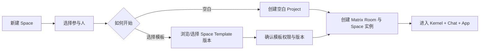
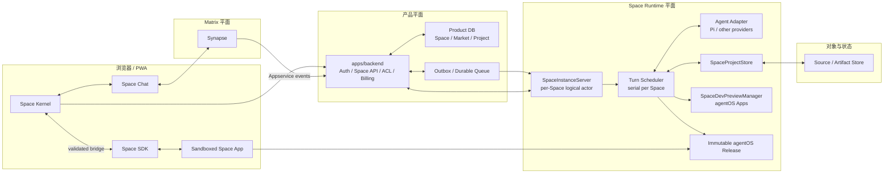

# VibeChat MVP 产品与技术设计

> 生命周期：长期稳定
> 文档类型：设计
> 状态：生效
> 更新日期：2026-08-22
> 维护范围：VibeChat Web/PWA、Space Kernel、Chat、Space App Runtime、Agent 协作生成、Space 市场、Matrix 消息底座与发布系统
> 事实边界：本文定义目标状态；当前实现、迁移差距与完成证据见 [Active 实施跟踪](../../development/active/product-and-technical-implementation.md)
> 设计演进：[Space App 设计演进与实施记录](../../development/active/space-app-design-transition.md)

## 1. 执行摘要

VibeChat 是一个以聊天为基础、可由 Agent 持续定制的多人 **Space** 产品。

每个 Space 首先都是完整的聊天空间：成员、邀请、消息、媒体、回复、编辑、删除、回应、已读、正在输入、历史同步和权限不依赖 App 或 Agent 才能工作。在这套聊天底座上，每个 Space 还拥有一份独立的 App Project。成员通过 Chat 与 Agent 对话，让 Agent 创建或修改 Space 的 App 体验；修改先成为 Draft，经过明确发布后才成为正式 Release。

Space 可以通过两种方式开始：

1. 创建空白 Space，立即进入完整 Chat，之后再从市场选择模板或与 Agent 对话创建 App。
2. 从 Space 市场选择一个模板创建 Space，模板作为初始 App Project 的来源。

市场中的模板不是正在运行的聊天实例。模板被应用时会复制为该 Space 独有的 Project/Revision；之后的成员、消息、状态和定制都只属于当前 Space，不会反向修改市场模板。

Space 只有三个产品与信任边界：

- **Kernel**：平台可信控制层，负责 Space 身份、成员、权限、Agent 编排、模板应用、Draft/Release、创作状态、恢复和治理。
- **Chat**：平台固定的完整聊天界面，承载人与人、人与 Agent 的对话。它始终可用，App 不能替换、隐藏或伪造。
- **App**：由模板和 Agent 共同塑造的应用体验，可以是场景、游戏、工具、仪式、信息面板或其他互动界面。

源码、生成进度、版本历史、发布和恢复入口属于 Kernel 的控制面板，不构成第四个 Studio 边界。

Agent 不是固定为 Pi。Pi 只是在 demo 中验证了对话分类、项目修改、隔离预览和发布链路的一种实现选择。正式架构使用 provider-neutral 的 Agent Adapter；同一 Space 可以配置默认 Agent，后续可以接入不同模型、编码 Agent、领域 Agent 或多 Agent 协作。

Space Runtime 的技术路线明确采用 `chat-app-server` 已验证的同构方案，而不是只借鉴产品语义：Node 22 + TypeScript + Hono 服务、每个 Space 一个逻辑实例服务器、SSE 实时下行与受控命令上行、同实例串行 Turn 队列、Project Store、Dev Preview Manager、agentOS Apps 隔离开发/不可变发布，以及 iframe Space SDK bridge。正式实现只把 demo 的 Guest 身份、本地 JSON 和单机内存调度替换成 Better Auth + Matrix、Product DB/Object Store 和可恢复 lease；核心对象边界与执行顺序保持一致。

本设计保留已经完成的 Better Auth、产品资料、联系人、邀请、Matrix identity、Matrix room/timeline、Space 市场基础、收藏和跨宿主 package 基线，只在其上增加 Space App、Agent、Draft 和 Release 能力。

### 1.1 本次设计校正

以下结论是硬约束：

- 产品语义统一使用 **Space**；`Matrix room` 只表示底层协议对象，不作为用户可见产品名称。
- Space 市场、分类、详情、收藏、版本和模板选择继续存在，不因生成式 App 而退场。
- 空白 Space 与模板 Space 都必须拥有完整 Chat；App 或 Agent 不可用时仍能正常聊天。
- 现有认证、资料、联系人、邀请、消息和 Space 目录能力必须保持兼容和回归全绿。
- Kernel、Chat、App 是仅有的三个边界；不再定义 Studio Surface。
- Agent 是可插拔能力，Pi 仅是示例 provider，不进入公共产品契约或数据库核心命名。
- 创建 Space 时可以选择模板，也可以跳过模板创建空白 Space。
- 空白 Space 在尚未发布定制 App 时可以直接应用模板；已有定制时应用模板必须生成可回退 Draft，不能静默覆盖 Live。

### 1.2 核心原则

1. **Chat 是产品基础，App 与 Agent 是增量能力。**
2. **产品叫 Space；Matrix room 只是 Space 的消息与成员底座。**
3. **Kernel、Chat、App 三个边界固定且相互隔离。**
4. **市场模板可复用，Space 实例的成员、消息、项目和状态独立。**
5. **普通人类对话不自动修改 App；面向 Agent 的定制请求才进入生成队列。**
6. **Agent provider 可替换；编排、权限、计费、项目和发布契约归平台所有。**
7. **修改默认形成 Draft；显式发布才原子切换 Live Release。**
8. **同一 Space 的 App 写入严格串行，不同 Space 在配额内并行。**
9. **App 无法获取凭据、源码管理、Agent 控制、构建或发布能力。**
10. **App/Agent/Runtime 失败不能破坏 Chat，也不能覆盖当前 Live。**

## 2. 产品定义与术语

### 2.1 核心实体

| 实体 | 定义 |
| --- | --- |
| User | Better Auth 管理的产品账号，并映射到一个 Matrix 用户 |
| Space | 用户可见的稳定聊天与协作实例，拥有成员、完整 Chat、Kernel、App Project 和权限 |
| Matrix Room | Space 在 Matrix/Synapse 中的底层成员与消息容器，仅用于协议、代码和运维语境 |
| Space Template | 市场中可发现、收藏、版本化和审核的 Space 起始模板 |
| Template Version | 模板的一次不可变发布，包含初始 App source/artifact、能力声明、说明和 provenance |
| Space Kernel | 平台可信内核，维护身份、ACL、Agent 编排、模板来源、版本指针、状态和恢复 |
| Space Chat | 平台固定的完整 Matrix 聊天体验，包含人类成员与 Agent 消息 |
| Space App | 当前 Space 中运行的可定制应用体验 |
| App Project | 某个 Space 独有的源码、Draft、Live Release、Agent 上下文和模板 lineage |
| Revision | 一次通过基础校验的不可变源码快照 |
| Draft | 成员可预览但尚未正式发布的 Revision |
| Release | 从固定 Revision 构建出的不可变正式产物 |
| Agent | 通过受控 Adapter 参与 Space 对话和 App 定制的 AI 执行主体 |
| Agent Adapter | 将平台统一任务协议适配到 Pi 或其他 Agent/provider 的服务端实现 |
| Agent Turn | Agent 对一条或一批 Space 请求的可审计处理单元 |
| Space Instance Server | `chat-app-server.LocalRoomServer` 的正式同构实现；每个 Space 一个逻辑状态机，管理连接、App State、presence、Agent 队列、进度和恢复 |
| Space SDK | App 与 Kernel 之间唯一受控的浏览器能力桥 |

### 2.2 术语规则

- 用户界面、产品设计和公开文档统一使用 `Space`/“空间”。
- `roomId`、`Matrix room` 只允许出现在现有兼容 API、Matrix 事件和基础设施实现说明中。
- 市场对象统一称为 `Space Template`，运行中的协作对象称为 `Space`，避免模板与实例混淆。
- `Kernel`、`Chat` 和 `App` 是三个边界；生成面板、历史、发布与恢复是 Kernel 的功能，不使用 `Studio` 命名。
- 公共契约使用 `agentId`、`agentProvider`、`agentSessionRef`；不得使用 `piSession` 等 provider 专属字段。
- `Draft` 表示可预览未发布版本；`Release` 表示不可变正式版本。

### 2.3 不变量

- 一个 Space、一个现有 `room_index` 记录、一个 Matrix Room、一个逻辑 Space Instance Server 和一个 App Project 构成同一实例；不得同时创建“聊天房间实例”和“多人 Space 实例”。
- 私聊、已有房间和多人 Space 只在成员数量与展示上不同，使用相同 ID 映射、Repository、Instance Server、SDK、队列和发布链路。
- 一个 Space 即使没有模板、App 尚未 ready、Agent 不可用或余额不足，也能继续使用完整 Chat。
- Space Template 可以被多个 Space 使用，但每次应用都会创建独立 Revision，不共享可变 App State。
- 一个 Space 同时最多有一个当前 Draft 和一个当前 Live Release。
- Revision、Template Version 和 Release 一旦生成不可原地修改；指针可以前移或恢复。
- App 不能替换 Kernel、Chat、成员管理、发布确认、账号或支付界面。
- 一个 Space 同一时间只有一个 App 写入批次；多个只读或不同 Space 请求可按配额并发。
- Matrix 是成员与聊天消息权威；Product DB 是 Space 索引、市场、Project、队列、版本和持久 App State 权威。
- Agent 只能通过平台授予的上下文、工具和预算工作，不能因 prompt 获得额外权限。
- App SDK 不暴露源码、构建、发布、Agent 工具、凭据、任意宿主请求或自定义高权限通道。

## 3. MVP 范围与成功标准

### 3.1 必须保留的基础能力

- Better Auth 登录、注册、OTP、session、资料设置和设备撤销。
- 联系人搜索、好友请求、接受/拒绝、屏蔽和从联系人发起 Space。
- Space 创建、邀请、成员同步和真实 Matrix timeline。
- 文字、媒体、回复、编辑、删除、回应、已读、typing、历史加载和错误恢复。
- Space 市场的目录、分类、详情、收藏、版本、权限说明和创建入口。
- 账号、偏好、积分、计费、Admin 和多应用/package 边界。

以上能力不因 Space App 改造降级。任何切片如果让 Chat 依赖 Agent、让市场入口消失或破坏旧 Space 可读性，都不能发布。

### 3.2 新增目标

- 创建 Space 时选择空白或市场模板；从模板详情也可以直接发起创建。
- 空白 Space 立即拥有完整 Chat 和安全的空 App 状态，之后可以应用模板或请求 Agent 创建 App。
- Space 成员可以在 Chat 中选择或提及 Agent，进行普通问答或提出 App 定制请求。
- Agent 将定制请求转成受限项目修改；成功后生成 Draft，不自动覆盖 Live。
- Draft 在隔离 Dev Runtime 中验证并向有权限成员预览。
- 有发布权限的成员通过 Kernel 明确发布不可变 Release；失败保持旧 Live。
- App 使用 Space SDK 获取成员、有限消息、presence、持久 state、瞬时 event、chat 和受限 theme。
- Runtime/Agent 重启后恢复 Project、App State、队列、请求和账务状态。
- Agent Adapter 支持替换 provider，不要求数据库迁移或前端重写。

### 3.3 MVP 非目标

- App 替换完整 Chat、成员管理、认证、支付或 Kernel。
- App 直接调用 Agent 工具、读取源码或自行发布。
- 任意 URL、任意 npm 项目或未经审核压缩包直接成为市场模板。
- Agent 获得平台密钥、用户 Cookie、Matrix token、账单详情或任意外部网络。
- 多个 App 同时控制一个 Space 的主 App Surface。
- E2EE、音视频、Matrix 联邦和原生移动端。
- 在首个 Agent 切片中完成开放 Agent 商店、多 Agent 自主协商或用户自带 provider key。
- 把当前官方模板目录冒充已经上线的第三方创作者生态。

### 3.4 成功指标

| 指标 | MVP 目标 |
| --- | --- |
| 普通 Matrix 消息同区域对端渲染 | p95 < 500ms |
| App State/瞬时事件在线广播 | p95 < 300ms |
| 已就绪 Draft 热切换 | p95 < 2s |
| 已缓存 Live Release 首次 ready | p95 < 2s |
| Agent 请求接受反馈 | 1s 内展示排队或拒绝原因 |
| Agent 或 Runtime 故障期间 Chat | 保持可用，不丢已确认消息 |
| 已入队 Agent 请求 | 服务重启后可恢复，不静默丢弃 |
| 发布失败 | 100% 保持上一个 Live Release 可用 |
| 模板应用 | 不修改市场版本，不丢 Space Chat/成员/旧 Release |
| 可信宿主界面 | WCAG 2.2 AA |

Agent 完成时间依赖 provider 和变更复杂度，不承诺固定秒数；Kernel 必须持续展示队列、阶段、心跳和可恢复错误。

## 4. 用户体验与信息架构

### 4.1 一级入口

MVP 一级入口保持：

1. 消息
2. 联系人
3. 发现
4. 我的

| 路由 | 目标职责 |
| --- | --- |
| `/auth`、`/signin`、`/signup` | 认证流程 |
| `/onboarding` | 昵称、用户名和头像设置 |
| `/messages` | Space 会话列表、未读和创建入口 |
| `/rooms/:roomId` | 现有兼容路由；用户语义显示 Space，后续可迁移到 `/spaces/:spaceId` |
| `/contacts` | 联系人、好友请求、搜索和发起 Space |
| `/discover` | Space Template 市场、分类、详情、收藏和创建入口 |
| `/me` | 账号、会话、偏好、积分和隐私 |

路由兼容不能泄露为产品术语：保留 `/rooms/:roomId` 不等于继续把界面命名为 Room。

### 4.2 创建 Space



- 从市场模板详情发起时，创建流程预选该模板，用户仍需选择成员并确认。
- 选择空白时不要求 initial prompt，不等待 Agent，Space 创建完成后立即进入 Chat。
- 空白 Space 在没有已发布定制 App 时，可以从 Kernel 或发现页应用模板。
- 已有 Draft/Live 时再次应用模板必须显示影响、创建新 Revision 并保留恢复点，不能清空消息、成员或历史版本。
- 创建事务以 `clientRequestId` 幂等；Matrix Room 创建成功但 Space/Project 索引未提交时由 outbox/reconciler 补偿。
- 模板不可用时可以回退为空白创建，不应阻塞基础聊天。

### 4.3 三边界页面模型

#### Kernel

Kernel 是永远可信的 Space 外壳，负责：

- 返回、Space 名称、成员、在线状态、连接状态和系统菜单。
- 模板来源、Agent 选择、队列/生成状态、Draft/Live 标记。
- 源码/版本历史、发布、恢复、权限、举报和治理入口。
- App 崩溃、加载失败、余额不足和 Agent 不可用时的恢复动作。

这些能力可以用顶栏、抽屉、模态框或状态层呈现，但仍属于 Kernel，不形成 Studio 或其他独立边界。

#### Chat

Chat 是完整而固定的产品能力：

- 展示人类成员、系统消息和 Agent 身份。
- 支持现有文字、媒体、回复、编辑、删除、回应、已读、typing 和历史同步。
- App 可以通过受限主题 token 协调配色，但不能改变 Chat 的结构、文案、层级、权限或可访问性。
- Chat 可以展开、收起或在移动端切换，但始终有宿主提供的明确恢复入口。

#### App

App 占据 Space 的体验画布：

- 空白 Space 可以显示安全的空状态、模板推荐和“与 Agent 创建”入口。
- 模板 Space 初始运行模板复制出的 Revision/Release。
- 定制后的 Space 运行当前 Draft 或 Live Release。
- App 在隔离 origin/Runtime 中执行，只能通过 Space SDK 与 Kernel 通信。

### 4.4 聊天与 Agent 语义

- 所有人类消息先按标准 Matrix 消息保存和广播，不等待 Agent。
- 普通成员之间的对话默认不进入 Agent 队列。
- 用户通过 `@Agent`、选择 Agent 对话、Kernel 的定制动作或显式命令发起 Agent Turn。
- Space 可以配置一个默认 Agent；未明确选中时不得把每条人类聊天都自动送入付费 Agent。
- Agent 对请求分类：
  - **Conversation**：回答、解释、讨论或澄清，不修改 Project。
  - **Revision**：创建、修改、修复或删除 App 行为，产生候选源码。
- Conversation 只追加带明确 Agent 身份的 Matrix 回复。
- Revision 必须经过 Space Dev 验证，成功后成为 Draft，并由 Kernel 标记“尚未发布”。
- Agent 思考、工具调用和构建日志只显示为 Kernel 状态；最终回复和稳定失败摘要才进入 Chat。

### 4.5 Agent 选择与扩展

- Agent Registry 保存 `agentId`、provider、模型/能力、可用工具、费用策略、版本和状态。
- Space 保存默认 Agent 与允许 Agent 列表；成员权限决定谁能调用、切换或管理 Agent。
- MVP 可以先接入一个 Pi Adapter，但 UI、API、队列、表名、错误码和账务必须使用通用 Agent 术语。
- 新增 Agent Adapter 必须通过相同的权限、上下文裁剪、项目工具、usage、取消、超时和审计合约。
- 不同 Agent 不得直接共享隐藏 session；跨 Agent 上下文只能通过平台持有的可审计 Space 摘要、Project 和授权消息窗口。
- 未来多 Agent 协作应作为独立设计，不改变 Chat 权威或 App 发布规则。

### 4.6 多成员协作

- Agent 忙碌时，Chat 消息仍立即保存、同步和展示。
- 同一 Space 的相邻 Agent 定制请求可以在短窗口内按服务端接收顺序合并。
- 后续明确修正可以覆盖同批次前文；无法安全合并时 Agent 先在 Chat 中请求澄清。
- Publish 单独成批，是前后修改都不能跨越的顺序屏障。
- 在线成员看到同一队列数量、Agent 阶段、Draft 和 Live 指针。
- 默认成员可聊天；`agent.invoke`、`agent.manage`、`app.edit`、`app.publish` 和 `space.manage` 独立授权。

### 4.7 Draft、发布与恢复

- App 修改默认只更新 Draft。
- 有编辑权限的成员可以预览同一 Draft；普通入口继续使用当前 Live Release。
- 发布必须由具备 `app.publish` 权限的成员通过 Kernel 明确确认目标 Revision。
- 发布前重新验证 Draft，随后构建不可变 Release。
- 成功后原子更新 Live 指针并通知成员；失败只显示诊断，不改变 Live。
- 模板应用、Agent 修改和手动恢复都形成 lineage，任何操作都不能删除 Chat 历史。
- 当 Draft 与 Live 指向同一 Revision 时，Kernel 显示已发布并拒绝重复提交。

### 4.8 响应式与可访问性

- 桌面端保留 Space 列表与 Space 主区域；Kernel 不覆盖全局账号退出能力。
- 移动端 Space 独占视口；Chat 必须有固定可唤回入口，Kernel 关键操作支持键盘与触摸。
- Kernel 和 Chat 支持屏幕阅读器、200% 字体缩放、高对比和 `prefers-reduced-motion`。
- App 崩溃、加载失败或不满足最低无障碍要求时，Kernel 仍提供 Chat、成员、版本状态、重试和恢复。

## 5. 系统架构

### 5.1 已实现底座与新增目标

| 边界 | 当前事实 | 目标 |
| --- | --- | --- |
| Auth/Profile/Social | Better Auth、资料、联系人和屏蔽已实现 | 保持 |
| Matrix Chat | identity、device、room、timeline、媒体与关系事件已实现 | 继续作为成员与聊天权威 |
| Space 创建 | 当前以 `/v1/rooms` 创建 Matrix Room，并要求内置 `spaceId` | 保持兼容，补充空白/模板模式和 Space 实例语义 |
| Space 市场 | 服务端内置目录、分类、详情、收藏和版本已实现 | 保持并升级为 Space Template 市场 |
| App Runtime | 未实现 | 新增隔离 App、Space SDK 与 Space Dev |
| Agent 协作 | 现有 AI 是独立能力 | 新增 provider-neutral Agent Registry、Adapter 和 Space 队列 |
| 发布 | 未实现 | 新增不可变 Revision/Release 和原子 Live 指针 |

### 5.2 目标拓扑



### 5.3 应用与 package 边界

| 位置 | 责任 |
| --- | --- |
| `apps/web-app` | Space 页面组合、Matrix 浏览器同步、Kernel、Chat、可信 App bridge 和市场 UI |
| `apps/backend` | Better Auth、Space/Template ACL、市场 API、数据库事务、积分、Matrix appservice 和 outbox |
| `apps/space-runtime` | 与 `chat-app-server` 同构的 Node 22 + TypeScript + Hono runtime；Space Instance Server、SSE、Turn scheduler、Agent Adapter、Project Store、agentOS Apps Dev/Release |
| `apps/admin-app` | Space/Template/Agent/Release 治理、审核、撤销和审计 |
| `packages/space-app-contracts` | Space SDK、Agent task、runtime session、事件、错误码和 schema |
| `packages/space-app-sdk` | App 使用的浏览器 SDK，不依赖 React、Matrix 或宿主路由 |
| `packages/space-app-client` | Web/Desktop Kernel 可复用 bridge 与 runtime client |
| `libs/space-apps` | Backend 单宿主 Project、Revision、Release、State、ACL 和 repository |
| `libs/space-agents` | Agent Registry、计费/outbox 领域规则，不承载 provider SDK 或 VM |
| 现有 `libs/rooms` | Matrix Room 生命周期和兼容 API；不定义用户可见产品术语 |

`apps/space-runtime` 独立部署，因为现有 Cloudflare Backend 不应启动 Agent 子进程、长期 VM 或 Release build。Runtime 只接受 Backend 签发的短期任务和成员作用域 session，不直接信任浏览器 Cookie。

### 5.4 技术方案定案：生产化 `chat-app-server`

Space 技术方案不再保持 Runtime 实现中立。第一版必须沿用 demo 的对象分解与执行链，并在本仓库中使用 Space 命名：

| `chat-app-server` | VibeChat 正式组件 | 保持不变的语义 | 生产化替换 |
| --- | --- | --- | --- |
| `src/server.ts` Hono server | `apps/space-runtime` Hono Node 服务 | HTTP command、SSE event、调度、Dev、Publish 组合 | Backend 签名、ACL、credits、trace |
| `LocalRoomServer` | `SpaceInstanceServer` | 一实例一状态机、snapshot、presence、App State、queue、progress、broadcast、恢复 | `appId` 改为 `spaceInstanceId`；JSON 改为 Repository/lease |
| `rooms` Map | `SpaceInstanceRegistry` | 按实例 ID 惰性加载并复用活动实例 | 多副本以 DB lease 选主，不依赖进程内唯一性 |
| `scheduleRoom/drainTurnQueue` | `SpaceTurnScheduler` | 同实例单写、跨实例有限并行、短批次、Publish 屏障 | durable queue、attempt、heartbeat、reconciler |
| `processTurn` | `SpaceTurnProcessor` | Conversation/Revision、自动修复、Draft、失败保护 | Agent Adapter、credits、审计 |
| `project-store.ts` | `SpaceProjectStore` | 固定项目文件、Draft/Live 指针、原子保存 | Product DB 元数据 + Object Store source/artifact |
| `DevPreviewManager` | `SpaceDevPreviewManager` | candidate 同步、隔离 build、ready/error、版本复用 | agentOS Apps 正式环境与配额 |
| `deployApp/appsRouter` | `SpaceReleaseManager` | 不可变 build、release ID、正式 serving | SBOM、provenance、签名、撤销 |
| `room-app-sdk.js` | `space-app-sdk` | snapshot、members/messages/presence/state/event/chat/agent/theme | Better Auth/Matrix 身份和严格 bridge schema |
| Pi generator | `PiAgentAdapter` | 首个 Conversation/Revision 与文件工具实现 | 通过通用 Agent Adapter 接口，可替换其他 Agent |

实现技术栈确定为：

- Node.js 22、TypeScript ESM、Hono 与 `@hono/node-server`。
- `@rivet-dev/agentos` 与 `@rivet-dev/agentos-apps` 作为 App Dev/Release 技术底座；具体版本在实现 spike 后由 lockfile 固定。
- MVP Generated Project 继续采用 demo 已验证的受限文件集合和 TypeScript build 约束，扩大文件/依赖能力需独立评审。
- Kernel realtime 与 demo 一致采用 SSE 下行；写操作使用认证 HTTP command。断线通过事件 sequence + snapshot 恢复。
- App iframe 与 Kernel 之间继续采用版本化 `postMessage` bridge；App 不直接连接 Matrix、Backend privileged API 或 Agent provider。

Agent 仍保持 provider-neutral：确定的是 Space Instance/Project/Dev/Release 技术链，不是把 Pi 固定为唯一 Agent。Agent Adapter 与 agentOS Apps Runtime 是两个接口层。

### 5.5 现有房间与多人 Space 的统一实例模型

不新增第二套 `MultiplayerSpaceInstance`、`RoomInstance` 或平行 Runtime。统一关系为：

```text
SpaceInstance
  1 ── 1 room_index row（当前物理表，逐步扩展）
  1 ── 1 Matrix Room（成员与 Chat 权威）
  1 ── 1 SpaceInstanceServer（逻辑 actor，可重建）
  1 ── 1 App Project（首次迁移时幂等 bootstrap）
  1 ── 0..1 Space Template lineage
  1 ── N members / Agent sessions / Revisions / Releases
```

- 当前私聊或群聊只要已经出现在 `room_index`，它就已经是一个 SpaceInstance，不克隆 Matrix Room，不迁移消息，不重新邀请成员。
- “多人 Space”不是新实体，只是同一 SpaceInstance 中存在多个 Matrix member 和多个 Runtime connection。
- `spaceInstanceId` 是新增长期稳定产品 ID；`matrixRoomId` 保持唯一映射和底层路由 ID。Runtime、Project 和 App State 统一以 `spaceInstanceId` 分区。
- 当前 `spaceId/spaceVersionId` 表示 Space Template lineage，不作为运行实例 ID；空白 Space 允许二者为空。
- Matrix membership 是成员权威；`participant_user_ids_json` 只作创建/ACL 投影缓存，必须由 Matrix event 修复，不能形成第二份成员事实。
- Chat timeline 继续只以 Matrix 为权威。demo `LocalRoomServer.messages` 在正式实现中映射为最近消息投影/Agent 上下文引用，不建立第二套消息数据库。
- Kernel 同时组合 Matrix Chat stream 与 Space Runtime SSE；对用户仍是一个 Space，不暴露两个后端实例。

### 5.6 统一实例生命周期

#### 打开现有聊天实例

1. Kernel 从兼容 `matrixRoomId` 查询 `SpaceInstanceRepository`。
2. 如果历史行没有 `spaceInstanceId`，Backend 在事务中生成并持久化一次；重复请求读取同一值。
3. 如果没有 `projectId`，以现有 `spaceId/spaceVersionId` 模板 lineage 幂等 bootstrap Project；模板已失效则使用 blank seed。
4. Backend 签发绑定 user、Matrix membership、`spaceInstanceId` 和 Project 的短期 Runtime session。
5. `SpaceInstanceRegistry.get(spaceInstanceId)` 惰性加载与 demo `#getReadyRoom()` 同构的 Instance Server，并从 Repository 恢复 App State、queued/active Turns 和 sequence。
6. Kernel 从 Matrix SDK 恢复 Chat，从 Runtime SSE 恢复 App/Agent snapshot；两者显示为同一 Space。

#### 创建空白或模板 Space

1. Backend 先生成 `spaceInstanceId` 和 `clientRequestId` 幂等键，校验成员和可选 Template Version。
2. 创建唯一 Matrix Room；成功后在同一 Saga 中写一条 `room_index` 记录，而不是分别写 Room 与 Space。
3. 空白模式 bootstrap blank Project；模板模式复制固定 Template Version 为初始 Revision。
4. outbox 写入 v2 Matrix state，并允许现有客户端继续读取 v1 模板字段。
5. Instance Server 只在首个 Runtime/Agent/App 请求时惰性启动；仅聊天的 Space 不消耗 Dev VM。

#### 从一对一变为多人

- 增加成员只产生标准 Matrix membership 事件和 ACL 投影更新。
- `spaceInstanceId`、Matrix Room、Project、Instance Server、Draft/Live、App State 和队列全部保持不变。
- Instance Server 更新 members/presence snapshot 并广播，不运行“转换为多人 Space”的迁移任务。

#### 多副本接管

- 每个 `spaceInstanceId` 同时只有一个写 lease owner；非 owner 可以代理/重定向 SSE 和 command，但不能 claim Turn。
- lease、active attempt、queued request 和 snapshot 均持久化。owner 失联后，新副本恢复 interrupted Turns 到队首，与 demo 把 `activeTurns` 放回 `queuedTurns` 的规则一致。
- Chat 不经过该 lease，Space Runtime 接管期间 Matrix 消息仍正常工作。

## 6. Space Kernel 与 Agent 编排

### 6.1 Kernel 职责

Space Kernel 负责：

- 校验 Better Auth 用户、Matrix membership 和 Space 权限。
- 投影固定 Chat 的消息、成员、已读、typing、媒体和连接状态。
- 管理 Space Template 应用、lineage 和市场来源展示。
- 保存并广播持久 App State、presence 和瞬时事件。
- 维护 Agent 请求队列、批次、心跳、取消、失败、重试和恢复。
- 维护 App Project、Draft 和 Live Release 指针。
- 执行积分预留/结算、发布权限、审计和配额。
- 向 App 暴露最小 Space SDK snapshot 和事件。

Kernel 是浏览器中的可信界面；`SpaceInstanceServer` 是它在 Runtime 中的同实例状态机。二者通过 `spaceInstanceId` 和短期 Runtime session 绑定。Backend 负责身份、Matrix、ACL、账务和持久事务，Instance Server 负责与 demo `LocalRoomServer` 一致的活动连接、sequence、snapshot、App realtime、Turn 状态和广播；不能把两者实现成两个不同的产品实例。

### 6.2 消息到 Draft 的执行流

```mermaid
sequenceDiagram
    participant U as Member
    participant M as Matrix/Synapse
    participant B as Backend
    participant S as SpaceInstanceServer
    participant A as Agent Adapter
    participant D as Space Dev
    participant K as Kernel

    U->>M: message(txnId, optional agent mention)
    M-->>U: eventId / local echo confirmed
    M->>B: appservice event
    alt human-only chat
        B-->>K: timeline projection only
    else explicit Agent request
        B->>B: membership + ACL + credits + dedupe
        B->>S: beginTurn(eventId, agentId)
        S->>S: persist + enqueue + broadcast
        S-->>K: queue_updated over SSE
        S->>A: claim serial batch + bounded context
        alt Conversation
            A-->>B: Agent reply only
            B->>M: Agent message
        else Revision
            A-->>D: bounded project files
            D->>D: validate / transpile / health check
            alt ready
                D-->>B: immutable revision + draft ready
                B-->>K: draft_ready
            else failed
                D-->>B: stable diagnostics
                B-->>K: turn_failed; Live unchanged
            end
        end
    end
```

Matrix appservice 事件以 `eventId` 幂等投影。`beginTurn → persist → broadcast → schedule → claim → process → complete/fail` 的顺序与 demo 保持一致，只把本地 JSON 保存替换为持久 Repository。浏览器重复同步、Backend 重试或 Runtime 重连不能产生第二个 Agent 请求。Chat 接受成功与 Agent 请求成功是两个独立结果：Agent 拒绝不能撤回已经确认的人类消息。

### 6.3 排队、批次与屏障

- 队列键为 `spaceInstanceId`；同一键最多一个 active write batch。
- 不同 Space 由全局、租户、用户、Agent provider 和 Runtime provider 配额限制后并行。
- 短窗口只合并相邻的 Agent 定制请求，不合并普通人类聊天。
- 批次保留每条请求的作者、Matrix event ID、Agent ID、时间和积分 reservation。
- `publish` 每次只处理固定 Draft，并作为顺序屏障。
- Agent/Runtime 定期发送心跳；lease 超时回到可恢复状态，不能直接重复扣费或发消息。

### 6.4 Agent 上下文与工具

- 每个 Space/Agent 组合有隔离 session；不得读取其他 Space 或其他 Agent 的隐藏上下文。
- Agent 只接收完成请求所需的成员显示名、显式授权消息窗口、Project snapshot、模板 lineage 和预算。
- 不发送邮箱、token、账单详情、完整账号资料或未授权私聊历史。
- 工具限定在项目文件 allowlist、单文件/总大小、依赖 allowlist 和受限读写动作。
- 安装依赖、任意 shell、宿主文件、凭据、网络和发布动作默认不可用。
- 平台校验 Agent 输出；Agent 不能自行扩大 SDK、Runtime 或网络权限。

### 6.5 Provider Adapter 合约

每个 Agent Adapter 至少实现：

```ts
interface SpaceAgentAdapter {
  beginSession(input: BeginSessionInput): Promise<AgentSessionRef>
  runTurn(input: AgentTurnInput, signal: AbortSignal): AsyncIterable<AgentEvent>
  summarize(input: AgentSummaryInput): Promise<AgentSummary>
  cancel(input: CancelAgentTurnInput): Promise<void>
  restore(input: RestoreAgentSessionInput): Promise<AgentSessionRef>
}
```

统一 `AgentEvent` 只允许标准化的 `status`、`text_delta`、`tool_activity`、`project_patch`、`usage`、`completed` 和 `failed`。Provider 原始事件留在受限诊断中，不直接暴露给浏览器。

Pi Adapter 可以将 demo 的 conversation/revision 分类、文件工具和 session 恢复映射到该合约；其他 Agent 使用相同入口。

### 6.6 重启恢复

- 接收 Agent 请求时先持久化请求、reservation 和顺序，再确认入队。
- active batch 使用 lease/attempt；Runtime 重启后过期任务回到队首或进入人工恢复。
- Project snapshot、Agent session ref、Draft/Live、模板 lineage 和 App State 持久化。
- 重试必须复用 Matrix event ID、request ID 和 reservation，不重复回复、Revision、Release 或扣费。
- Agent session 无法恢复时允许从平台摘要重建，但必须记录上下文截断和 provenance。

### 6.7 权限模型

| 权限 | 说明 |
| --- | --- |
| `space.chat` | 使用完整 Chat |
| `space.invite` | 邀请成员 |
| `template.apply` | 将模板应用为 Draft |
| `agent.invoke` | 调用已允许 Agent |
| `agent.manage` | 选择默认 Agent、允许列表和策略 |
| `app.interact` | 使用 App SDK 互动 |
| `app.edit` | 查看 Draft、源码摘要和生成诊断 |
| `app.publish` | 发布固定 Revision |
| `space.manage` | 管理成员、权限和 Space 生命周期 |

权限变化由 Kernel/Backend 校验，不由 App、模板或 Agent 决定。被移出 Matrix Room 的用户立即失去 Runtime session。

### 6.8 积分与结算

- 普通人类 Chat 不产生 Agent 费用。
- 每个显式 Agent 请求单独预留积分，批次执行后按可审计规则分摊 usage。
- Provider 返回模型、token、工具和构建 usage；平台映射到规范交易代码。
- 无权限或余额不足时消息仍可进入 Chat，但该 Agent 请求不入队，并给作者明确反馈。
- 超时、取消、失败、重试和恢复必须执行恰好一次结算或退款。
- Template 应用本身默认不产生 Agent 费用；需要 Agent 迁移/修复时先再次确认预算。

## 7. Space Template、Project、Dev 与 Release

### 7.1 Space 市场

市场保留并继续承担：

- 浏览官方及后续审核通过的 Space Template。
- 分类、搜索、详情、预览、收藏、版本、作者、权限和兼容性说明。
- 从模板详情创建 Space，或向空白/已有 Space 应用模板。
- 展示模板版本更新，但不自动覆盖 Space 的定制 Project。

当前 `/v1/spaces` 与 `spaceId/spaceVersionId` 是已实现目录契约。迁移期将其解释为模板引用并保持兼容；新契约可逐步增加 `spaceTemplateId/spaceTemplateVersionId`，不能先删除现有消费者。

### 7.2 模板应用规则

- 创建时选择模板：复制固定 Template Version 为 Project 初始 Revision。
- 创建空白：生成最小安全 Project/空 App 状态，Chat 立即可用。
- 空白且未定制：可直接选择模板并创建 Draft/初始 Live，具体发布策略由创建确认决定。
- 已定制：应用模板必须创建新 Draft、展示差异/风险并保留原 Live 与恢复点。
- 模板升级：只提示新版本；成员明确选择后才创建合并或替换 Draft。
- 模板卸载不是删除 Space；可以恢复为空白 App，但 Chat、成员和版本历史继续存在。

### 7.3 Project 与 Revision

Project 只允许平台支持的文件类型、入口和依赖。它保存：

- `spaceInstanceId`
- 模板与版本 lineage
- 当前 source manifest/hash
- Draft Revision 指针
- Live Release 指针
- Agent session refs 与摘要
- Runtime provider 和兼容版本

每个 Revision 保存 source hash/object key、父 Revision、来源类型（blank/template/agent/restore）、作者、Agent/Template 引用、摘要、校验状态和 provenance。

### 7.4 Space Dev

- Candidate source 在隔离、短生命周期环境验证。
- 校验入口、依赖、类型、构建、启动、health、SDK 版本和基本资源上限。
- 验证成功才写不可变 Revision 并更新 Draft。
- 验证失败返回截断诊断；不会覆盖最后 ready Draft 或 Live。
- 自动修复由当前 Agent Adapter 在预算与次数上限内完成，不绑定 Pi。

### 7.5 发布

发布输入固定 `revisionId`、`clientRequestId` 和发布者身份：

1. 校验 membership、`app.publish`、Revision/Space 归属和状态。
2. 对相同 source/runtime 输入复用已有安全 artifact。
3. 在隔离 build 环境生成不可变 artifact、SBOM 和 provenance。
4. 通过 health/SDK compatibility/security checks。
5. 创建 Release 并原子切换 Space Live 指针。
6. 用 outbox 同步 Matrix state 和在线成员。

任何失败都保留旧 Live。Release 撤销或回滚只移动指针，不改写历史。

## 8. Space SDK 与 App Runtime

### 8.1 信任边界

App 按不可信代码处理。它只能获得短期、Space/成员/Release 绑定的 Runtime session，以及最小 SDK snapshot。

| 能力 | App 可用 | Kernel/服务端专属 |
| --- | --- | --- |
| 读取最小成员资料 | 是 | 完整账号、邮箱、权限变更 |
| 读取有限 Chat snapshot | 是 | Matrix token、完整历史导出 |
| Presence | 是 | 成员身份伪造 |
| 持久 App State | 是，受 CAS/配额限制 | DB 直写、跨 Space 访问 |
| 瞬时事件 | 是，受限流限制 | 任意广播或跨 Space topic |
| 发送 Chat | 是，由当前成员身份代理 | 指定他人/Agent/系统身份 |
| 调用 Agent | 只可发起受权限/计费控制的请求 | 选择隐藏工具、注入 provider key |
| Theme token | 是，受 allowlist 限制 | 替换 Kernel/Chat 结构 |
| Source/build/publish | 否 | Kernel、Backend、Runtime |

### 8.2 SDK API

```ts
interface VibeChatSpaceSDK {
  ready(): Promise<SpaceSnapshot>
  members: {
    list(): readonly SpaceMember[]
    subscribe(handler: (members: readonly SpaceMember[]) => void): Unsubscribe
  }
  messages: {
    recent(options?: { limit?: number; before?: string }): Promise<MessagePage>
    subscribe(handler: (event: MessageEvent) => void): Unsubscribe
  }
  presence: {
    get(): PresenceSnapshot
    set(value: JsonValue): Promise<void>
    subscribe(handler: (event: PresenceEvent) => void): Unsubscribe
  }
  state: {
    get<T extends JsonValue>(key: string): Promise<StateValue<T> | null>
    set<T extends JsonValue>(key: string, value: T, expectedRevision?: number): Promise<StateValue<T>>
    subscribe(handler: (event: StateEvent) => void): Unsubscribe
  }
  events: {
    emit(name: string, payload: JsonValue): Promise<void>
    subscribe(name: string, handler: (event: AppEvent) => void): Unsubscribe
  }
  chat: {
    send(input: { text: string; clientRequestId: string }): Promise<{ eventId: string }>
    open(): void
  }
  agent: {
    status(): ReadonlyAgentStatus
    request(input: { agentId?: string; text: string; clientRequestId: string }): Promise<AgentRequestReceipt>
  }
  theme: {
    request(tokens: Partial<ThemeTokens>): Promise<AppliedThemeTokens>
  }
}
```

`agent.request()` 不是直接调用 provider。Kernel 仍执行身份、Agent allowlist、权限、预算和计费确认；App 不能指定工具、session、模型密钥或发布意图。

### 8.3 Bridge 与 iframe

- App 与 Host 使用不同 origin；Host 校验准确 `contentWindow`、session nonce、schema、sequence、action 和 payload。
- iframe 默认只允许 scripts/forms/modals/downloads，不授予顶层导航、摄像头、麦克风、宿主 Cookie 或存储。
- Generated Runtime 不注入平台 secret，出站网络默认拒绝。
- 未知 action、旧 iframe、错误 nonce、超配额、原型污染 key 和伪造身份全部拒绝。
- App 身份由 Host 注入；payload 中的 user/space/release 声明不可信。
- 未来外部网络 capability 需要独立的域名 allowlist、用户同意、egress proxy 和审计设计。

### 8.4 数据限制

初始上限：

- Presence：单成员 8 KiB，客户端合并到约 10 次/秒。
- 瞬时事件：16 KiB，按 Space/成员限流。
- 持久 App State：总计 128 KiB、最多 128 个 key、最大 12 层 JSON。
- key/事件名：1–64 位安全字符，拒绝原型污染键。
- 有限消息 snapshot：默认最近 50 条，受 membership、隐私和 retention 控制。
- App 发起 Chat/Agent 写入必须有幂等 request ID。

服务端必须再次校验，不能信任 SDK 客户端节流。

## 9. Matrix、数据模型与迁移

### 9.1 数据权威

| 数据 | 权威来源 |
| --- | --- |
| 用户、Cookie session | Better Auth |
| 资料、联系人、屏蔽 | Product DB |
| Matrix identity/device | Product DB 映射 + Synapse |
| Space membership、邀请、Chat、媒体、已读、typing | Matrix/Synapse |
| Space 实例索引、ACL、模板 lineage | Product DB，membership 以 Matrix 复核 |
| 市场目录、收藏、模板版本与审核 | Product DB/Object Store |
| Project、Revision、Draft、Release | Product DB/Object Store |
| Agent Registry、请求、lease、reservation、审计 | Product DB/Durable Queue |
| 持久 App State | Product DB |
| Presence、瞬时事件、构建进度 | Realtime/Runtime，可由 snapshot 重建 |

### 9.2 Matrix 映射

继续使用标准事件：

- `m.room.member`：成员与邀请。
- `m.room.message`：人类和 Agent 的文字/媒体消息。
- `m.reaction`、reply、replace、redaction：回应、回复、编辑和删除。
- receipt、typing：已读和正在输入。

新增 `io.vibechat.space.instance.v2` 只保存公开、可恢复指针：

```json
{
  "schemaVersion": 2,
  "spaceInstanceId": "01J...",
  "spaceTemplateId": "builtin-garden",
  "spaceTemplateVersionId": "v1",
  "projectId": "01J...",
  "liveReleaseId": "01J...",
  "runtimeVersion": "1",
  "updatedAt": "2026-08-22T00:00:00Z"
}
```

Matrix state 不保存源码、Agent session、token 或私有构建日志。Product DB 是指针业务权威；跨系统不一致由 outbox 幂等修复。

### 9.3 核心数据模型

`room_index`（统一 SpaceInstance 的现有物理表，不再新建 `space_instances` 平行表）

- `matrix_room_id`：现有主键，继续唯一。
- `space_instance_id`：新增稳定 ULID，唯一、非空；历史行回填，新逻辑 actor/Project/SDK 统一使用。
- `creator_user_id` / `participant_user_ids_json`：保留；后者降级为 Matrix membership 投影缓存。
- `space_id` / `space_version_id`：保留兼容，语义明确为 Template lineage；空白 Space 改为 nullable。
- `project_id`：新增唯一外键；迁移期间允许 nullable 并幂等 bootstrap。
- `default_agent_id`：nullable，指向 Agent Registry。
- `client_request_id`、`instance_config_json`、`status`、`created_at`、`updated_at`。

领域层立即改名为 `SpaceInstanceRecord`、`SpaceInstanceRepository` 和 `SpaceInstanceService`。物理表暂时保留 `room_index` 名称是为了 PostgreSQL/SQLite/D1 安全迁移，不代表存在 Room 产品实体；禁止再创建一张承载同一 Matrix Room 的 Space 表。

`space_instance_runtime_state` / `space_instance_leases`

- `space_instance_id`（主键/外键）、`sequence`、`snapshot_version`、`lease_owner`、`lease_expires_at`、`updated_at`。
- Instance Server 可以丢弃并重建；持久状态、Turn 和 lease 不能只存在 Node 进程内。
- lease 只约束 Space App/Agent 写状态机，不阻塞 Matrix Chat。

`space_templates` / `space_template_versions`

- 市场 identity、作者、分类、状态、收藏/展示元数据。
- 版本 source/artifact hash、SDK/runtime compatibility、capabilities、provenance 和审核状态。

`space_app_projects`

- `id`、`space_instance_id`、`draft_revision_id`、`live_release_id`
- `runtime_provider`、`created_at`、`updated_at`

`space_app_revisions`

- `id`、`project_id`、`parent_revision_id`
- `source_hash`、`source_object_key`、`summary`
- `source_kind`、`source_template_version_id`、`source_agent_id`、`source_turn_id`
- `created_by`、`validation_status`、`created_at`

`space_app_releases`

- `id`、`project_id`、`revision_id`、`runtime_release_id`
- `artifact_hash`、`provenance_json`、`published_by`、`published_at`、`revoked_at`

`space_agents` / `space_agent_sessions`

- Registry 配置与 Space/Agent 隔离 session ref、版本、摘要和恢复信息。

`space_agent_requests` / `space_agent_batches`

- Space、Matrix event、作者、Agent、顺序、kind、状态、lease、attempt、reservation 和结果。
- 唯一约束覆盖 Matrix `event_id` 与业务幂等键。

`space_app_state`

- `space_instance_id`、`revision`、`values_json`、`updated_at`。
- 写入使用 `expectedRevision` CAS；冲突返回最新 revision。

### 9.4 兼容迁移

- 现有每条 `room_index` 记录原地升级为唯一 SpaceInstance；新增并回填 `space_instance_id`，不复制记录、不创建新 Matrix Room、不移动 timeline。
- `SpaceInstanceRepository` 是唯一实例 Repository；旧 `RoomRepository/RoomService` 在迁移期只作为同一服务的命名适配器，不能拥有独立表、缓存或创建事务。
- 现有 `/v1/rooms`、`/rooms/:roomId` 和 `matrixRoomId` 继续服务，通过唯一映射解析同一 `spaceInstanceId`；迁移不能中断 Chat。
- 现有 `spaceId`、`spaceVersionId` 继续表示创建时选择的模板/版本，逐步别名为 `spaceTemplateId`、`spaceTemplateVersionId`。
- 现有 `/v1/spaces`、Discover、分类、详情和收藏继续保留；不得按上一版方案删除。
- `io.vibechat.space.instance.v1` 继续双读；新能力写 v2，并保留回滚读取。
- 历史 Space 在 backfill job 或首次进入新 Kernel 时幂等创建同一实例的 Project，模板 lineage 来自当前行/v1 state；找不到模板时创建空白 Project，但 Chat 不受影响。
- `SpaceInstanceRegistry` 首次收到 Runtime session、App command 或 Agent Turn 时按 `spaceInstanceId` 惰性恢复一个逻辑 Instance Server；多副本同时恢复时只允许持有 lease 的副本消费写队列。
- 一对一与多人实例执行完全相同的 bootstrap、subscribe、state、queue、Dev 和 Release 路径；测试不得用参与人数选择另一套 service/runtime。
- 不把现有市场收藏迁移为运行实例收藏；它继续关联 Space Template。

## 10. API 与实时契约

### 10.1 市场与创建兼容

现有市场 API 保持可用。目标契约可增加更清晰的 Template 路径，但不能删除旧路径后再迁移客户端。

| Method | Path | 用途 |
| --- | --- | --- |
| `GET` | `/v1/spaces` | 现有 Space Template 市场目录兼容入口 |
| `GET` | `/v1/spaces/:templateId` | 模板详情与当前可用版本 |
| `PUT` | `/v1/preferences/favorite-spaces/:templateId` | 收藏模板 |
| `GET` | `/v1/space-templates` | 目标别名，可在客户端迁移后启用 |
| `POST` | `/v1/rooms` | 现有创建入口；内部创建 Matrix Room 与 Space 实例 |

兼容创建请求：

```json
{
  "participantUserIds": ["01J..."],
  "spaceId": "builtin-garden",
  "spaceVersionId": "v1",
  "clientRequestId": "01J..."
}
```

空白创建允许模板字段为空。新客户端可同时发送命名更明确的 `spaceTemplateId/spaceTemplateVersionId`，服务端拒绝两组字段互相冲突。

### 10.2 Space App API

| Method | Path | 用途 |
| --- | --- | --- |
| `POST` | `/v1/rooms/metadata` | 兼容批量读取可访问 Space 摘要 |
| `GET` | `/v1/rooms/:roomId/app` | 通过 Matrix Room 兼容 ID 读取 Project/Draft/Live |
| `POST` | `/v1/rooms/:roomId/apply-template` | 将固定模板版本应用为 Draft |
| `POST` | `/v1/rooms/:roomId/runtime-session` | 签发短期成员作用域 Runtime session |
| `GET` | `/v1/rooms/:roomId/revisions` | 读取 Revision 摘要 |
| `POST` | `/v1/rooms/:roomId/agent-requests` | 显式调用允许的 Agent |
| `POST` | `/v1/rooms/:roomId/publish` | 发布固定 Revision |
| `GET` | `/v1/rooms/:roomId/releases` | Release 历史和撤销状态 |
| `PUT` | `/v1/rooms/:roomId/permissions/:userId` | 管理协作权限 |

目标 `/v1/space-instances/:spaceInstanceId/*` 可以在拥有稳定 Space 实例 ID 后作为新别名提供；迁移期间两组 API 共享同一领域服务，不能复制业务逻辑。

Chat 继续由 Matrix SDK 发送，不另造聊天 API。

`POST /v1/rooms` 与未来 `POST /v1/space-instances` 都只能调用 `SpaceInstanceService.create()`；前者是兼容 transport adapter。`GET /v1/rooms/metadata` 同样读取 `SpaceInstanceRepository`，不存在另一份 Room 元数据模型。

### 10.3 Backend、Runtime 与 Agent Adapter

- Backend 通过签名任务投递 Agent batch、Project snapshot、预算和权限快照。
- Runtime 选择 Agent Adapter，并标准化 progress、candidate Revision、diagnostics、usage 和 completion。
- Runtime 不能直接改积分账本、ACL、市场或 Matrix membership。
- 内部调用包含短期 audience、task/attempt/trace ID 和幂等键，不复用用户 Cookie。
- Runtime transport 与 demo 保持同构：Kernel 用短期 session 建立 `GET /runtime/spaces/:spaceInstanceId/events` SSE；写命令进入 `POST /runtime/spaces/:spaceInstanceId/commands`。Backend/网关校验后覆盖 user、Space、Agent 和 Release identity。
- SSE snapshot 包含 Instance Server 的 `sequence`、members projection、App State、presence、Agent build/queue 与 Project 指针；Chat 消息正文仍由 Matrix timeline 提供，snapshot 只包含授权的有限投影。
- `SpaceInstanceRegistry` 对相同 `spaceInstanceId` 返回同一逻辑实例；HTTP、Matrix appservice、SDK bridge 和恢复 worker 不能各自创建状态机。

### 10.4 实时事件

至少定义：

- `snapshot`
- `members_changed`
- `message_appended`
- `presence_changed`
- `app_state_changed`
- `app_event`
- `agent_queue_updated`
- `agent_turn_started`
- `agent_delta`
- `agent_activity`
- `heartbeat`
- `draft_ready`
- `dev_failed`
- `deployed`
- `agent_completed`
- `agent_failed`

断线后重新获取 snapshot 并按 cursor 接续；业务正确性不能依赖浏览器收齐全部 progress event。

### 10.5 错误与幂等

新增稳定错误码至少区分：

- `SPACE_NOT_FOUND`
- `SPACE_PERMISSION_DENIED`
- `SPACE_TEMPLATE_NOT_FOUND`
- `SPACE_TEMPLATE_VERSION_UNAVAILABLE`
- `SPACE_AGENT_NOT_AVAILABLE`
- `SPACE_AGENT_CREDITS_REQUIRED`
- `SPACE_AGENT_QUEUE_FULL`
- `SPACE_DEV_PREVIEW_FAILED`
- `SPACE_REVISION_STALE`
- `SPACE_RELEASE_BUILD_FAILED`
- `SPACE_RUNTIME_UNAVAILABLE`
- `SPACE_APP_STATE_CONFLICT`

创建 Space、应用模板、Agent 入队、state mutation、publish 和 Release activation 都使用业务幂等键；HTTP/队列重试不得重复扣费、发消息、生成 Revision 或发布。

## 11. 安全、隐私与治理

### 11.1 主要威胁

- 模板或 Generated App 读取、伪造或外传 Chat/成员/状态数据。
- App 伪造 Kernel、Chat、Agent、登录、支付、发布或错误界面。
- iframe 逃逸、旧 session 重放或伪造成员身份。
- prompt injection 让 Agent 读取宿主文件、凭据或其他 Space。
- 恶意源码导致构建逃逸、资源耗尽、供应链替换或 SSRF。
- 成员滥用他人积分、覆盖 Draft 或未经授权发布。
- Matrix、Agent queue、账务和 Live 指针跨系统不一致。

### 11.2 强制控制

- Kernel、Chat 与 App 使用明确不同的信任边界；Generated Runtime 使用隔离 origin。
- SDK bridge 校验 `contentWindow`、nonce、schema、action、payload、sequence 和速率。
- App 身份由 Kernel 注入；user/space/release/agent 声明由服务端覆盖。
- Agent session 与工作区按 Space/Agent 隔离，仅开放 allowlist 工具和路径。
- 构建无平台 secret，并限制 CPU、内存、时间、磁盘和网络。
- Template Version、source、artifact、SBOM 和 provenance 与 hash 绑定。
- 市场发布需要审核、兼容性与权限说明；收藏和安装量不能赋予模板额外能力。
- 积分 reservation、结算、退款和 publish 幂等且可审计。
- 日志不记录消息正文、完整 prompt、源码全文、OTP、token、Cookie 或 App State 私有值。

### 11.3 隐私与治理

- Space 创建/邀请说明 Agent 是否启用、消息何时会提交给 Agent、费用由谁承担。
- 默认只有显式 Agent 请求进入 provider；普通人类 Chat 不自动发送给 Agent。
- App 只能获得最小成员资料、有限消息 snapshot 和 App State，默认不能联网。
- Admin 可以审核 Template、撤销 Release、冻结 Agent、限制权限和查看 provenance，不能绕过审计改源码。
- 被撤销 Release 不再加载；Kernel 保留 Chat 并回退安全版本或空 App。
- 支持举报 Space、消息、Template、App、Agent 回复和 Release。

## 12. 部署、容量与可观测性

### 12.1 部署单元

- `web-app`、`backend`、`admin-app` 延续现有独立构建和同源产品 API。
- `space-runtime` 部署在支持 Node、长连接、Agent Adapter、VM/client 和构建任务的环境。
- Synapse、Product DB、对象存储、Agent provider 和 Runtime provider 使用独立凭据与最小网络权限。
- Dev VM、build VM 和 serving replica 隔离；Live Release 可按并发扩缩容。
- Runtime session、内部任务签名和 Agent provider credential 使用不同 audience/key。

### 12.2 容量基线

- 10,000 DAU、1,000 峰值 Matrix 同步连接。
- 100 条 Matrix 消息/秒短时突发；Chat 容量不与 Agent 并发绑定。
- 初始最多 2 个不同 Space 并行 Agent write batch，配置范围 1–8。
- 同一 Space App 始终单写；默认批次窗口约 350ms，配置范围 0–2s。
- 每个 Release 初始 `minReplicas=0`，按 provider 能力设置上限。
- Template source、Project、Revision、Release 和日志具有用户/Space 配额和生命周期策略。

### 12.3 指标与告警

至少记录：

- Space/Matrix Room 创建、模板复制、补偿和 state 修复。
- Chat 消息延迟、失败和 Agent 不可用时的独立可用率。
- 市场目录、详情、收藏、模板应用和版本失败率。
- Agent queue depth、Agent/provider 分布、wait、batch、lease、turn 和失败码。
- Conversation/Revision 分类和自动修复次数。
- Space Dev 冷启动、编译、health 和失败率。
- Release build、activation、rollback/revoke 和 ready 时间。
- SDK action 量、延迟、拒绝、冲突和限流。
- 积分 reservation、settlement、refund 和 reconciliation。

告警覆盖 Space lease 过期、Dev/Release 失败率、无效 Live 指针、Matrix event 投影积压、Agent provider 故障、账务不一致和 artifact hash 校验失败。恢复演练必须证明 Chat、Space/Template、Project、Live、App State、队列和账务一致恢复。

## 13. 测试与发布验收

### 13.1 单元与合约

- `room_index` 历史行映射唯一 `spaceInstanceId`，不创建第二条实例记录或 Matrix Room。
- 一对一与多人参与者调用同一 `SpaceInstanceService/Repository/Server`，不存在人数分支的替代实现。
- 空白与模板两种 Space 创建模式保持 Matrix/Space/Project/outbox 幂等。
- 现有 Space 市场、收藏、详情和模板版本兼容。
- Agent Adapter 的通用事件、usage、取消、超时、恢复和 provider 切换。
- 同 Space 单写、跨 Space 并发、批次和 publish barrier。
- Conversation/Revision、Revision hash、Draft/Live 和发布幂等。
- SDK snapshot、presence、state CAS、event、chat、agent 和 theme schema。
- bridge source/nonce/action/size/rate limit。
- ACL、积分预留/结算/退款和失败补偿。

### 13.2 集成

- 对同一历史 Matrix Room 分别从兼容 `/v1/rooms`、Space Kernel、App SDK 和 Matrix appservice 进入，全部解析为同一 SpaceInstanceServer、Project、queue 和 App State。
- 两个 Runtime replica 并发恢复同一实例时，只有 lease owner 执行 Turn；断开后新 owner 从 snapshot/queue 恢复。
- Better Auth + Matrix + Product DB 创建空白/模板 Space，完整 Chat 均可用。
- 普通人类消息不入 Agent 队列；显式 Agent 请求仅投影一次。
- Pi Adapter 与至少一个 fake Agent Adapter 通过同一合约测试，证明公共契约不绑定 Pi。
- 隔离 Space Dev 验证 Draft；失败保留最后 ready Draft 和 Live。
- Template 应用创建独立 Revision，不修改市场版本或 Chat 历史。
- 两个浏览器通过 SDK 同步成员、presence、state 和瞬时事件。
- Runtime/Backend 重启与重复回调不重复扣费、回复或发布。

### 13.3 E2E 核心场景

正式实现以 [TEST-CATALOG #40](../../../tests/e2e/TEST-CATALOG.md) 为验收主目录，至少覆盖：

1. 空白 Space 与模板 Space 都能创建并立即聊天。
2. 现有私聊和新增多人 Space 都解析为唯一 SpaceInstance，使用同一 Instance Server/Project/SDK/queue。
3. Discover、分类、详情、收藏和模板创建入口保持工作。
4. Kernel、Chat、App 三边界固定，App 不能伪造宿主控制。
5. 人类普通聊天不调用 Agent；显式对话才进入 Agent 队列。
6. Conversation 只回复；定制请求生成 Draft 且标记未发布。
7. 切换 Agent Adapter 不改变 Project、权限、计费和发布契约。
8. 空白 Space 应用模板、已有 App 再应用模板都可恢复。
9. Draft 失败保留最后 ready Draft 和 Live，Chat 始终可用。
10. 显式发布、SDK、iframe、ACL、积分、重启和迁移符合安全与幂等语义。

### 13.4 发布门槛

- 现有认证、联系人、邀请、Chat 和 Space 市场回归全绿。
- 新增 unit、contract、integration 和 TanStack E2E 全绿。
- 无 P0/P1 权限、凭据、计费、市场供应链、发布一致性或 sandbox 缺陷。
- 通过真实 Synapse、真实 Runtime provider、至少一个 Agent Adapter 和双 Chromium 走查。
- docs、packages、Web、Backend、Admin 和 Space Runtime 构建通过。
- 备份恢复、lease 恢复、Release 撤销和积分 reconciliation 有证据。

## 14. 实施阶段

### 阶段 0：设计校正与兼容护栏

- 将用户语义统一为 Space，Matrix Room 保持底层实现术语。
- 保留 `/v1/spaces`、Discover、收藏、模板选择、`spaceId/spaceVersionId` 和现有 Chat。
- 确定采用与 `chat-app-server` 同构的 Node/Hono、Instance Server、SSE、Turn scheduler、ProjectStore、agentOS Apps 和 SDK 技术链。
- 定义 `room_index` 原地升级的唯一 SpaceInstance、Template、Project、Agent Adapter 和 v1/v2 state 双读。

交付标准：不存在删除市场或降低聊天能力的迁移任务；旧客户端与旧 Space 继续工作。

### 阶段 1：Space Kernel 与 Project 基础

- 在现有 `room_index` 原地增加 `space_instance_id/project_id/default_agent_id`，历史行幂等回填，不创建平行实例表。
- 将 `RoomService/Repository` 迁移为统一 `SpaceInstanceService/Repository`，`/v1/rooms` 只保留同服务适配器。
- 在现有创建链路中补充空白/模板模式；一对一与多人 Space 走同一事务。
- 新增 Space App contracts、ACL、Project/Revision/Release/State schema。
- 建立 Matrix event projection、durable queue、lease、outbox 和 credits reservation。
- 保持现有 Chat、社交、资料、市场和 session 回归全绿。

交付标准：空白和模板 Space 都能创建，Chat 不依赖 App/Agent，历史 Space 可读。

### 阶段 2：Kernel、Chat、App 与 Space SDK

- 新增 Node 22 + TypeScript + Hono 的 `apps/space-runtime`，实现 `SpaceInstanceRegistry/Server`、SSE、认证 command 和 lease 恢复。
- 接入 `@rivet-dev/agentos`、`@rivet-dev/agentos-apps`、`SpaceProjectStore` 与 `SpaceDevPreviewManager`。
- 实现 Space SDK members/messages/presence/state/event/chat/agent/theme。
- 固定 Kernel/Chat/App 三边界、错误恢复和双浏览器实时链路。
- 支持空白 Space 应用市场模板并保留历史。

交付标准：模板或种子 App 可多人互动，App 故障不影响完整 Chat。

### 阶段 3：Agent Adapter、Space Dev 与 Draft

- 建立 Agent Registry 与 provider-neutral Adapter；先接 Pi Adapter 和 fake Adapter。
- 实现显式 Agent 寻址、串行批次、Conversation/Revision 和受限工作区。
- 实现 Space Dev、诊断修复、Revision/Draft、积分和恢复。

交付标准：成员可选择 Agent 进行问答和 App 定制，替换 Agent 不改变平台契约。

### 阶段 4：不可变发布与治理

- 实现 publish barrier、不可变 Release、原子激活、恢复和撤销。
- 接入 Template/Agent/Release Admin 治理、审计、SBOM 和 provenance。
- 完成历史 Space 的 v1/v2 state 双读和 Project bootstrap。

交付标准：模板与 Agent 修改可安全发布，任何失败都保留 Chat 和旧 Live。

### 阶段 5：生产就绪与市场演进

- 完成压测、可观测性、备份恢复、安全审计和灰度。
- 在现有官方市场基础上评审第三方模板提交、审核、签名、更新和分成。
- 只有在兼容消费者迁移完成后，才考虑新增清晰的 Template API 别名；不删除市场能力。

交付标准：核心回归与 #40 全绿，Space 市场、Chat、Agent 和 App 达到生产门槛。

## 15. 风险、确定决策与后续范围

### 15.1 主要风险

| 风险 | 影响 | 缓解 |
| --- | --- | --- |
| Space/Template 语义混淆 | API 和 UI 概念冲突 | 明确实例与模板，兼容字段记录 lineage |
| 现有房间与多人 Space 双实例化 | 消息、成员、App State 和权限分裂 | `room_index` 原地升级、Matrix Room 唯一映射、单一 SpaceInstanceRepository/Server |
| 单机 `LocalRoomServer` 水平扩展 | 同一 Space 被多副本同时消费 | Space lease、sticky SSE、durable queue、snapshot 和接管测试 |
| App/Agent 侵蚀 Chat 基础 | 故障时无法沟通 | Chat 独立链路、容量和回归门槛 |
| 自然语言误触发修改 | 意外扣费或改 App | 显式 Agent 寻址、Conversation/Revision、Draft 不自动发布 |
| Agent provider 锁定 | 难以替换或多 Agent | Registry + Adapter + 标准事件/usage/恢复合约 |
| 多成员连续修改冲突 | 后请求覆盖前请求 | 同 Space 单写、顺序批次、澄清、Revision 历史 |
| 模板覆盖定制 | 丢失成员作品 | 模板只生成 Draft、保留 lineage/Live/恢复点 |
| Generated code 不可信 | 泄漏、伪造、资源耗尽 | 隔离 origin/VM、无 secret、SDK allowlist、配额 |
| Draft 与 Live 混淆 | 误认为已发布 | 双指针、Kernel 状态、显式发布 |
| Matrix/队列/账务不一致 | 丢请求、重复扣费 | eventId、outbox、lease、reservation、reconciler |
| 市场供应链风险 | 恶意或失效模板 | 版本不可变、审核、签名、SBOM、撤销 |

### 15.2 已确定决策

- 产品实体和用户语义为 Space；Matrix Room 仅是底层聊天容器。
- 现有聊天房间与多人 Space 是同一个 SpaceInstance 模型；每个 Matrix Room 只能映射一个 `spaceInstanceId`、Instance Server 和 Project。
- 物理 `room_index` 原地升级为统一实例记录，不新建承载相同对象的 `space_instances` 表；`/v1/rooms` 只作为兼容 API。
- 每个 Space 保留完整聊天功能，Chat 不依赖 App、Agent、余额或 Runtime。
- Space 市场、发现、分类、详情、收藏、版本和模板创建继续存在。
- Space 可以空白创建，也可以选择模板创建；空白 Space 可以后续应用模板。
- Kernel、Chat、App 是仅有的三个边界；创作和发布能力属于 Kernel。
- App 可生成；Kernel 与 Chat 不可由模板或 Agent 替换。
- Agent 使用可插拔 Adapter；Pi 是首个候选示例，不是平台固定 Agent。
- 普通人类 Chat 不自动调用 Agent；显式 Agent 请求才进入权限与计费链路。
- 修改默认生成 Draft，显式发布才激活不可变 Release。
- Matrix 继续作为成员与 Chat 权威；Product DB 管理市场、Space、Project、Agent、Release 和 App State。
- Space Runtime 明确采用 `chat-app-server` 同构的 Node/Hono + SpaceInstanceServer + SSE/command + 串行 Turn + ProjectStore + agentOS Apps Dev/Release + Space SDK 技术方案。
- Agent 仍通过通用 Adapter 接入，Pi 不因 Runtime 技术定案而成为固定 Agent。
- MVP 仍是 Web/PWA、熟人私聊/小群、无 E2EE、音视频和联邦。

### 15.3 后续独立设计

- 第三方模板提交、审核、签名、更新、排名、评论和作者分成。
- Agent 市场、用户选择模型、组织 Agent、多 Agent 协作和自带 provider key。
- 公共 Space、分享可见性和社区治理。
- 从已有 Space 创建模板、分叉 lineage 与隐私清理。
- 外部网络 capability、用户同意和 egress 审计。
- E2EE 下 Agent 与 App State 授权。
- 原生端 Runtime、音视频和大型多人状态。

### 15.4 当前仓库前提

当前活动实现位于 `apps/web-app`、`apps/backend`、`apps/admin-app`、新增的 `apps/space-runtime` 和 workspace packages；A1/A2 已有真实 Matrix、完整 Chat、Space 目录和产品状态证据。Space App contracts/SDK、通用 Agent Adapter、Kernel/Chat/App、Space Dev 和 Release 已形成首版纵向切片，但生产存储、多副本 lease、Matrix Agent 回写、真实 usage 结算和 #40 双浏览器 E2E 仍在 Active 实施。任何实现说明必须引用 Active 文档和实际测试，不得把首版切片写成完整交付。
